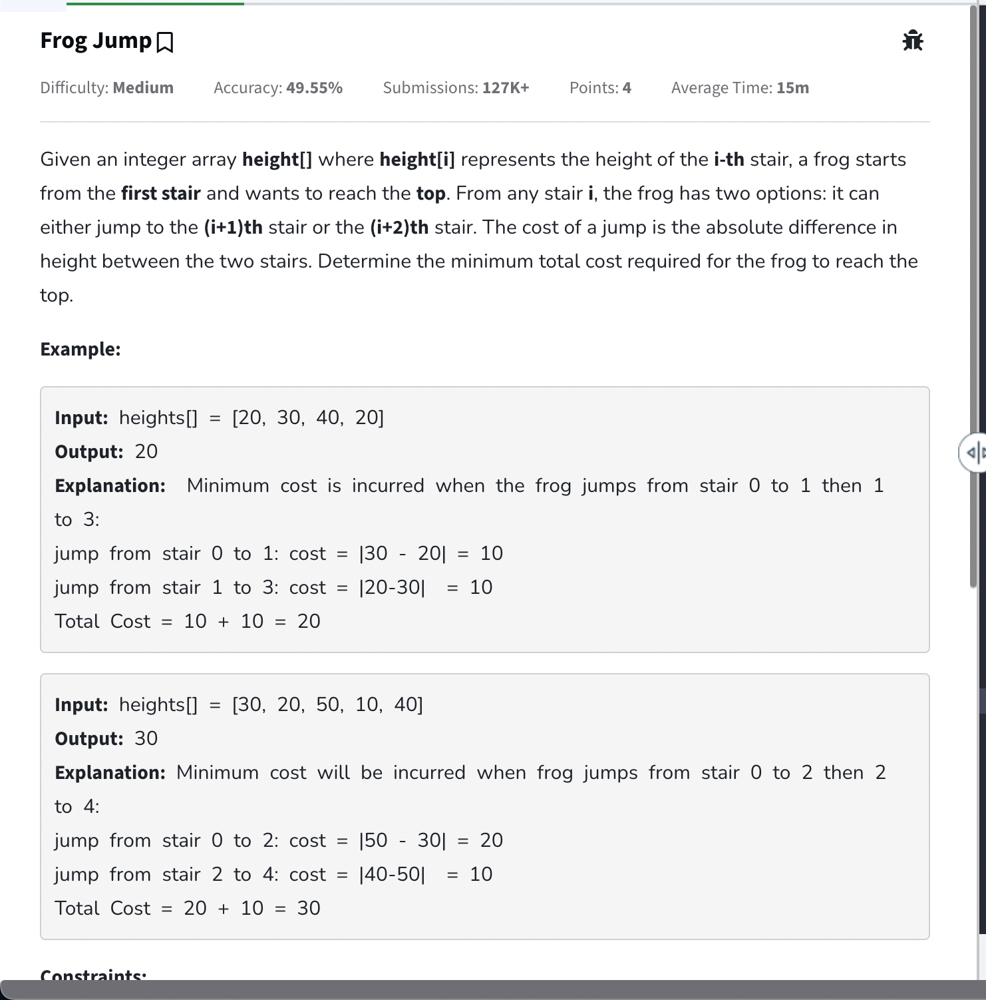
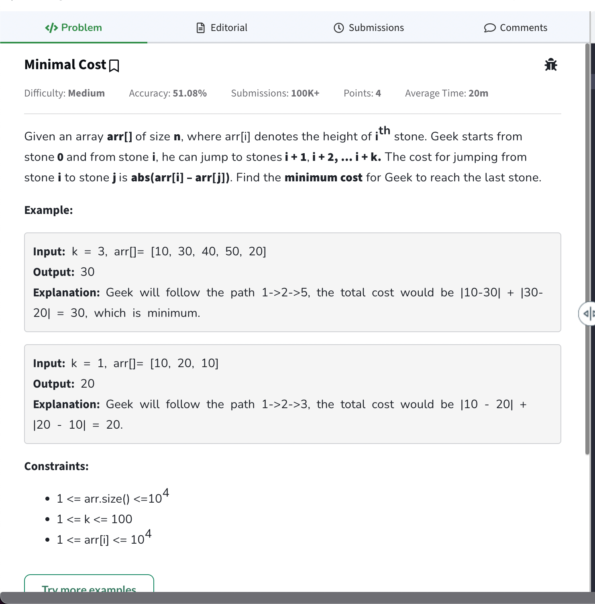

- [Questions List](#questions-list)
- [When/what to use dp](#whenwhat-to-use-dp)
- [509. Fibonacci Number](#509-fibonacci-number)
  - [Approach](#approach)
  - [Code](#code)
- [When to apply dp/ recursion to solve a problem](#when-to-apply-dp-recursion-to-solve-a-problem)
  - [How to solve/ write recurrence relation](#how-to-solve-write-recurrence-relation)
- [70. Climbing Stairs](#70-climbing-stairs)
  - [Approach](#approach-1)
  - [Code](#code-1)
    - [Recursive](#recursive)
    - [Memoisation](#memoisation)
- [Frog Jump](#frog-jump)
  - [Code](#code-2)
- [Frog Jump with K Steps](#frog-jump-with-k-steps)
  - [Code](#code-3)

# Questions List

# When/what to use dp

- When in question there are overlapping subproblems ( problem that is already solved is being solved again )
- When there is optimal substructure present ( choti problem + choti problem = solution to badi problem )
- Ways to solve
  - Recursion + Memoisation ( top down approach )
  - Loops + DS (bottom up approach)
    - Space Optimisation ( can be done for some problems to reduce space complexity required )

# [509. Fibonacci Number](https://leetcode.com/problems/fibonacci-number/description/)

The <b>Fibonacci numbers</b>, commonly denoted <code>F(n)</code> form a sequence, called the <b>Fibonacci sequence</b>, such that each number is the sum of the two preceding ones, starting from <code>0</code> and <code>1</code>. That is,

```
F(0) = 0, F(1) = 1
F(n) = F(n - 1) + F(n - 2), for n > 1.
```

Given <code>n</code>, calculate <code>F(n)</code>.

**Example 1:**

```
Input: n = 2
Output: 1
Explanation: F(2) = F(1) + F(0) = 1 + 0 = 1.
```

**Example 2:**

```
Input: n = 3
Output: 2
Explanation: F(3) = F(2) + F(1) = 1 + 1 = 2.
```

**Example 3:**

```
Input: n = 4
Output: 3
Explanation: F(4) = F(3) + F(2) = 2 + 1 = 3.
```

**Constraints:**

- <code>0 <= n <= 30</code>

## Approach

- T.C => O(N) reduced from O(2^n)
- S.C => O(N) for both memoisation and tabulation but tabluation improves as it does not have recursion overhead
- S.C => O(1) for space optimised version
-

## Code

```cpp
/*
    * Steps to solve dp problem with top down approach ( recursion + memorisation ) ( goes from n -> 0 )
      * Create dp array ( can be 1d, 2d or 3d dimensions depend on number of changing parameter )
      * pass this to recursion function and store answer whenever it gets computed
      * on each call check if answer was already computed or not and return that

    * Steps to solve using bottom up approach ( iterative + tabulation ) ( builds solution from 0 to n)
      * Create dp array ( can be 1d, 2d or 3d dimensions depend on number of changing parameter )
      * Initialise dp array with base cases
      * Same logic as recursive and run loop while building solutions from 0 to n

    * Steps to space optimise
      * Check if a pattern exists in tabulation method and then work on that
*/
class Solution {
private:
    int solveUsingMemorisation(int n, vector<int>& dp){
        if(n <= 1) return n;

        if(dp[n] != -1) return dp[n]; // if already pre computed return that only

        dp[n] = solveUsingMemorisation(n - 1, dp) + solveUsingMemorisation(n - 2, dp);
        return dp[n];
    }

    int solveUsingTabulation(int n){
        if(n <= 1) return n; // base cases can causes issues if say n was 0 then dp will be of size 1 but we will accessing dp[1] etc.

        vector<int> dp(n + 1, -1);

        dp[0] = 0;
        dp[1] = 1;

        for(int i = 2; i <= n; i++){
            dp[i] = dp[i - 1] + dp[i - 2]; // building solutions using previous
        }

        return dp[n];
    }

    int solveUsingTabulationSpaceOptimised(int n){
        if(n <= 1) return n;

        int prev = 0;
        int curr = 1;
        int ans;

        // if we observe we only need the previous 2 values from the array in tabulation
        // can just store in variables instead
        for(int i = 2; i <= n; i++){
            ans = prev + curr;
            prev = curr;
            curr = ans;
        }

        return ans;
    }

public:
    int fib(int n) {
        vector<int> dp(n + 1, -1); // need to return the nth fib number

        int result = solveUsingMemorisation(n, dp);
        return result;
    }
};
```

# When to apply dp/ recursion to solve a problem

- Problems where need to explore all paths/ ways to figure something out. ex.
  - Problem asking for count the total number of ways.
  - Given multiple ways of performing a task, it is asked which way will yield the minimum or maximum output.

## How to solve/ write recurrence relation

- Try to represent problem using indexes
- Do all possible stuff on that idx according to problem
- Count of all ways -> sum all stuff
- Minimum of all ways -> min all stuff
- maximum of all ways -> find max all stuff

# [70. Climbing Stairs](https://leetcode.com/problems/climbing-stairs/description/)

You are climbing a staircase. It takes <code>n</code> steps to reach the top.

Each time you can either climb <code>1</code> or <code>2</code> steps. In how many distinct ways can you climb to the top?

**Example 1:**

```
Input: n = 2
Output: 2
Explanation: There are two ways to climb to the top.
1. 1 step + 1 step
2. 2 steps
```

**Example 2:**

```
Input: n = 3
Output: 3
Explanation: There are three ways to climb to the top.
1. 1 step + 1 step + 1 step
2. 1 step + 2 steps
3. 2 steps + 1 step
```

**Constraints:**

- <code>1 <= n <= 45</code>

## Approach

- Pattern: 1-d dp

## Code

### Recursive

- Similar to fibonacci only. f(n) = f(n - 1) + f(n - 2)
- Can also be done from 0 to n with first call of f(0) = f(1) + f(2) and so on with base condition at i == n return 1 and if i > n return 0.

```cpp
// think of n as index can go from n -> 0

class Solution {
public:
    // this function returns number of ways it takes to reach from n to 0
    int climbStairs(int n) {
        if(n == 0 || n == 1) return 1; // if we at 0 then only 1 way exists to reach 0 ( do nothing )
        // if we at 1 then can take 1 step

        // if climbStairs(n) return number of ways from n -> 0
        // then climbStairs(n - 1) will return number of ways from n - 1 -> 0
        int numberOfWaysIfWeTakeOneStep = climbStairs(n - 1);
        int numberOfWaysIfWeTakeTwoSteps = climbStairs(n - 2);

        // problem asks for count of all ways return sum
        return numberOfWaysIfWeTakeOneStep + numberOfWaysIfWeTakeTwoSteps;
    }
};
```

### Memoisation

```cpp
// think of n as index can go from n -> 0

class Solution {
private:
    int climbStairs(int n, vector<int>& dp){
        if(n == 0 || n == 1) return 1;

        if(dp[n] != -1) return dp[n];

        dp[n] = climbStairs(n - 1, dp) + climbStairs(n - 2, dp);
        return dp[n];
    }

public:
    // similar to fibonacci sequence
    // can be further optimised to tabulation -> space optimised with a loop
    int climbStairs(int n) {
        vector<int> dp(n + 1, -1);

        return climbStairs(n, dp);
    }

    /* recursive
    // this function returns number of ways it takes to reach from n to 0
    int climbStairs(int n) {
        if(n == 0 || n == 1) return 1; // if we at 0 then only 1 way exists to reach 0 ( do nothing )
        // if we at 1 then can take 1 step

        // if climbStairs(n) return number of ways from n -> 0
        // then climbStairs(n - 1) will return number of ways from n - 1 -> 0
        int numberOfWaysIfWeTakeOneStep = climbStairs(n - 1);
        int numberOfWaysIfWeTakeTwoSteps = climbStairs(n - 2);

        // problem asks for count of all ways return sum
        return numberOfWaysIfWeTakeOneStep + numberOfWaysIfWeTakeTwoSteps;
    }
    */
};
```

# [Frog Jump](https://www.geeksforgeeks.org/problems/geek-jump/1?utm_source=youtube&utm_medium=collab_striver_ytdescription&utm_campaign=geek-jump)



## Code

- Steps followed same as above

  - Convert to use indexes
  - do stuff
  - find min of all stuff

- Can also do space optimisation similar to fibonacci
- T.C => O(N) and S.C => O(N)

```cpp
class Solution {
private:
    int minCostTabulation(vector<int>& height, int n){
        vector<int> dp(n + 1, -1);

        dp[0] = 0;
        dp[1] = abs(height[1] - height[0]);

        for(int i = 2; i < n; i++){
            dp[i] = min(dp[i - 1] + abs(height[i] - height[i - 1]),
                        dp[i - 2] + abs(height[i] - height[i - 2]));
        }

        return dp[n];
    }

    int minCostMemoised(vector<int>& height, vector<int>& dp, int currentStep){
        if(currentStep == 0) return 0; // if at 0 step then to go to 0th step
        // it will take 0 cost
        if(dp[currentStep] != -1) return dp[currentStep];

        // cost till here + the cost to go from n - 1 -> n
        int costToTakeOneStep = minCostMemoised(height, dp, currentStep - 1) + abs(height[currentStep] - height[currentStep - 1]);

        // can only take 2 steps if not at 1 or 0
        int costToTakeTwoSteps = INT_MAX;

        if(currentStep > 1) {
            costToTakeTwoSteps = minCostMemoised(height, dp, currentStep - 2) + abs(height[currentStep] - height[currentStep - 2]);
        }

        // asssings and then returns
        return dp[currentStep] = min(costToTakeOneStep, costToTakeTwoSteps);
    }

    int minCost(vector<int>& height, int currentStep){
        if(currentStep == 0) return 0; // if at 0 step then to go to 0th step
        // it will take 0 cost

        // cost till here + the cost to go from n - 1 -> n
        int costToTakeOneStep = minCost(height, currentStep - 1) + abs(height[currentStep] - height[currentStep - 1]);

        // can only take 2 steps if not at 1 or 0
        int costToTakeTwoSteps = INT_MAX;

        if(currentStep > 1) {
            costToTakeTwoSteps = minCost(height, currentStep - 2) + abs(height[currentStep] - height[currentStep - 2]);
        }

        return min(costToTakeOneStep, costToTakeTwoSteps);
    }

  public:
    int minCost(vector<int>& height) {
        int n = height.size();
        int top = n - 1;
        vector<int> dp(n, -1);

        return minCostTabulation(height, n);
    }
};
```

# [Frog Jump with K Steps](https://www.geeksforgeeks.org/problems/minimal-cost/1?utm_source=youtube&utm_medium=collab_striver_ytdescription&utm_campaign=minimal-cost)



## Code

- T.C => O(N \* K) for memo and tabulation but O(k ^ N) for recursion ( k options for n choices )
- same as above but at each step we can take k steps so need to check if current - k is possible or not

```cpp
class Solution {
private:
    int minimizeCostMemo(int k, vector<int>& arr,vector<int>& dp, int currentStep){
        if(currentStep == 0) return 0;

        if(dp[currentStep] != -1) return dp[currentStep];

        int minimumCost = INT_MAX;

        for(int i = 1; i <= k; i++) {
            if(currentStep - i >= 0) {
                minimumCost = min(
                        minimizeCostMemo(k, arr, dp, currentStep - i) +
                        abs(arr[currentStep] - arr[currentStep - i]),
                        minimumCost
                    );
            }
        }

        return dp[currentStep] = minimumCost;
    }

    int minimizeCostTabulation(int k, vector<int>& arr){
        int n = arr.size();

        vector<int> dp(n + 1, -1);
        dp[0] = 0;
        dp[1] = abs(arr[1] - arr[0]);

        for(int i = 2; i < n; i++){
            int minCost = INT_MAX;
            for(int j = 1; j <= k; j++){
                if(i - j >= 0){
                    minCost = min(dp[i - j] + abs(arr[i] - arr[i - j]), minCost);
                }
            }

            dp[i] = minCost;
        }

        return dp[n - 1];
    }

    int minimizeCost(int k, vector<int>& arr, int currentStep){
        if(currentStep == 0) return 0;

        int minimumCost = INT_MAX;

        for(int i = 1; i <= k; i++) {
            if(currentStep - i >= 0) {
                minimumCost = min(
                        minimizeCost(k, arr, currentStep - i) +
                        abs(arr[currentStep] - arr[currentStep - i]),
                        minimumCost
                    );
            }
        }

        return minimumCost;
    }
  public:
    int minimizeCost(int k, vector<int>& arr) {
        int n = arr.size();
        vector<int> dp(n + 1, -1);
        return minimizeCostTabulation(k, arr);
    }
};
```
