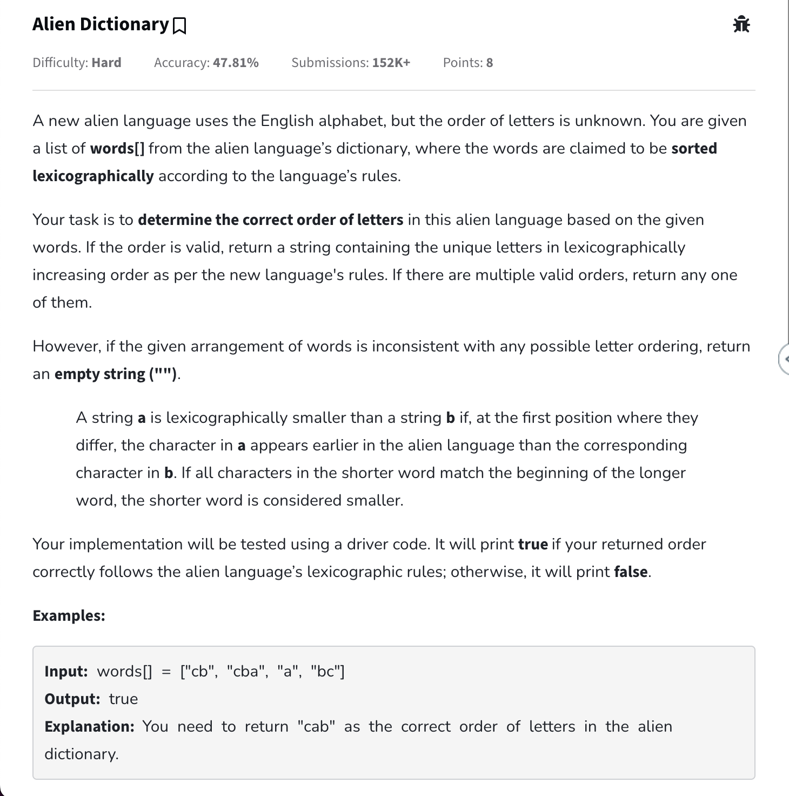
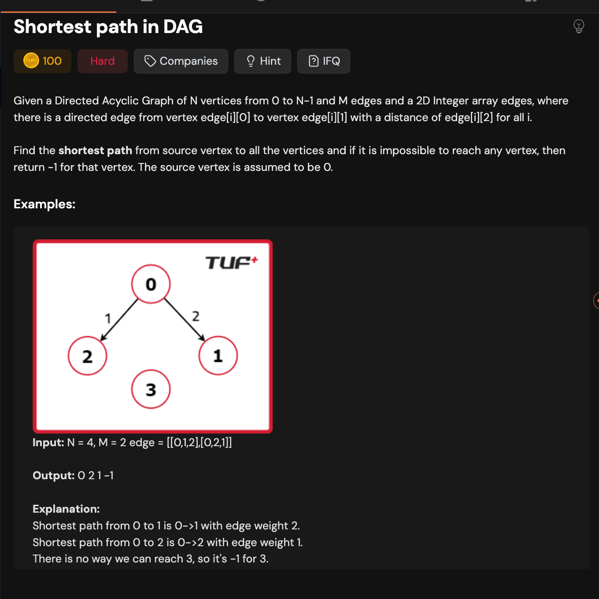
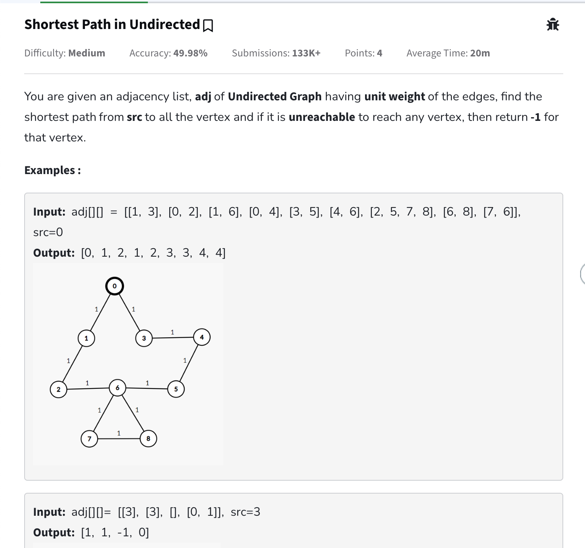

- [323. Number of Connected Components in an Undirected Graph](#323-number-of-connected-components-in-an-undirected-graph)
  - [Approach](#approach)
  - [Code](#code)
- [547. Number of Provinces](#547-number-of-provinces)
  - [Approach](#approach-1)
  - [Code](#code-1)
- [200. Number of Islands](#200-number-of-islands)
  - [Approach](#approach-2)
  - [Code](#code-2)
- [733. Flood Fill](#733-flood-fill)
  - [Approach](#approach-3)
  - [Code](#code-3)
- [1020. Number of Enclaves](#1020-number-of-enclaves)
  - [Approach](#approach-4)
  - [Code](#code-4)
- [994. Rotting Oranges](#994-rotting-oranges)
  - [Approach](#approach-5)
  - [Code](#code-5)
- [542. 01 Matrix](#542-01-matrix)
  - [Approach](#approach-6)
  - [Code](#code-6)
- [130. Surrounded Regions](#130-surrounded-regions)
  - [Approach](#approach-7)
  - [Code](#code-7)
- [Number of distinct islands](#number-of-distinct-islands)
  - [Approach](#approach-8)
  - [Code](#code-8)
- [Detect Cycle in Undirected Graph](#detect-cycle-in-undirected-graph)
  - [Approach](#approach-9)
  - [Code](#code-9)
- [785. Is Graph Bipartite?](#785-is-graph-bipartite)
  - [Approach](#approach-10)
  - [Code](#code-10)
- [Topological Sort/ Kahns Algorithm](#topological-sort-kahns-algorithm)
  - [Code](#code-11)
- [Detect cycle in directed graph](#detect-cycle-in-directed-graph)
  - [DFS](#dfs)
    - [Code](#code-12)
  - [BFS using kahns algo ( Important )](#bfs-using-kahns-algo--important-)
- [802. Find Eventual Safe States](#802-find-eventual-safe-states)
  - [Approach](#approach-11)
    - [DFS](#dfs-1)
    - [Kahns Algo](#kahns-algo)
- [207. Course Schedule](#207-course-schedule)
  - [Approach](#approach-12)
  - [Code](#code-13)
- [Alien Dictionary](#alien-dictionary)
  - [Approach](#approach-13)
  - [Code](#code-14)
- [Shortest path in DAG](#shortest-path-in-dag)
  - [Code](#code-15)
- [Shortest Path in Undirected Graph with unit weight](#shortest-path-in-undirected-graph-with-unit-weight)
  - [Approach](#approach-14)
  - [Code](#code-16)

# [323. Number of Connected Components in an Undirected Graph](https://leetcode.com/problems/number-of-connected-components-in-an-undirected-graph/description/)

You have a graph of <code>n</code> nodes. You are given an integer <code>n</code> and an array <code>edges</code> where <code>edges[i] = [a<sub>i</sub>, b<sub>i</sub>]</code> indicates that there is an edge between <code>a<sub>i</sub></code> and <code>b<sub>i</sub></code> in the graph.

Return the number of connected components in the graph.

**Example 1:**


```
Input: n = 5, edges = [[0,1],[1,2],[3,4]]
Output: 2
```

**Example 2:**


```
Input: n = 5, edges = [[0,1],[1,2],[2,3],[3,4]]
Output: 1
```

**Constraints:**

- <code>1 <= n <= 2000</code>
- <code>1 <= edges.length <= 5000</code>
- <code>edges[i].length == 2</code>
- <code>0 <= a<sub>i</sub> <= b<sub>i</sub> < n</code>
- <code>a<sub>i</sub> != b<sub>i</sub></code>
- There are no repeated edges.

## Approach

- **Pattern: Basic DFS**
- Each dfs call can traverse its own graph independently on its own. So each component basically is a single dfs call only. So we can keep track of number of dfs calls.
- T.C => O(V + E) S.C => O(V + E)

## Code

```cpp
class Solution {
private:
    void dfs(int node, vector<vector<int>>& adjList, vector<bool>& visited) {
        visited[node] = true;

        for (auto& neighbour : adjList[node]) {
            if (!visited[neighbour]) {
                dfs(neighbour, adjList, visited);
            }
        }
    }

    // T.C => O(V + E) dfs call for graph and building adjList
    // S.C => O(V + E) for storing visited and adjList
public:
    int countComponents(int n, vector<vector<int>>& edges) {
        vector<vector<int>> adjList(n);
        vector<bool> visited(n);
        int count = 0; // keeps track of how many times dfs was called for the
                       // entire graph
        // in a single dfs call it will visit its entire graph component
        // next call will only be made for the not visited node from the next
        // component

        // create adj list for the undirected graph
        for (auto& edge : edges) {
            int u = edge[0];
            int v = edge[1];

            adjList[u].push_back(v);
            adjList[v].push_back(u);
        }

        for (int i = 0; i < n; i++) {
            if (!visited[i]) {
                dfs(i, adjList, visited);
                count++;
            }
        }

        return count;
    }
};
```

# [547. Number of Provinces](https://leetcode.com/problems/number-of-provinces/description/)

There are <code>n</code> cities. Some of them are connected, while some are not. If city <code>a</code> is connected directly with city <code>b</code>, and city <code>b</code> is connected directly with city <code>c</code>, then city <code>a</code> is connected indirectly with city <code>c</code>.

A **province** is a group of directly or indirectly connected cities and no other cities outside of the group.

You are given an <code>n x n</code> matrix <code>isConnected</code> where <code>isConnected[i][j] = 1</code> if the <code>i^th</code> city and the <code>j^th</code> city are directly connected, and <code>isConnected[i][j] = 0</code> otherwise.

Return the total number of **provinces** .

**Example 1:**


```
Input: isConnected = [[1,1,0],[1,1,0],[0,0,1]]
Output: 2
```

**Example 2:**


```
Input: isConnected = [[1,0,0],[0,1,0],[0,0,1]]
Output: 3
```

**Constraints:**

- <code>1 <= n <= 200</code>
- <code>n == isConnected.length</code>
- <code>n == isConnected[i].length</code>
- <code>isConnected[i][j]</code> is <code>1</code> or <code>0</code>.
- <code>isConnected[i][i] == 1</code>
- <code>isConnected[i][j] == isConnected[j][i]</code>

## Approach

- **Pattern: Basic DFS**
- Same as above new thing was how to convert adj mat to adj list

## Code

```cpp
class Solution {
private:
    void dfs(int node, vector<bool>& visited, vector<vector<int>>& adjList){
        visited[node] = true;

        for(auto& neighbour : adjList[node]){
            if(!visited[neighbour]){
                dfs(neighbour, visited, adjList);
            }
        }
    }

public:
    int findCircleNum(vector<vector<int>>& isConnected) {
        // given the adjacency matrix we can convert to adj list first
        int v = isConnected.size();
        vector<vector<int>> adjList(v);

        for(int i = 0; i < v; i++){
            for(int j = 0; j < v; j++){
                // if there exists an edge b/w i and j and i does not connect to j ( no self loop )
                if(isConnected[i][j] == 1 && i != j){
                    adjList[i].push_back(j);
                    adjList[j].push_back(i);
                }
            }
        }

        int countOfProvinces = 0;
        vector<bool> visited(v, false);

        // har ek not visited node ke liye dfs call karege
        // jabhi uska dfs khatam hoga matlab usne apne vaala pura graph explore kar lia h
        // yeh dfs se pehel loop isliye lagaya h kyuki graph connected nahi h
        // similar to finding number of connected components
        for(int i = 0; i < v; i++){
            // imagine if starting at a node then uska dfs call karte hi voh apna pura graph visit karleta h
            if(!visited[i]){
                dfs(i, visited, adjList);
                countOfProvinces++;
            }
        }

        return countOfProvinces;
    }
};
```

# [200. Number of Islands](https://leetcode.com/problems/number-of-islands/description/)

Given an <code>m x n</code> 2D binary grid <code>grid</code> which represents a map of <code>'1'</code>s (land) and <code>'0'</code>s (water), return the number of islands.

An **island** is surrounded by water and is formed by connecting adjacent lands horizontally or vertically. You may assume all four edges of the grid are all surrounded by water.

**Example 1:**

```
Input: grid = [
  ["1","1","1","1","0"],
  ["1","1","0","1","0"],
  ["1","1","0","0","0"],
  ["0","0","0","0","0"]
]
Output: 1
```

**Example 2:**

```
Input: grid = [
  ["1","1","0","0","0"],
  ["1","1","0","0","0"],
  ["0","0","1","0","0"],
  ["0","0","0","1","1"]
]
Output: 3
```

**Constraints:**

- <code>m == grid.length</code>
- <code>n == grid[i].length</code>
- <code>1 <= m, n <= 300</code>
- <code>grid[i][j]</code> is <code>'0'</code> or <code>'1'</code>.

## Approach

- Pattern: Grid Based BFS
- Most solved similarly using multi source bfs as need to visit neighbours first.
- Count of bfs calls will give number of islands. ( in this can need to go from 1 and connect island )

## Code

```cpp
class Solution {
    private:
        void bfs(int row, int col, vector<vector<char>>& grid, vector<vector<bool>>& visited){
            int m = grid.size();
            int n = grid[0].size();

            queue<pair<int, int>> q;
            visited[row][col] = true;

            q.push({row, col});
            vector<pair<int, int>> directions = {{0, -1}, {0, 1}, {1, 0}, {-1, 0}};

            while(!q.empty()){
                auto& [row, col] = q.front();
                q.pop();

                for(auto& [dy, dx]: directions){
                    int newRow = row + dy;
                    int newCol = col + dx;

                    if(newRow < m && newRow >= 0 && newCol < n && newCol >= 0 && grid[newRow][newCol] == '1' && !visited[newRow][newCol]){
                        visited[newRow][newCol] = true;
                        q.push({newRow, newCol});
                    }
                }
            }

        }

public:
    int numIslands(vector<vector<char>>& grid) {
        int count = 0;
        int m = grid.size();
        int n = grid[0].size();

        vector<vector<bool>> visited(m, vector<bool>(n, false));

        for(int i = 0; i < m; i++){
            for(int j = 0; j < n; j++){
                if(grid[i][j] == '1' && !visited[i][j]){
                    visited[i][j] = true;
                    bfs(i, j, grid, visited);
                    count++;
                }
            }
        }

        return count;
    }
};
```

# [733. Flood Fill](https://leetcode.com/problems/flood-fill/description/)

You are given an image represented by an <code>m x n</code> grid of integers <code>image</code>, where <code>image[i][j]</code> represents the pixel value of the image. You are also given three integers <code>sr</code>, <code>sc</code>, and <code>color</code>. Your task is to perform a **flood fill** on the image starting from the pixel <code>image[sr][sc]</code>.

To perform a **flood fill** :

- Begin with the starting pixel and change its color to <code>color</code>.
- Perform the same process for each pixel that is **directly adjacent** (pixels that share a side with the original pixel, either horizontally or vertically) and shares the **same color** as the starting pixel.
- Keep **repeating** this process by checking neighboring pixels of the updated pixelsand modifying their color if it matches the original color of the starting pixel.
- The process **stops** when there are **no more** adjacent pixels of the original color to update.

Return the **modified** image after performing the flood fill.

**Example 1:**

<div class="example-block">
Input: image = [[1,1,1],[1,1,0],[1,0,1]], sr = 1, sc = 1, color = 2

Output: [[2,2,2],[2,2,0],[2,0,1]]

Explanation:


From the center of the image with position <code>(sr, sc) = (1, 1)</code> (i.e., the red pixel), all pixels connected by a path of the same color as the starting pixel (i.e., the blue pixels) are colored with the new color.

Note the bottom corner is **not** colored 2, because it is not horizontally or vertically connected to the starting pixel.

**Example 2:**

<div class="example-block">
Input: image = [[0,0,0],[0,0,0]], sr = 0, sc = 0, color = 0

Output: [[0,0,0],[0,0,0]]

Explanation:

The starting pixel is already colored with 0, which is the same as the target color. Therefore, no changes are made to the image.

**Constraints:**

- <code>m == image.length</code>
- <code>n == image[i].length</code>
- <code>1 <= m, n <= 50</code>
- <code>0 <= image[i][j], color < 2^16</code>
- <code>0 <= sr < m</code>
- <code>0 <= sc < n</code>

## Approach

- Pattern: Grid based BFS

## Code

```cpp
class Solution {
public:
    vector<vector<int>> floodFill(vector<vector<int>>& image, int sr, int sc, int color) {
        int m = image.size();
        int n = image[0].size();

        int originalColor = image[sr][sc];

        queue<pair<int, int>> q; // stores row vs col
        vector<vector<bool>> visited(m, vector<bool>(n, false));

        image[sr][sc] = color;
        visited[sr][sc] = true;
        q.push({sr, sc});

        vector<pair<int, int>> directions = {{-1, 0}, {1, 0}, {0, -1}, {0, 1}};
        while(!q.empty()){
            auto& [row, col] = q.front();
            q.pop();

            for(auto& [dy, dx] : directions){
                int newRow = row + dy;
                int newCol = col + dx;

                // if valid config and equal to original color of image[sr][sc]
                if(newRow < m && newRow >= 0 && newCol < n && newCol >= 0 && image[newRow][newCol] == originalColor && !visited[newRow][newCol]){
                    visited[newRow][newCol] = true;
                    image[newRow][newCol] = color;
                    q.push({newRow, newCol});
                }
            }
        }

        return image;
    }
};
```

# [1020. Number of Enclaves](https://leetcode.com/problems/number-of-enclaves/description/)

You are given an <code>m x n</code> binary matrix <code>grid</code>, where <code>0</code> represents a sea cell and <code>1</code> represents a land cell.

A **move** consists of walking from one land cell to another adjacent (**4-directionally** ) land cell or walking off the boundary of the <code>grid</code>.

Return the number of land cells in <code>grid</code> for which we cannot walk off the boundary of the grid in any number of **moves** .

**Example 1:**


```
Input: grid = [[0,0,0,0],[1,0,1,0],[0,1,1,0],[0,0,0,0]]
Output: 3
Explanation: There are three 1s that are enclosed by 0s, and one 1 that is not enclosed because its on the boundary.
```

**Example 2:**


```
Input: grid = [[0,1,1,0],[0,0,1,0],[0,0,1,0],[0,0,0,0]]
Output: 0
Explanation: All 1s are either on the boundary or can reach the boundary.
```

**Constraints:**

- <code>m == grid.length</code>
- <code>n == grid[i].length</code>
- <code>1 <= m, n <= 500</code>
- <code>grid[i][j]</code> is either <code>0</code> or <code>1</code>.

## Approach

- Pattern: Grid based bfs/dfs
- We inversed the pattern in this and finding those for which we can not go.
- Important: Boundary traversal

## Code

```cpp
class Solution {
private:
    void dfs(
        vector<vector<int>>& grid, vector<vector<bool>>& visited,
        int row, int col, vector<pair<int, int>>& directions
    ) {
        int m = grid.size();
        int n = grid[0].size();

        visited[row][col] = true;

        for (auto& [dy, dx] : directions) {
            int newRow = row + dy;
            int newCol = col + dx;

            if (newRow >= 0 && newRow < m && newCol >= 0 && newCol < n &&
                grid[newRow][newCol] == 1 && !visited[newRow][newCol]) {
                visited[newRow][newCol] = true;
                dfs(grid, visited, newRow, newCol, directions);
            }
        }
    }

public:
    int numEnclaves(vector<vector<int>>& grid) {
        int m = grid.size();
        int n = grid[0].size();
        int count = 0;

        vector<vector<bool>> visited(m, vector<bool>(n, false));
        vector<pair<int, int>> directions = {{-1, 0}, {1, 0}, {0, -1}, {0, 1}};

        // traverse only boundaries
        // top row
        for (int i = 0; i < n; i++) {
            if (grid[0][i] == 1 && !visited[0][i]) {
                visited[0][i] = true;
                dfs(grid, visited, 0, i, directions);
            }
        }
        // left col
        for (int i = 0; i < m; i++) {
            if (grid[i][0] == 1 && !visited[i][0]) {
                visited[i][0] = true;
                dfs(grid, visited, i, 0, directions);
            }
        }

        // right col
        for (int i = 0; i < m; i++) {
            if (grid[i][n - 1] == 1 && !visited[i][n - 1]) {
                visited[i][n - 1] = true;
                dfs(grid, visited, i, n - 1, directions);
            }
        }

        // bottom row
        for (int i = 0; i < n; i++) {
            if (grid[m - 1][i] == 1 && !visited[m - 1][i]) {
                visited[m - 1][i] = true;
                dfs(grid, visited, m - 1, i, directions);
            }
        }

        for (int i = 0; i < m; i++) {
            for (int j = 0; j < n; j++) {
                // if we find any 1 which we were also not able to visit then
                // that 1 can never lead us out of the grid since we started
                // from the boundaries only
                if (grid[i][j] == 1 && !visited[i][j]) {
                    count++;
                }
            }
        }

        return count;
    }
};
```

# [994. Rotting Oranges](https://leetcode.com/problems/rotting-oranges/description/)

You are given an <code>m x n</code> <code>grid</code> where each cell can have one of three values:

- <code>0</code> representing an empty cell,
- <code>1</code> representing a fresh orange, or
- <code>2</code> representing a rotten orange.

Every minute, any fresh orange that is **4-directionally adjacent** to a rotten orange becomes rotten.

Return the minimum number of minutes that must elapse until no cell has a fresh orange. If this is impossible, return <code>-1</code>.

**Example 1:**


```
Input: grid = [[2,1,1],[1,1,0],[0,1,1]]
Output: 4
```

**Example 2:**

```
Input: grid = [[2,1,1],[0,1,1],[1,0,1]]
Output: -1
Explanation: The orange in the bottom left corner (row 2, column 0) is never rotten, because rotting only happens 4-directionally.
```

**Example 3:**

```
Input: grid = [[0,2]]
Output: 0
Explanation: Since there are already no fresh oranges at minute 0, the answer is just 0.
```

**Constraints:**

- <code>m == grid.length</code>
- <code>n == grid[i].length</code>
- <code>1 <= m, n <= 10</code>
- <code>grid[i][j]</code> is <code>0</code>, <code>1</code>, or <code>2</code>.

## Approach

- Pattern: Grid bfs/ multi source bfs

## Code

```cpp
/*
Any problem that involves a grid with neighbors (up, down, left, right) can often be modeled as an implicit graph:
Each cell is a node.
An edge exists between adjacent (up, down, left, right) cells.
*/
class Solution {
public:
    int orangesRotting(vector<vector<int>>& grid) {
        int n = grid.size();
        int m = grid[0].size();

        queue<pair<pair<int,int>, int>> q; // stores { row, col, time }
        vector<vector<int>> visited(n, vector<int>(m, 0));

        int freshCount = 0; // how many fresh oranges exist before
        // to check if at the end we were able to completely rot all or not
        int maxTime = 0;

        for(int i = 0; i < n; i++){
            for(int j = 0; j < m; j++){
                if(grid[i][j] == 2){
                    q.push({{i, j}, 0});
                    visited[i][j] = 2; // using 2 as visited indicator ( basically this orange has rotted )
                } else if(grid[i][j] == 0) {
                    visited[i][j] = 0;
                } else if(grid[i][j] == 1){
                    freshCount++;
                }
            }
        }

        vector<pair<int, int>> directions = {{0, -1}, {-1, 0}, {0, 1}, {1, 0}}; // standing at [i,j] these all are the directions i can take

        // normal bfs
        while(!q.empty()){
            auto p = q.front();
            q.pop();

            int row = p.first.first;
            int col = p.first.second;
            int time = p.second;

            maxTime = max(time, maxTime);

            for(auto& [dy,dx]: directions){
                int newRow = row + dy;
                int newCol = col + dx;

                // if valid matrix config and not visited and is a rotten orange
                if(newRow < n && newRow >= 0 && newCol < m && newCol >= 0 && visited[newRow][newCol] == 0 && grid[newRow][newCol] == 1){
                    visited[newRow][newCol] = 2;
                    q.push({{newRow, newCol}, time + 1});
                    freshCount--;
                }
            }
        }

        return freshCount == 0 ? maxTime : -1;
    }
};
```

# [542. 01 Matrix](https://leetcode.com/problems/01-matrix/description/)

Given an <code>m x n</code> binary matrix <code>mat</code>, return the distance of the nearest <code>0</code> for each cell.

The distance between two cells sharing a common edge is <code>1</code>.

**Example 1:**


```
Input: mat = [[0,0,0],[0,1,0],[0,0,0]]
Output: [[0,0,0],[0,1,0],[0,0,0]]
```

**Example 2:**


```
Input: mat = [[0,0,0],[0,1,0],[1,1,1]]
Output: [[0,0,0],[0,1,0],[1,2,1]]
```

**Constraints:**

- <code>m == mat.length</code>
- <code>n == mat[i].length</code>
- <code>1 <= m, n <= 10^4</code>
- <code>1 <= m \* n <= 10^4</code>
- <code>mat[i][j]</code> is either <code>0</code> or <code>1</code>.
- There is at least one <code>0</code> in <code>mat</code>.

**Note:** This question is the same as 1765: <a href="https://leetcode.com/problems/map-of-highest-peak/description/" target="_blank">https://leetcode.com/problems/map-of-highest-peak/</a>

## Approach

- Pattern: Grid bfs
- **BFS guarantees the shortest path due to its level-order traversal.**

## Code

```cpp
class Solution {
public:
    vector<vector<int>> updateMatrix(vector<vector<int>>& grid) {
        int m = grid.size();
        int n = grid[0].size();

        vector<vector<int>> distance(m, vector<int>(n, 0));
        vector<vector<bool>> visited(m, vector<bool>(n, false));

        queue<pair<pair<int, int>, int>>
            q; // stores {row, col} vs steps it took to reach there
        vector<pair<int, int>> directions = {{0, -1}, {0, 1}, {1, 0}, {-1, 0}};

        for (int i = 0; i < m; i++) {
            for (int j = 0; j < n; j++) {
                if (grid[i][j] == 0) {
                    q.push({{i, j}, 0}); // initial config for queue
                    // if any data is 0 then it is at 0 distance from the
                    // nearest 0
                    visited[i][j] = true;
                }
            }
        }

        while (!q.empty()) {
            int row = q.front().first.first;
            int col = q.front().first.second;
            int stepsTillHere = q.front().second;

            q.pop();
            // update in result matrix
            distance[row][col] = stepsTillHere;

            for (pair<int, int> p : directions) {
                int dy = p.first;
                int dx = p.second;

                int newRow = row + dy;
                int newCol = col + dx;

                if (newRow < m && newRow >= 0 && newCol < n && newCol >= 0 &&
                    !visited[newRow][newCol]) {
                    // visit this node
                    // it will take 1 more step from current
                    visited[newRow][newCol] = true;
                    q.push({{newRow, newCol}, stepsTillHere + 1});
                }
            }
        }

        return distance;
    }
};
```

# [130. Surrounded Regions](https://leetcode.com/problems/surrounded-regions/description/)

You are given an <code>m x n</code> matrix <code>board</code> containing **letters** <code>'X'</code> and <code>'O'</code>, **capture regions** that are **surrounded** :

- **Connect** : A cell is connected to adjacent cells horizontally or vertically.
- **Region** : To form a region **connect every** <code>'O'</code> cell.
- **Surround** : The region is surrounded with <code>'X'</code> cells if you can **connect the region ** with <code>'X'</code> cells and none of the region cells are on the edge of the <code>board</code>.

To capture a **surrounded region** , replace all <code>'O'</code>s with <code>'X'</code>s **in-place** within the original board. You do not need to return anything.

**Example 1:**

<div class="example-block">
Input: board = [["X","X","X","X"],["X","O","O","X"],["X","X","O","X"],["X","O","X","X"]]

Output: [["X","X","X","X"],["X","X","X","X"],["X","X","X","X"],["X","O","X","X"]]

Explanation:

In the above diagram, the bottom region is not captured because it is on the edge of the board and cannot be surrounded.

**Example 2:**

<div class="example-block">
Input: board = [["X"]]

Output: [["X"]]

**Constraints:**

- <code>m == board.length</code>
- <code>n == board[i].length</code>
- <code>1 <= m, n <= 200</code>
- <code>board[i][j]</code> is <code>'X'</code> or <code>'O'</code>.

## Approach

- Pattern: Grid BFS/DFS

## Code

```cpp
class Solution {
private:
    void dfs(int row, int col, vector<vector<char>>& board, vector<vector<bool>>& visited, vector<pair<int, int>>& directions){
        int m = board.size();
        int n = board[0].size();

        visited[row][col] = true;

        for(auto& [dy,dx] : directions){
            int newRow = row + dy;
            int newCol = col + dx;

            if(newRow < m && newRow >=0 && newCol < n && newCol >= 0 && !visited[newRow][newCol] && board[newRow][newCol] == 'O'){
                visited[newRow][newCol] = true;
                dfs(newRow, newCol, board, visited, directions);
            }
        }
    }

    void printVector(vector<vector<bool>>& visited){
        for(int i = 0; i < visited.size(); i++){
            for(int j = 0; j < visited[0].size();j++){
                cout << visited[i][j] << " ";
            }
            cout << endl;
        }
    }

public:
    void solve(vector<vector<char>>& board) {
        int m = board.size();
        int n = board[0].size();

        vector<pair<int, int>> directions = {{0, -1}, {0, 1}, {-1, 0}, {1, 0}};
        vector<vector<bool>> visited(m, vector<bool>(n, false));
        // traverse all boundaries of board and if there is a 0 mark that place as visited
        // if from boundary there is 0 then all 0 that touch this cannot be converted to X

        // top row
        for(int j = 0; j < n; j++){
            if(board[0][j] == 'O' && !visited[0][j]){
                dfs(0, j, board, visited, directions);
            }
        }

        // left col
        for(int j = 0; j < m; j++){
            if(board[j][0] == 'O' && !visited[j][0]){
                dfs(j, 0, board, visited, directions);
            }
        }

        // right col
        for(int j = 0; j < m; j++){
            if(board[j][n - 1] == 'O' && !visited[j][n - 1]){
                dfs(j, n - 1, board, visited, directions);
            }
        }

        // bottom row
        for(int j = 0; j < n; j++){
            if(board[m - 1][j] == 'O' && !visited[m - 1][j]){
                dfs(m - 1, j, board, visited, directions);
            }
        }

        printVector(visited);

        for(int i = 0; i < m; i++){
            for(int j = 0; j < n;j++){
                if(visited[i][j] == false) board[i][j] = 'X';
            }
        }
    }
};
```

# [Number of distinct islands](https://www.geeksforgeeks.org/problems/number-of-distinct-islands/0)

## Approach

- Pattern: Grid DFS/BFS. Check code comments

## Code

```cpp
class Solution {
    private:
        vector<pair<int, int>> directions = {{-1, 0}, {1, 0}, {0, -1}, {0, 1}};

        void dfs(int row, int col, int baseRow, int baseCol, int m, int n,
        vector<vector<int>>& grid, vector<vector<bool>>& visited, vector<pair<int, int>>& dfsPath){
            visited[row][col] = true;
            dfsPath.push_back({row - baseRow, col - baseCol});

            for(pair<int,int> p: directions){
                int dy = p.first;
                int dx = p.second;

                int newRow = row + dy;
                int newCol = col + dx;

                // if valid config then traverse using dfs
                if(newRow < m && newRow >= 0 && newCol < n && newCol >= 0 &&
                    !visited[newRow][newCol] && grid[newRow][newCol] == 1){
                    visited[newRow][newCol] = true;
                    dfs(newRow, newCol, baseRow, baseCol, m, n, grid, visited, dfsPath);
                }
            }
        }
  public:
    int countDistinctIslands(vector<vector<int>>& grid) {
        // code here
        int m = grid.size();
        int n = grid[0].size();

        vector<vector<bool>> visited(m, vector<bool>(n, false));
        set<vector<pair<int, int>>> s;

        // T.C => O(M * N * log(M * N)) can reduce the log factor if we implement
        // a custom hash function for the unordered_set<vector>> which is not supported
        // by default


        // dfs is a much better approach or else we will have to store
        // base row, base col etc. as well in the queue pair

        // approach
        // in each dfs call from here a single island will get visited
        // we can store the path of {row, col} this island took in its dfs in a set
        // now set stores only unique
        // but to make sure similar looking islands are not counted again we
        // only store the distance from the cell from where we started the dfs call
        for(int i = 0; i < m; i++){
            for(int j = 0; j < n; j++){
                if(grid[i][j] == 1 && !visited[i][j]){
                    vector<pair<int, int>> dfsPath;
                    dfsPath.push_back({i - i, j - j}); // initially will be {0, 0} only
                    // but dfs will go normally from i and j and dfs path will use base row and base col
                    dfs(i,j,i, j,m, n,grid, visited, dfsPath);
                    s.insert(dfsPath);
                }
            }
        }

        return s.size();
    }
};
```

# [Detect Cycle in Undirected Graph](https://www.geeksforgeeks.org/problems/detect-cycle-in-an-undirected-graph/1)

## Approach

- For undirected graph while traversing if we land on a node which was already visited and the node which we landed on was not the same node as from which we came then there is a cycle. Can be done using both bfs and dfs.

## Code

```cpp
class Solution {
private:
    // bool bfs(vector<vector<int>>& adj, vector<bool>& visited, int src){
    //     queue<pair<int,int>> q; // stores node vs its parent
    //     q.push({src, -1}); // initial node has no parent
    //     visited[src] = true;

    //     while(!q.empty()){
    //         int node = q.front().first;
    //         int parent = q.front().second;
    //         q.pop();

    //         for(int neighbour: adj[node]){
    //             if(!visited[neighbour]){
    //                 q.push({neighbour, node}); // for this neighbour the initial
    //                 // node will be the parent from where it came from
    //                 visited[neighbour] = true;
    //             } else if(parent != neighbour){
    //                 // agar yeh node pehle se visited tha aur jaha se hum aaye h
    //                 // voh iska parent nahi tha
    //                 // to somehow kisi aur node ke bfs se ham yaha pehle jaa chuke h
    //                 // and if we start bfs at the same level then if bfs calls lead
    //                 // to same node then there exists a cycle
    //                 return true;
    //             }
    //         }
    //     }

    //     return false;
    // }
    bool dfs(vector<vector<int>>& adj, vector<bool>& visited, int src, int parent){
        visited[src] = true;
        for(int neighbour: adj[src]){
            if(!visited[neighbour]){
                visited[neighbour] = true;
                if(dfs(adj, visited, neighbour, src)) return true;
            } else if(neighbour != parent){
                return true;
            }
        }

        return false;
    }
  public:
    // Function to detect cycle in an undirected graph.
    bool isCycle(vector<vector<int>>& adj) {
        // Code here
        vector<bool> visited(adj.size(), false);
        for(int i = 0; i < adj.size(); i++){
            if(!visited[i]){
                visited[i] = true;
                if(dfs(adj, visited, i, -1)) return true;
            }
        }

        return false;
    }
};
```

# [785. Is Graph Bipartite?](https://leetcode.com/problems/is-graph-bipartite/description/)

There is an **undirected** graph with <code>n</code> nodes, where each node is numbered between <code>0</code> and <code>n - 1</code>. You are given a 2D array <code>graph</code>, where <code>graph[u]</code> is an array of nodes that node <code>u</code> is adjacent to. More formally, for each <code>v</code> in <code>graph[u]</code>, there is an undirected edge between node <code>u</code> and node <code>v</code>. The graph has the following properties:

- There are no self-edges (<code>graph[u]</code> does not contain <code>u</code>).
- There are no parallel edges (<code>graph[u]</code> does not contain duplicate values).
- If <code>v</code> is in <code>graph[u]</code>, then <code>u</code> is in <code>graph[v]</code> (the graph is undirected).
- The graph may not be connected, meaning there may be two nodes <code>u</code> and <code>v</code> such that there is no path between them.

A graph is **bipartite** if the nodes can be partitioned into two independent sets <code>A</code> and <code>B</code> such that **every** edge in the graph connects a node in set <code>A</code> and a node in set <code>B</code>.

Return <code>true</code> if and only if it is **bipartite** .

**Example 1:**


````
Input: graph = [[1,2,3],[0,2],[0,1,3],[0,2]]
Output: false
Explanation: There is no way to partition the nodes into two independent sets such that every edge connects a node in one and a node in the other.```

**Example 2:**


````

Input: graph = [[1,3],[0,2],[1,3],[0,2]]
Output: true
Explanation: We can partition the nodes into two sets: {0, 2} and {1, 3}.```

**Constraints:**

- <code>graph.length == n</code>
- <code>1 <= n <= 100</code>
- <code>0 <= graph[u].length < n</code>
- <code>0 <= graph[u][i] <= n - 1</code>
- <code>graph[u]</code>does not contain<code>u</code>.
- All the values of <code>graph[u]</code> are **unique** .
- If <code>graph[u]</code> contains <code>v</code>, then <code>graph[v]</code> contains <code>u</code>.

## Approach

- Pattern: Grid BFS. Refer code

## Code

```cpp
/*
    basic meaning of bipartite graph
    if we can color the graph in 2 colors such that no 2 adjacent node have the same color
    then that graph is bipartite
    - any linear graph will always be this
    - any graph with odd lenght cycle can never be bipartite
    - any graph with even length cycle will be bipartite
*/

class Solution {
    private:
        // normal graph bfs
        bool check(int src, int color, vector<vector<int>>& graph, vector<int>& colors){
            queue<int> q;
            q.push(src);
            colors[src] = color;

            while(!q.empty()){
                int node = q.front();
                q.pop();

                for(int neighbour: graph[node]){
                    if(colors[neighbour] == -1){ // not visited basically
                        colors[neighbour] = !colors[node]; // mark the neighbour color with opposite color since using 0 and 1 as color indicators
                        q.push(neighbour);

                    }
                    // else if the neighbour color which is adjacent is same as that of
                    // current node then cannot be bipartite
                    else if(colors[neighbour] == colors[node]){
                        return false;
                    }
                }
            }

            return true;
        }

        void printVector(vector<int>& vec){
            for(int a: vec) cout << a << " ";
        }
public:
    bool isBipartite(vector<vector<int>>& graph) {
        int m = graph.size();

        vector<int> colors(m, -1); // by default not colored

        for(int i = 0; i < m; i++){
            if(colors[i] == -1){
                if(check(i, 0, graph, colors) == false) return false; // if any component not bipartite
            }
        }

        printVector(colors);

        return true;
    }
};
```

# [Topological Sort/ Kahns Algorithm](https://www.geeksforgeeks.org/problems/topological-sort/1)

- list of nodes such that any u that is connected to v should come before in final traversal.
- can only exist for DAG's ( directed acyclic graph )
- Refer code

## Code

```cpp
class Solution{
private:
    void dfs(int src, stack<int>& st, vector<bool>& visited, vector<int> adj[]){
        visited[src] = true;

        for(auto neighbour: adj[src]){
            if(!visited[neighbour]) {
                dfs(neighbour, st, visited, adj);
            }
        }

        // this is done only after for this u all its v's has been processed
        st.push(src);
    }

    void printVector(vector<int>& vec){
        for(int num: vec) cout << num << " ";
    }

public:
    vector<int> topoSort(int V, vector<int> adj[]){
        vector<int> result;
        vector<int> inDegree(V, 0);
        queue<int> q; // stores all such nodes that have indegree of 0
        // isko aise soch ki agar kisi node ki indegree 2 h toh uska matlab yeh h ki voh uspe itna dependent h
        // aur agar koi task ho gaya toh uski indegree kam hogyi agar uska parent node process hogaya toh
        for(int i = 0; i < V; i++){
            vector<int> edges = adj[i];
            for(auto& edge: edges){
                inDegree[edge]++;
            }
        }

        // printVector(inDegree);

        for(int i = 0; i < inDegree.size(); i++){
            if(inDegree[i] == 0) q.push(i);
        }

        while(!q.empty()){
            int node = q.front();
            q.pop();

            // this node has been processed
            result.push_back(node);

            // remove this nodes dependecny from its neighbours/ dependents
            for(int neighbour: adj[node]){
                inDegree[neighbour]--;
                if(inDegree[neighbour] == 0) q.push(neighbour);
            }
        }

        return result;
    }

    // T.C => normal dfs only
    vector<int> topoSortDFS(int V, vector<int> adj[]){
        vector<bool> visited(V, false);
        stack<int> st;
        vector<int> result;
        // at any time for a element if its dfs has been completed
        // then it will store all the elements that will come after its linear
        // ordering basically storing all vs after u in a stack so that for the
        // last u that is inserted it will be at the top all its v's

        for(int i = 0; i < V; i++){
            if(!visited[i]){
                dfs(i, st, visited, adj);
            }
        }

        while(!st.empty()){
            result.push_back(st.top());
            st.pop();
        }

        return result;
    }
};
```

# Detect cycle in directed graph

## DFS

- Can not use the same algo as undirected because there can be a case that the graph node got visited from a different path.
- Maintain a path array in dfs which when node dfs is called path[node] = true and when dfs is completed reset it to false for other paths.

### Code

```cpp
class Solution{
    private:
        bool dfs(int src, vector<bool>& visited, vector<bool>& visitedInCurrentPath, vector<int> adj[]){
            visited[src] = true;
            visitedInCurrentPath[src] = true;

            for(int neighbour: adj[src]){
                if(!visited[neighbour]){
                    if(dfs(neighbour, visited, visitedInCurrentPath, adj)) return true;
                }

                // if node was already visited before and also exists in the current path then the directed graph can have a cycle
                if(visitedInCurrentPath[neighbour]){
                    return true;
                }
            }

            // after dfs has been done remove from current path
            visitedInCurrentPath[src] = false;
            return false;
        }
public:
    bool isCyclic(int N, vector<int> adj[]) {
        vector<bool> visited(N, false);
        // stores all the nodes that have been visited in the current path
        vector<bool> visitedInCurrentPath(N, false);

        for(int i = 0; i < N; i++){
            if(!visited[i]){
                // dfs here will check if any i has a cycle or not
                if(dfs(i, visited, visitedInCurrentPath, adj)) return true;
            }
        }

        return false;
    }
};
```

## BFS using kahns algo ( Important )

- Can also say the fact that kahns algo only works for DAG's( Directed acyclic graphs ) so if we try calculating topo sort of a graph that has a cycle then the size of the resultant topo sort will not be equal to the graph size. Can use this fact to detect if cycle exists or not.
- Important for other questions as well.

# [802. Find Eventual Safe States](https://leetcode.com/problems/find-eventual-safe-states/description/)

There is a directed graph of <code>n</code> nodes with each node labeled from <code>0</code> to <code>n - 1</code>. The graph is represented by a **0-indexed** 2D integer array <code>graph</code> where <code>graph[i]</code> is an integer array of nodes adjacent to node <code>i</code>, meaning there is an edge from node <code>i</code> to each node in <code>graph[i]</code>.

A node is a **terminal node** if there are no outgoing edges. A node is a **safe node** if every possible path starting from that node leads to a **terminal node** (or another safe node).

Return an array containing all the **safe nodes** of the graph. The answer should be sorted in **ascending** order.

**Example 1:**


```
Input: graph = [[1,2],[2,3],[5],[0],[5],[],[]]
Output: [2,4,5,6]
Explanation: The given graph is shown above.
Nodes 5 and 6 are terminal nodes as there are no outgoing edges from either of them.
Every path starting at nodes 2, 4, 5, and 6 all lead to either node 5 or 6.
```

**Example 2:**

```

Input: graph = [[1,2,3,4],[1,2],[3,4],[0,4],[]]
Output: [4]
Explanation:
Only node 4 is a terminal node, and every path starting at node 4 leads to node 4.

```

**Constraints:**

- <code>n == graph.length</code>
- <code>1 <= n <= 10^4</code>
- <code>0 <= graph[i].length <= n</code>
- <code>0 <= graph[i][j] <= n - 1</code>
- <code>graph[i]</code> is sorted in a strictly increasing order.
- The graph may contain self-loops.
- The number of edges in the graph will be in the range <code>[1, 4 * 10^4]</code>.

## Approach

- Pattern: Topo Sort/ DAG Cycle

### DFS

```cpp
class Solution {
    private:
        bool dfs(int src, vector<bool>& visited, vector<bool>& visitedInPath, vector<bool>& safe, vector<vector<int>>& adj){
            visited[src] = true;
            visitedInPath[src] = true;

            // traverse adjancent nodes
            for(int neighbour: adj[src]){
                if(!visited[neighbour]){
                    // a cycle was found
                    if(dfs(neighbour, visited, visitedInPath, safe, adj)) return true;
                }
                // if visited already and part of path then cycle exists
                else if(visitedInPath[neighbour]) return true;
            }

            // no cycle was found can mark this node as safe and remove it from the path
            safe[src] = true;
            visitedInPath[src] = false;
            return false;
        }
public:
    /*
        * Approach
        * For dfs based approach if any node is part of a cycle or there is any path in it that leads to a cycle then any such node cannot have a path that leads to a terminal node
        * the path will get stuck in the cycle only
        * we basically call dfs for each node and if there is a cycle then that nodes does not get unmarked from not safe
        * also any node that leads to a node that is part of a cycle gets tracked by the fact that if a cycle is found we dont remove them from the path visited
    */
    vector<int> eventualSafeNodes(vector<vector<int>>& graph) {
        int n = graph.size();
        vector<bool> visited(n, false);
        vector<bool> visitedInPath(n, false);
        vector<bool> safe(n, false); // no node is safe initially

        vector<int> result;

        for(int i = 0; i < n; i++){
            if(!visited[i]){
                // cout << i << " ";
                dfs(i, visited, visitedInPath, safe, graph);
            }
        }

        for(int i = 0; i < n; i++){
            cout << safe[i] << " " << i << " " << endl;
            if(safe[i]) result.push_back(i);
        }

        return result;
    }
};
```

### Kahns Algo

- Any node that is part or forms a cycle can never be part of topo sort. But first need to convert the graph ( ulte edges ) since problem is about outdegree 0 and kahns works on indegree 0.

# [207. Course Schedule](https://leetcode.com/problems/course-schedule/description/)

There are a total of <code>numCourses</code> courses you have to take, labeled from <code>0</code> to <code>numCourses - 1</code>. You are given an array <code>prerequisites</code> where <code>prerequisites[i] = [a<sub>i</sub>, b<sub>i</sub>]</code> indicates that you **must** take course <code>b<sub>i</sub></code> first if you want to take course <code>a<sub>i</sub></code>.

- For example, the pair <code>[0, 1]</code>, indicates that to take course <code>0</code> you have to first take course <code>1</code>.

Return <code>true</code> if you can finish all courses. Otherwise, return <code>false</code>.

**Example 1:**

```
Input: numCourses = 2, prerequisites = [[1,0]]
Output: true
Explanation: There are a total of 2 courses to take.
To take course 1 you should have finished course 0. So it is possible.
```

**Example 2:**

```
Input: numCourses = 2, prerequisites = [[1,0],[0,1]]
Output: false
Explanation: There are a total of 2 courses to take.
To take course 1 you should have finished course 0, and to take course 0 you should also have finished course 1. So it is impossible.
```

**Constraints:**

- <code>1 <= numCourses <= 2000</code>
- <code>0 <= prerequisites.length <= 5000</code>
- <code>prerequisites[i].length == 2</code>
- <code>0 <= a<sub>i</sub>, b<sub>i</sub> < numCourses</code>
- All the pairs prerequisites[i] are **unique** .

## Approach

- Pattern: Topo sort/ kahns algo application

## Code

```cpp
class Solution {
    private:
        vector<int> getTopologicalSort(vector<int>& inDegree, vector<vector<int>>& adjList){
            queue<int> q;
            vector<int> result;

            for(int i = 0; i < inDegree.size(); i++){
                if(inDegree[i] == 0) q.push(i);
            }

            while(!q.empty()){
                int node = q.front();
                q.pop();

                result.push_back(node);

                for(int neighbour: adjList[node]){
                    inDegree[neighbour]--;
                    if(inDegree[neighbour] == 0) q.push(neighbour);
                }
            }
            return result;
        }

public:
    bool canFinish(int numCourses, vector<vector<int>>& prerequisites) {
        vector<vector<int>> adjList(numCourses);
        vector<int> inDegree(numCourses);

        // create adj list
        for(auto& dependenctCourses: prerequisites){
            int course = dependenctCourses[0];
            int prerequisite = dependenctCourses[1];
            adjList[prerequisite].push_back(course);
        }

        // using adjList create indegree array
        for(int i = 0; i < numCourses; i++){
            vector<int> edges = adjList[i];
            for(auto& edge: edges){
                inDegree[edge]++;
            }
        }

        // get topological sorting if its size is equal to numCourses then can exhaust
        // all dependencies or else there exists a cycle
        // all the courses can be completed in the order returned by topological sort. Else it is not possible to complete all the courses.
        vector<int> topologicalSorting = getTopologicalSort(inDegree, adjList);
        if(topologicalSorting.size() == numCourses) return true;

        return false;
    }
};
```

# [Alien Dictionary](https://www.geeksforgeeks.org/problems/alien-dictionary/1)



## Approach

- Pattern: Kahns Algo
- **Also see how to work with numbers and char in case of graph**

## Code

```cpp
class Solution {
    // Approach
    // This has dependencies on words in dictionary
    // ex. baa comes before abcd according to the dict in that case b comes
    // before a ( b -> a ) abcd comes before abca ( means d comes before a in
    // this dictionary d -> a ) what we need to find is this dictionaries order
    // basically want to find the sorted order for this can use topo sort to
    // find sorted order if we consider a as 0 b as 1 etc.
   private:
    vector<int> topoSort(vector<vector<int>>& adjList) {
        int n = adjList.size();

        vector<int> indegree(n, 0);
        vector<int> result;

        queue<int> q;
        for (int i = 0; i < n; i++) {
            for (int edge : adjList[i]) {
                indegree[edge]++;
            }
        }

        for(int i = 0; i < n; i++){
			if(indegree[i] == 0) q.push(i);
		}

        while (!q.empty()) {
            int node = q.front();
            q.pop();
            result.push_back(node);

            for (int neighbour : adjList[node]) {
                indegree[neighbour]--;
                if (indegree[neighbour] == 0) q.push(neighbour);
            }
        }

        return result;
    }

   public:
    string findOrder(string dict[], int N, int K) {
        string result = "";
        vector<vector<int>> adjList(K);

        for (int i = 0; i < N - 1; i++) {
            string s1 = dict[i];
            string s2 = dict[i + 1];

            int minLength = min(s1.size(), s2.size());

            for (int ptr = 0; ptr < minLength; ptr++) {
                if (s1[ptr] != s2[ptr]) {
                    // baa & abcd b not equal to a then a is dependent on b or b
                    // -> a also - 'a' to store as number only
                    adjList[s1[ptr] - 'a'].push_back(s2[ptr] - 'a');
                    break;  // in a dictionary only first letter matters
                }
            }
        }

        vector<int> topo = topoSort(adjList);

        // if(topo.size() != K) return "";

        for (int i = 0; i < topo.size(); i++) {
            result +=
                char(topo[i] +
                     'a');  // 0 + 'a' = 97 then converting ascii back to get a
        }

        return result;
    }
};
```

# Shortest path in DAG



- Important how to define graphs with weight

## Code

```cpp
class Solution {
   private:
    void topoSort(int node, vector<vector<pair<int, int>>>& adj,
                  vector<bool>& vis, stack<int>& st) {
        // Mark the node as visited
        vis[node] = true;

        // Traverse all the neighbors
        for (auto it : adj[node]) {
            // Get the node
            int v = it.first;

            // If not visited, recursively perform DFS.
            if (!vis[v]) {
                topoSort(v, adj, vis, st);
            }
        }

        /* Add the current node to stack
        once all the nodes connected to it
        have been processed */
        st.push(node);
    }

    /*
    Approach
        ham isme shortest path nikal rahe using topo sort
        topo sort isliye kyuki agar kisi node ko process karte h toh all nodes jisse
        uss node tak pahuch sakte the voh already process ho chuke h unke distances
        what we basically do is for each node in topo sort check karte h ki agar
        is node se edge ka weight use karke neighbour pe jaae toh is it smaller than the path
        we already took before to reach that node ( or INT_MAX )
    */
   public:
    vector<int> shortestPath(int N, int M, vector<vector<int>>& edges) {
        vector<int> dist(N, 1e9);

        vector<vector<pair<int, int>>> adjList(N);
        // create adjList from given edges
        for (int i = 0; i < M; i++) {
            int u = edges[i][0];
            int v = edges[i][1];
            int wt = edges[i][2];

            adjList[u].push_back({v, wt});
        }

        // find topo sort using dfs
        // can also get through kahns as well
        stack<int> st;
        vector<bool> visited(N);

        for (int i = 0; i < N; i++) {
            if (!visited[i]) {
                topoSort(i, adjList, visited, st);
            }
        }

        dist[0] = 0;  // if starting from 0 then shortest distance for this will
                      // be 0 only
        while (!st.empty()) {
            int u = st.top();
            st.pop();

            for (auto& neighbour : adjList[u]) {
                int v = neighbour.first;
                int wt = neighbour.second;

                // known as relaxation process
                dist[v] = min(dist[v], dist[u] + wt);
            }
        }

        // answer demands we replace with -1 if not possible
        for (int i = 0; i < N; i++) {
            if (dist[i] == 1e9) dist[i] = -1;
        }

        return dist;
    }
};
```

# [Shortest Path in Undirected Graph with unit weight](https://www.geeksforgeeks.org/problems/shortest-path-in-undirected-graph-having-unit-distance/1?utm_source=youtube&utm_medium=collab_striver_ytdescription&utm_campaign=shortest-path-in-undirected-graph-having-unit-distance)



## Approach

- BFS algo does shortest path by default if graph is not directed.

## Code

```cpp
class Solution {
  public:
    // Function to find the shortest path from source to all other nodes
    vector<int> shortestPath(vector<vector<int>>& adj, int src) {
        // code here
        int n = adj.size();
        vector<int> dist(n, INT_MAX);
        queue<pair<int,int>> q; // stores node vs path length it took to reach here
        dist[src] = 0;

        q.push({src, 0});

        while(!q.empty()){
            pair<int, int> p = q.front();
            q.pop();

            int node = p.first;
            int pathLengthTillHere = p.second;

            // unit weight for a single path length
            for(int neighbour: adj[node]){
                if(pathLengthTillHere + 1 < dist[neighbour]) {
                    dist[neighbour] = 1 + pathLengthTillHere;
                    q.push({neighbour, 1 + pathLengthTillHere});
                }
            }
        }

        for(int i = 0; i < dist.size(); i++){
            if(dist[i] == INT_MAX) dist[i] = -1;
        }

        return dist;
    }
};
```
