# Questions List

- [Questions List](#questions-list)
- [323. Number of Connected Components in an Undirected Graph](#323-number-of-connected-components-in-an-undirected-graph)
  - [Approach](#approach)
  - [Code](#code)
- [547. Number of Provinces](#547-number-of-provinces)
  - [Approach](#approach-1)
  - [Code](#code-1)
- [200. Number of Islands](#200-number-of-islands)
  - [Approach](#approach-2)
  - [Code](#code-2)
- [733. Flood Fill](#733-flood-fill)
  - [Approach](#approach-3)
  - [Code](#code-3)
- [1020. Number of Enclaves](#1020-number-of-enclaves)
  - [Approach](#approach-4)
  - [Code](#code-4)
- [994. Rotting Oranges](#994-rotting-oranges)
  - [Approach](#approach-5)
  - [Code](#code-5)
- [542. 01 Matrix](#542-01-matrix)
  - [Approach](#approach-6)
  - [Code](#code-6)
- [130. Surrounded Regions](#130-surrounded-regions)
  - [Approach](#approach-7)
  - [Code](#code-7)
- [Number of distinct islands](#number-of-distinct-islands)
  - [Approach](#approach-8)
  - [Code](#code-8)
- [Detect Cycle in Undirected Graph](#detect-cycle-in-undirected-graph)
  - [Approach](#approach-9)
  - [Code](#code-9)
- [785. Is Graph Bipartite?](#785-is-graph-bipartite)
  - [Approach](#approach-10)
  - [Code](#code-10)
- [Topological Sort/ Kahns Algorithm](#topological-sort-kahns-algorithm)
  - [Code](#code-11)
- [Detect cycle in directed graph](#detect-cycle-in-directed-graph)
  - [DFS](#dfs)
    - [Code](#code-12)
  - [BFS using kahns algo ( Important )](#bfs-using-kahns-algo--important-)
- [802. Find Eventual Safe States](#802-find-eventual-safe-states)
  - [Approach](#approach-11)
    - [DFS](#dfs-1)
    - [Kahns Algo](#kahns-algo)
- [207. Course Schedule](#207-course-schedule)
  - [Approach](#approach-12)
  - [Code](#code-13)
- [Alien Dictionary](#alien-dictionary)
  - [Approach](#approach-13)
  - [Code](#code-14)
- [Shortest path in DAG](#shortest-path-in-dag)
  - [Code](#code-15)
- [Shortest Path in Undirected Graph with unit weight](#shortest-path-in-undirected-graph-with-unit-weight)
  - [Approach](#approach-14)
  - [Code](#code-16)
- [127. Word Ladder](#127-word-ladder)
  - [Approach](#approach-15)
  - [Code](#code-17)
- [126. Word Ladder II](#126-word-ladder-ii)
  - [Approach](#approach-16)
  - [Code](#code-18)
- [Dijkstra Algorithm](#dijkstra-algorithm)
  - [Approach](#approach-17)
  - [Code](#code-19)
    - [Using min heap](#using-min-heap)
- [Print Shortest Path in Weighted Undirected Graph](#print-shortest-path-in-weighted-undirected-graph)
  - [Approach](#approach-18)
    - [Code](#code-20)
- [1091. Shortest Path in Binary Matrix](#1091-shortest-path-in-binary-matrix)
  - [Approach](#approach-19)
  - [Code](#code-21)
- [1631. Path With Minimum Effort](#1631-path-with-minimum-effort)
  - [Approach](#approach-20)
  - [Code](#code-22)
- [787. Cheapest Flights Within K Stops](#787-cheapest-flights-within-k-stops)
  - [Approach](#approach-21)
  - [Code](#code-23)
- [Minimum Multiplications to reach end](#minimum-multiplications-to-reach-end)
  - [Approach](#approach-22)
  - [Code](#code-24)
- [1976. Number of Ways to Arrive at Destination](#1976-number-of-ways-to-arrive-at-destination)
  - [Approach](#approach-23)
  - [Code](#code-25)
- [Bellman Ford](#bellman-ford)
  - [Code](#code-26)
- [Floyd Warshall](#floyd-warshall)
  - [Code](#code-27)
- [1334. Find the City With the Smallest Number of Neighbors at a Threshold Distance](#1334-find-the-city-with-the-smallest-number-of-neighbors-at-a-threshold-distance)
  - [Approach](#approach-24)
  - [Code](#code-28)
- [Disjoint Set Union(DSU)](#disjoint-set-uniondsu)
  - [Code](#code-29)
    - [Using Rank, Size \& Path Compression](#using-rank-size--path-compression)
- [Find Minimum Spanning Tree Weight](#find-minimum-spanning-tree-weight)
  - [Spanning Tree](#spanning-tree)
  - [MST](#mst)
  - [Using Prims Algorithm](#using-prims-algorithm)
  - [Using kruskals](#using-kruskals)
- [1319. Number of Operations to Make Network Connected](#1319-number-of-operations-to-make-network-connected)
  - [Approach](#approach-25)
  - [Code](#code-30)
- [721. Accounts Merge](#721-accounts-merge)
  - [Approach](#approach-26)
  - [Code](#code-31)
- [Number of islands 2](#number-of-islands-2)
  - [Code](#code-32)
- [827. Making A Large Island](#827-making-a-large-island)
  - [Approach](#approach-27)
  - [Code](#code-33)
- [947. Most Stones Removed with Same Row or Column](#947-most-stones-removed-with-same-row-or-column)
  - [Approach](#approach-28)
  - [Code](#code-34)

# [323. Number of Connected Components in an Undirected Graph](https://leetcode.com/problems/number-of-connected-components-in-an-undirected-graph/description/)

You have a graph of <code>n</code> nodes. You are given an integer <code>n</code> and an array <code>edges</code> where <code>edges[i] = [a<sub>i</sub>, b<sub>i</sub>]</code> indicates that there is an edge between <code>a<sub>i</sub></code> and <code>b<sub>i</sub></code> in the graph.

Return the number of connected components in the graph.

**Example 1:**


```
Input: n = 5, edges = [[0,1],[1,2],[3,4]]
Output: 2
```

**Example 2:**


```
Input: n = 5, edges = [[0,1],[1,2],[2,3],[3,4]]
Output: 1
```

**Constraints:**

- <code>1 <= n <= 2000</code>
- <code>1 <= edges.length <= 5000</code>
- <code>edges[i].length == 2</code>
- <code>0 <= a<sub>i</sub> <= b<sub>i</sub> < n</code>
- <code>a<sub>i</sub> != b<sub>i</sub></code>
- There are no repeated edges.

## Approach

- **Pattern: Basic DFS**
- Each dfs call can traverse its own graph independently on its own. So each component basically is a single dfs call only. So we can keep track of number of dfs calls.
- T.C => O(V + E) S.C => O(V + E)

## Code

```cpp
class Solution {
private:
    void dfs(int node, vector<vector<int>>& adjList, vector<bool>& visited) {
        visited[node] = true;

        for (auto& neighbour : adjList[node]) {
            if (!visited[neighbour]) {
                dfs(neighbour, adjList, visited);
            }
        }
    }

    // T.C => O(V + E) dfs call for graph and building adjList
    // S.C => O(V + E) for storing visited and adjList
public:
    int countComponents(int n, vector<vector<int>>& edges) {
        vector<vector<int>> adjList(n);
        vector<bool> visited(n);
        int count = 0; // keeps track of how many times dfs was called for the
                       // entire graph
        // in a single dfs call it will visit its entire graph component
        // next call will only be made for the not visited node from the next
        // component

        // create adj list for the undirected graph
        for (auto& edge : edges) {
            int u = edge[0];
            int v = edge[1];

            adjList[u].push_back(v);
            adjList[v].push_back(u);
        }

        for (int i = 0; i < n; i++) {
            if (!visited[i]) {
                dfs(i, adjList, visited);
                count++;
            }
        }

        return count;
    }
};
```

# [547. Number of Provinces](https://leetcode.com/problems/number-of-provinces/description/)

There are <code>n</code> cities. Some of them are connected, while some are not. If city <code>a</code> is connected directly with city <code>b</code>, and city <code>b</code> is connected directly with city <code>c</code>, then city <code>a</code> is connected indirectly with city <code>c</code>.

A **province** is a group of directly or indirectly connected cities and no other cities outside of the group.

You are given an <code>n x n</code> matrix <code>isConnected</code> where <code>isConnected[i][j] = 1</code> if the <code>i^th</code> city and the <code>j^th</code> city are directly connected, and <code>isConnected[i][j] = 0</code> otherwise.

Return the total number of **provinces** .

**Example 1:**


```
Input: isConnected = [[1,1,0],[1,1,0],[0,0,1]]
Output: 2
```

**Example 2:**


```
Input: isConnected = [[1,0,0],[0,1,0],[0,0,1]]
Output: 3
```

**Constraints:**

- <code>1 <= n <= 200</code>
- <code>n == isConnected.length</code>
- <code>n == isConnected[i].length</code>
- <code>isConnected[i][j]</code> is <code>1</code> or <code>0</code>.
- <code>isConnected[i][i] == 1</code>
- <code>isConnected[i][j] == isConnected[j][i]</code>

## Approach

- **Pattern: Basic DFS**
- Same as above new thing was how to convert adj mat to adj list

## Code

```cpp
class Solution {
private:
    void dfs(int node, vector<bool>& visited, vector<vector<int>>& adjList){
        visited[node] = true;

        for(auto& neighbour : adjList[node]){
            if(!visited[neighbour]){
                dfs(neighbour, visited, adjList);
            }
        }
    }

public:
    int findCircleNum(vector<vector<int>>& isConnected) {
        // given the adjacency matrix we can convert to adj list first
        int v = isConnected.size();
        vector<vector<int>> adjList(v);

        for(int i = 0; i < v; i++){
            for(int j = 0; j < v; j++){
                // if there exists an edge b/w i and j and i does not connect to j ( no self loop )
                if(isConnected[i][j] == 1 && i != j){
                    adjList[i].push_back(j);
                    adjList[j].push_back(i);
                }
            }
        }

        int countOfProvinces = 0;
        vector<bool> visited(v, false);

        // har ek not visited node ke liye dfs call karege
        // jabhi uska dfs khatam hoga matlab usne apne vaala pura graph explore kar lia h
        // yeh dfs se pehel loop isliye lagaya h kyuki graph connected nahi h
        // similar to finding number of connected components
        for(int i = 0; i < v; i++){
            // imagine if starting at a node then uska dfs call karte hi voh apna pura graph visit karleta h
            if(!visited[i]){
                dfs(i, visited, adjList);
                countOfProvinces++;
            }
        }

        return countOfProvinces;
    }
};
```

# [200. Number of Islands](https://leetcode.com/problems/number-of-islands/description/)

Given an <code>m x n</code> 2D binary grid <code>grid</code> which represents a map of <code>'1'</code>s (land) and <code>'0'</code>s (water), return the number of islands.

An **island** is surrounded by water and is formed by connecting adjacent lands horizontally or vertically. You may assume all four edges of the grid are all surrounded by water.

**Example 1:**

```
Input: grid = [
  ["1","1","1","1","0"],
  ["1","1","0","1","0"],
  ["1","1","0","0","0"],
  ["0","0","0","0","0"]
]
Output: 1
```

**Example 2:**

```
Input: grid = [
  ["1","1","0","0","0"],
  ["1","1","0","0","0"],
  ["0","0","1","0","0"],
  ["0","0","0","1","1"]
]
Output: 3
```

**Constraints:**

- <code>m == grid.length</code>
- <code>n == grid[i].length</code>
- <code>1 <= m, n <= 300</code>
- <code>grid[i][j]</code> is <code>'0'</code> or <code>'1'</code>.

## Approach

- Pattern: Grid Based BFS
- Most solved similarly using multi source bfs as need to visit neighbours first.
- Count of bfs calls will give number of islands. ( in this can need to go from 1 and connect island )

## Code

```cpp
class Solution {
    private:
        void bfs(int row, int col, vector<vector<char>>& grid, vector<vector<bool>>& visited){
            int m = grid.size();
            int n = grid[0].size();

            queue<pair<int, int>> q;
            visited[row][col] = true;

            q.push({row, col});
            vector<pair<int, int>> directions = {{0, -1}, {0, 1}, {1, 0}, {-1, 0}};

            while(!q.empty()){
                auto& [row, col] = q.front();
                q.pop();

                for(auto& [dy, dx]: directions){
                    int newRow = row + dy;
                    int newCol = col + dx;

                    if(newRow < m && newRow >= 0 && newCol < n && newCol >= 0 && grid[newRow][newCol] == '1' && !visited[newRow][newCol]){
                        visited[newRow][newCol] = true;
                        q.push({newRow, newCol});
                    }
                }
            }

        }

public:
    int numIslands(vector<vector<char>>& grid) {
        int count = 0;
        int m = grid.size();
        int n = grid[0].size();

        vector<vector<bool>> visited(m, vector<bool>(n, false));

        for(int i = 0; i < m; i++){
            for(int j = 0; j < n; j++){
                if(grid[i][j] == '1' && !visited[i][j]){
                    visited[i][j] = true;
                    bfs(i, j, grid, visited);
                    count++;
                }
            }
        }

        return count;
    }
};
```

# [733. Flood Fill](https://leetcode.com/problems/flood-fill/description/)

You are given an image represented by an <code>m x n</code> grid of integers <code>image</code>, where <code>image[i][j]</code> represents the pixel value of the image. You are also given three integers <code>sr</code>, <code>sc</code>, and <code>color</code>. Your task is to perform a **flood fill** on the image starting from the pixel <code>image[sr][sc]</code>.

To perform a **flood fill** :

- Begin with the starting pixel and change its color to <code>color</code>.
- Perform the same process for each pixel that is **directly adjacent** (pixels that share a side with the original pixel, either horizontally or vertically) and shares the **same color** as the starting pixel.
- Keep **repeating** this process by checking neighboring pixels of the updated pixelsand modifying their color if it matches the original color of the starting pixel.
- The process **stops** when there are **no more** adjacent pixels of the original color to update.

Return the **modified** image after performing the flood fill.

**Example 1:**

<div class="example-block">
Input: image = [[1,1,1],[1,1,0],[1,0,1]], sr = 1, sc = 1, color = 2

Output: [[2,2,2],[2,2,0],[2,0,1]]

Explanation:


From the center of the image with position <code>(sr, sc) = (1, 1)</code> (i.e., the red pixel), all pixels connected by a path of the same color as the starting pixel (i.e., the blue pixels) are colored with the new color.

Note the bottom corner is **not** colored 2, because it is not horizontally or vertically connected to the starting pixel.

**Example 2:**

<div class="example-block">
Input: image = [[0,0,0],[0,0,0]], sr = 0, sc = 0, color = 0

Output: [[0,0,0],[0,0,0]]

Explanation:

The starting pixel is already colored with 0, which is the same as the target color. Therefore, no changes are made to the image.

**Constraints:**

- <code>m == image.length</code>
- <code>n == image[i].length</code>
- <code>1 <= m, n <= 50</code>
- <code>0 <= image[i][j], color < 2^16</code>
- <code>0 <= sr < m</code>
- <code>0 <= sc < n</code>

## Approach

- Pattern: Grid based BFS

## Code

```cpp
class Solution {
public:
    vector<vector<int>> floodFill(vector<vector<int>>& image, int sr, int sc, int color) {
        int m = image.size();
        int n = image[0].size();

        int originalColor = image[sr][sc];

        queue<pair<int, int>> q; // stores row vs col
        vector<vector<bool>> visited(m, vector<bool>(n, false));

        image[sr][sc] = color;
        visited[sr][sc] = true;
        q.push({sr, sc});

        vector<pair<int, int>> directions = {{-1, 0}, {1, 0}, {0, -1}, {0, 1}};
        while(!q.empty()){
            auto& [row, col] = q.front();
            q.pop();

            for(auto& [dy, dx] : directions){
                int newRow = row + dy;
                int newCol = col + dx;

                // if valid config and equal to original color of image[sr][sc]
                if(newRow < m && newRow >= 0 && newCol < n && newCol >= 0 && image[newRow][newCol] == originalColor && !visited[newRow][newCol]){
                    visited[newRow][newCol] = true;
                    image[newRow][newCol] = color;
                    q.push({newRow, newCol});
                }
            }
        }

        return image;
    }
};
```

# [1020. Number of Enclaves](https://leetcode.com/problems/number-of-enclaves/description/)

You are given an <code>m x n</code> binary matrix <code>grid</code>, where <code>0</code> represents a sea cell and <code>1</code> represents a land cell.

A **move** consists of walking from one land cell to another adjacent (**4-directionally** ) land cell or walking off the boundary of the <code>grid</code>.

Return the number of land cells in <code>grid</code> for which we cannot walk off the boundary of the grid in any number of **moves** .

**Example 1:**


```
Input: grid = [[0,0,0,0],[1,0,1,0],[0,1,1,0],[0,0,0,0]]
Output: 3
Explanation: There are three 1s that are enclosed by 0s, and one 1 that is not enclosed because its on the boundary.
```

**Example 2:**


```
Input: grid = [[0,1,1,0],[0,0,1,0],[0,0,1,0],[0,0,0,0]]
Output: 0
Explanation: All 1s are either on the boundary or can reach the boundary.
```

**Constraints:**

- <code>m == grid.length</code>
- <code>n == grid[i].length</code>
- <code>1 <= m, n <= 500</code>
- <code>grid[i][j]</code> is either <code>0</code> or <code>1</code>.

## Approach

- Pattern: Grid based bfs/dfs
- We inversed the pattern in this and finding those for which we can not go.
- Important: Boundary traversal

## Code

```cpp
class Solution {
private:
    void dfs(
        vector<vector<int>>& grid, vector<vector<bool>>& visited,
        int row, int col, vector<pair<int, int>>& directions
    ) {
        int m = grid.size();
        int n = grid[0].size();

        visited[row][col] = true;

        for (auto& [dy, dx] : directions) {
            int newRow = row + dy;
            int newCol = col + dx;

            if (newRow >= 0 && newRow < m && newCol >= 0 && newCol < n &&
                grid[newRow][newCol] == 1 && !visited[newRow][newCol]) {
                visited[newRow][newCol] = true;
                dfs(grid, visited, newRow, newCol, directions);
            }
        }
    }

public:
    int numEnclaves(vector<vector<int>>& grid) {
        int m = grid.size();
        int n = grid[0].size();
        int count = 0;

        vector<vector<bool>> visited(m, vector<bool>(n, false));
        vector<pair<int, int>> directions = {{-1, 0}, {1, 0}, {0, -1}, {0, 1}};

        // traverse only boundaries
        // top row
        for (int i = 0; i < n; i++) {
            if (grid[0][i] == 1 && !visited[0][i]) {
                visited[0][i] = true;
                dfs(grid, visited, 0, i, directions);
            }
        }
        // left col
        for (int i = 0; i < m; i++) {
            if (grid[i][0] == 1 && !visited[i][0]) {
                visited[i][0] = true;
                dfs(grid, visited, i, 0, directions);
            }
        }

        // right col
        for (int i = 0; i < m; i++) {
            if (grid[i][n - 1] == 1 && !visited[i][n - 1]) {
                visited[i][n - 1] = true;
                dfs(grid, visited, i, n - 1, directions);
            }
        }

        // bottom row
        for (int i = 0; i < n; i++) {
            if (grid[m - 1][i] == 1 && !visited[m - 1][i]) {
                visited[m - 1][i] = true;
                dfs(grid, visited, m - 1, i, directions);
            }
        }

        for (int i = 0; i < m; i++) {
            for (int j = 0; j < n; j++) {
                // if we find any 1 which we were also not able to visit then
                // that 1 can never lead us out of the grid since we started
                // from the boundaries only
                if (grid[i][j] == 1 && !visited[i][j]) {
                    count++;
                }
            }
        }

        return count;
    }
};
```

# [994. Rotting Oranges](https://leetcode.com/problems/rotting-oranges/description/)

You are given an <code>m x n</code> <code>grid</code> where each cell can have one of three values:

- <code>0</code> representing an empty cell,
- <code>1</code> representing a fresh orange, or
- <code>2</code> representing a rotten orange.

Every minute, any fresh orange that is **4-directionally adjacent** to a rotten orange becomes rotten.

Return the minimum number of minutes that must elapse until no cell has a fresh orange. If this is impossible, return <code>-1</code>.

**Example 1:**


```
Input: grid = [[2,1,1],[1,1,0],[0,1,1]]
Output: 4
```

**Example 2:**

```
Input: grid = [[2,1,1],[0,1,1],[1,0,1]]
Output: -1
Explanation: The orange in the bottom left corner (row 2, column 0) is never rotten, because rotting only happens 4-directionally.
```

**Example 3:**

```
Input: grid = [[0,2]]
Output: 0
Explanation: Since there are already no fresh oranges at minute 0, the answer is just 0.
```

**Constraints:**

- <code>m == grid.length</code>
- <code>n == grid[i].length</code>
- <code>1 <= m, n <= 10</code>
- <code>grid[i][j]</code> is <code>0</code>, <code>1</code>, or <code>2</code>.

## Approach

- Pattern: Grid bfs/ multi source bfs

## Code

```cpp
/*
Any problem that involves a grid with neighbors (up, down, left, right) can often be modeled as an implicit graph:
Each cell is a node.
An edge exists between adjacent (up, down, left, right) cells.
*/
class Solution {
public:
    int orangesRotting(vector<vector<int>>& grid) {
        int n = grid.size();
        int m = grid[0].size();

        queue<pair<pair<int,int>, int>> q; // stores { row, col, time }
        vector<vector<int>> visited(n, vector<int>(m, 0));

        int freshCount = 0; // how many fresh oranges exist before
        // to check if at the end we were able to completely rot all or not
        int maxTime = 0;

        for(int i = 0; i < n; i++){
            for(int j = 0; j < m; j++){
                if(grid[i][j] == 2){
                    q.push({{i, j}, 0});
                    visited[i][j] = 2; // using 2 as visited indicator ( basically this orange has rotted )
                } else if(grid[i][j] == 0) {
                    visited[i][j] = 0;
                } else if(grid[i][j] == 1){
                    freshCount++;
                }
            }
        }

        vector<pair<int, int>> directions = {{0, -1}, {-1, 0}, {0, 1}, {1, 0}}; // standing at [i,j] these all are the directions i can take

        // normal bfs
        while(!q.empty()){
            auto p = q.front();
            q.pop();

            int row = p.first.first;
            int col = p.first.second;
            int time = p.second;

            maxTime = max(time, maxTime);

            for(auto& [dy,dx]: directions){
                int newRow = row + dy;
                int newCol = col + dx;

                // if valid matrix config and not visited and is a rotten orange
                if(newRow < n && newRow >= 0 && newCol < m && newCol >= 0 && visited[newRow][newCol] == 0 && grid[newRow][newCol] == 1){
                    visited[newRow][newCol] = 2;
                    q.push({{newRow, newCol}, time + 1});
                    freshCount--;
                }
            }
        }

        return freshCount == 0 ? maxTime : -1;
    }
};
```

# [542. 01 Matrix](https://leetcode.com/problems/01-matrix/description/)

Given an <code>m x n</code> binary matrix <code>mat</code>, return the distance of the nearest <code>0</code> for each cell.

The distance between two cells sharing a common edge is <code>1</code>.

**Example 1:**


```
Input: mat = [[0,0,0],[0,1,0],[0,0,0]]
Output: [[0,0,0],[0,1,0],[0,0,0]]
```

**Example 2:**


```
Input: mat = [[0,0,0],[0,1,0],[1,1,1]]
Output: [[0,0,0],[0,1,0],[1,2,1]]
```

**Constraints:**

- <code>m == mat.length</code>
- <code>n == mat[i].length</code>
- <code>1 <= m, n <= 10^4</code>
- <code>1 <= m \* n <= 10^4</code>
- <code>mat[i][j]</code> is either <code>0</code> or <code>1</code>.
- There is at least one <code>0</code> in <code>mat</code>.

**Note:** This question is the same as 1765: <a href="https://leetcode.com/problems/map-of-highest-peak/description/" target="_blank">https://leetcode.com/problems/map-of-highest-peak/</a>

## Approach

- Pattern: Grid bfs
- **BFS guarantees the shortest path due to its level-order traversal.**

## Code

```cpp
class Solution {
public:
    vector<vector<int>> updateMatrix(vector<vector<int>>& grid) {
        int m = grid.size();
        int n = grid[0].size();

        vector<vector<int>> distance(m, vector<int>(n, 0));
        vector<vector<bool>> visited(m, vector<bool>(n, false));

        queue<pair<pair<int, int>, int>>
            q; // stores {row, col} vs steps it took to reach there
        vector<pair<int, int>> directions = {{0, -1}, {0, 1}, {1, 0}, {-1, 0}};

        for (int i = 0; i < m; i++) {
            for (int j = 0; j < n; j++) {
                if (grid[i][j] == 0) {
                    q.push({{i, j}, 0}); // initial config for queue
                    // if any data is 0 then it is at 0 distance from the
                    // nearest 0
                    visited[i][j] = true;
                }
            }
        }

        while (!q.empty()) {
            int row = q.front().first.first;
            int col = q.front().first.second;
            int stepsTillHere = q.front().second;

            q.pop();
            // update in result matrix
            distance[row][col] = stepsTillHere;

            for (pair<int, int> p : directions) {
                int dy = p.first;
                int dx = p.second;

                int newRow = row + dy;
                int newCol = col + dx;

                if (newRow < m && newRow >= 0 && newCol < n && newCol >= 0 &&
                    !visited[newRow][newCol]) {
                    // visit this node
                    // it will take 1 more step from current
                    visited[newRow][newCol] = true;
                    q.push({{newRow, newCol}, stepsTillHere + 1});
                }
            }
        }

        return distance;
    }
};
```

# [130. Surrounded Regions](https://leetcode.com/problems/surrounded-regions/description/)

You are given an <code>m x n</code> matrix <code>board</code> containing **letters** <code>'X'</code> and <code>'O'</code>, **capture regions** that are **surrounded** :

- **Connect** : A cell is connected to adjacent cells horizontally or vertically.
- **Region** : To form a region **connect every** <code>'O'</code> cell.
- **Surround** : The region is surrounded with <code>'X'</code> cells if you can **connect the region ** with <code>'X'</code> cells and none of the region cells are on the edge of the <code>board</code>.

To capture a **surrounded region** , replace all <code>'O'</code>s with <code>'X'</code>s **in-place** within the original board. You do not need to return anything.

**Example 1:**

<div class="example-block">
Input: board = [["X","X","X","X"],["X","O","O","X"],["X","X","O","X"],["X","O","X","X"]]

Output: [["X","X","X","X"],["X","X","X","X"],["X","X","X","X"],["X","O","X","X"]]

Explanation:

In the above diagram, the bottom region is not captured because it is on the edge of the board and cannot be surrounded.

**Example 2:**

<div class="example-block">
Input: board = [["X"]]

Output: [["X"]]

**Constraints:**

- <code>m == board.length</code>
- <code>n == board[i].length</code>
- <code>1 <= m, n <= 200</code>
- <code>board[i][j]</code> is <code>'X'</code> or <code>'O'</code>.

## Approach

- Pattern: Grid BFS/DFS

## Code

```cpp
class Solution {
private:
    void dfs(int row, int col, vector<vector<char>>& board, vector<vector<bool>>& visited, vector<pair<int, int>>& directions){
        int m = board.size();
        int n = board[0].size();

        visited[row][col] = true;

        for(auto& [dy,dx] : directions){
            int newRow = row + dy;
            int newCol = col + dx;

            if(newRow < m && newRow >=0 && newCol < n && newCol >= 0 && !visited[newRow][newCol] && board[newRow][newCol] == 'O'){
                visited[newRow][newCol] = true;
                dfs(newRow, newCol, board, visited, directions);
            }
        }
    }

    void printVector(vector<vector<bool>>& visited){
        for(int i = 0; i < visited.size(); i++){
            for(int j = 0; j < visited[0].size();j++){
                cout << visited[i][j] << " ";
            }
            cout << endl;
        }
    }

public:
    void solve(vector<vector<char>>& board) {
        int m = board.size();
        int n = board[0].size();

        vector<pair<int, int>> directions = {{0, -1}, {0, 1}, {-1, 0}, {1, 0}};
        vector<vector<bool>> visited(m, vector<bool>(n, false));
        // traverse all boundaries of board and if there is a 0 mark that place as visited
        // if from boundary there is 0 then all 0 that touch this cannot be converted to X

        // top row
        for(int j = 0; j < n; j++){
            if(board[0][j] == 'O' && !visited[0][j]){
                dfs(0, j, board, visited, directions);
            }
        }

        // left col
        for(int j = 0; j < m; j++){
            if(board[j][0] == 'O' && !visited[j][0]){
                dfs(j, 0, board, visited, directions);
            }
        }

        // right col
        for(int j = 0; j < m; j++){
            if(board[j][n - 1] == 'O' && !visited[j][n - 1]){
                dfs(j, n - 1, board, visited, directions);
            }
        }

        // bottom row
        for(int j = 0; j < n; j++){
            if(board[m - 1][j] == 'O' && !visited[m - 1][j]){
                dfs(m - 1, j, board, visited, directions);
            }
        }

        printVector(visited);

        for(int i = 0; i < m; i++){
            for(int j = 0; j < n;j++){
                if(visited[i][j] == false) board[i][j] = 'X';
            }
        }
    }
};
```

# [Number of distinct islands](https://www.geeksforgeeks.org/problems/number-of-distinct-islands/0)

## Approach

- Pattern: Grid DFS/BFS. Check code comments

## Code

```cpp
class Solution {
    private:
        vector<pair<int, int>> directions = {{-1, 0}, {1, 0}, {0, -1}, {0, 1}};

        void dfs(int row, int col, int baseRow, int baseCol, int m, int n,
        vector<vector<int>>& grid, vector<vector<bool>>& visited, vector<pair<int, int>>& dfsPath){
            visited[row][col] = true;
            dfsPath.push_back({row - baseRow, col - baseCol});

            for(pair<int,int> p: directions){
                int dy = p.first;
                int dx = p.second;

                int newRow = row + dy;
                int newCol = col + dx;

                // if valid config then traverse using dfs
                if(newRow < m && newRow >= 0 && newCol < n && newCol >= 0 &&
                    !visited[newRow][newCol] && grid[newRow][newCol] == 1){
                    visited[newRow][newCol] = true;
                    dfs(newRow, newCol, baseRow, baseCol, m, n, grid, visited, dfsPath);
                }
            }
        }
  public:
    int countDistinctIslands(vector<vector<int>>& grid) {
        // code here
        int m = grid.size();
        int n = grid[0].size();

        vector<vector<bool>> visited(m, vector<bool>(n, false));
        set<vector<pair<int, int>>> s;

        // T.C => O(M * N * log(M * N)) can reduce the log factor if we implement
        // a custom hash function for the unordered_set<vector>> which is not supported
        // by default


        // dfs is a much better approach or else we will have to store
        // base row, base col etc. as well in the queue pair

        // approach
        // in each dfs call from here a single island will get visited
        // we can store the path of {row, col} this island took in its dfs in a set
        // now set stores only unique
        // but to make sure similar looking islands are not counted again we
        // only store the distance from the cell from where we started the dfs call
        for(int i = 0; i < m; i++){
            for(int j = 0; j < n; j++){
                if(grid[i][j] == 1 && !visited[i][j]){
                    vector<pair<int, int>> dfsPath;
                    dfsPath.push_back({i - i, j - j}); // initially will be {0, 0} only
                    // but dfs will go normally from i and j and dfs path will use base row and base col
                    dfs(i,j,i, j,m, n,grid, visited, dfsPath);
                    s.insert(dfsPath);
                }
            }
        }

        return s.size();
    }
};
```

# [Detect Cycle in Undirected Graph](https://www.geeksforgeeks.org/problems/detect-cycle-in-an-undirected-graph/1)

## Approach

- For undirected graph while traversing if we land on a node which was already visited and the node which we landed on was not the same node as from which we came then there is a cycle. Can be done using both bfs and dfs.

## Code

```cpp
class Solution {
private:
    // bool bfs(vector<vector<int>>& adj, vector<bool>& visited, int src){
    //     queue<pair<int,int>> q; // stores node vs its parent
    //     q.push({src, -1}); // initial node has no parent
    //     visited[src] = true;

    //     while(!q.empty()){
    //         int node = q.front().first;
    //         int parent = q.front().second;
    //         q.pop();

    //         for(int neighbour: adj[node]){
    //             if(!visited[neighbour]){
    //                 q.push({neighbour, node}); // for this neighbour the initial
    //                 // node will be the parent from where it came from
    //                 visited[neighbour] = true;
    //             } else if(parent != neighbour){
    //                 // agar yeh node pehle se visited tha aur jaha se hum aaye h
    //                 // voh iska parent nahi tha
    //                 // to somehow kisi aur node ke bfs se ham yaha pehle jaa chuke h
    //                 // and if we start bfs at the same level then if bfs calls lead
    //                 // to same node then there exists a cycle
    //                 return true;
    //             }
    //         }
    //     }

    //     return false;
    // }
    bool dfs(vector<vector<int>>& adj, vector<bool>& visited, int src, int parent){
        visited[src] = true;
        for(int neighbour: adj[src]){
            if(!visited[neighbour]){
                visited[neighbour] = true;
                if(dfs(adj, visited, neighbour, src)) return true;
            } else if(neighbour != parent){
                return true;
            }
        }

        return false;
    }
  public:
    // Function to detect cycle in an undirected graph.
    bool isCycle(vector<vector<int>>& adj) {
        // Code here
        vector<bool> visited(adj.size(), false);
        for(int i = 0; i < adj.size(); i++){
            if(!visited[i]){
                visited[i] = true;
                if(dfs(adj, visited, i, -1)) return true;
            }
        }

        return false;
    }
};
```

# [785. Is Graph Bipartite?](https://leetcode.com/problems/is-graph-bipartite/description/)

There is an **undirected** graph with <code>n</code> nodes, where each node is numbered between <code>0</code> and <code>n - 1</code>. You are given a 2D array <code>graph</code>, where <code>graph[u]</code> is an array of nodes that node <code>u</code> is adjacent to. More formally, for each <code>v</code> in <code>graph[u]</code>, there is an undirected edge between node <code>u</code> and node <code>v</code>. The graph has the following properties:

- There are no self-edges (<code>graph[u]</code> does not contain <code>u</code>).
- There are no parallel edges (<code>graph[u]</code> does not contain duplicate values).
- If <code>v</code> is in <code>graph[u]</code>, then <code>u</code> is in <code>graph[v]</code> (the graph is undirected).
- The graph may not be connected, meaning there may be two nodes <code>u</code> and <code>v</code> such that there is no path between them.

A graph is **bipartite** if the nodes can be partitioned into two independent sets <code>A</code> and <code>B</code> such that **every** edge in the graph connects a node in set <code>A</code> and a node in set <code>B</code>.

Return <code>true</code> if and only if it is **bipartite** .

**Example 1:**


````
Input: graph = [[1,2,3],[0,2],[0,1,3],[0,2]]
Output: false
Explanation: There is no way to partition the nodes into two independent sets such that every edge connects a node in one and a node in the other.```

**Example 2:**


````

Input: graph = [[1,3],[0,2],[1,3],[0,2]]
Output: true
Explanation: We can partition the nodes into two sets: {0, 2} and {1, 3}.```

**Constraints:**

- <code>graph.length == n</code>
- <code>1 <= n <= 100</code>
- <code>0 <= graph[u].length < n</code>
- <code>0 <= graph[u][i] <= n - 1</code>
- <code>graph[u]</code>does not contain<code>u</code>.
- All the values of <code>graph[u]</code> are **unique** .
- If <code>graph[u]</code> contains <code>v</code>, then <code>graph[v]</code> contains <code>u</code>.

## Approach

- Pattern: Grid BFS. Refer code

## Code

```cpp
/*
    basic meaning of bipartite graph
    if we can color the graph in 2 colors such that no 2 adjacent node have the same color
    then that graph is bipartite
    - any linear graph will always be this
    - any graph with odd lenght cycle can never be bipartite
    - any graph with even length cycle will be bipartite
*/

class Solution {
    private:
        // normal graph bfs
        bool check(int src, int color, vector<vector<int>>& graph, vector<int>& colors){
            queue<int> q;
            q.push(src);
            colors[src] = color;

            while(!q.empty()){
                int node = q.front();
                q.pop();

                for(int neighbour: graph[node]){
                    if(colors[neighbour] == -1){ // not visited basically
                        colors[neighbour] = !colors[node]; // mark the neighbour color with opposite color since using 0 and 1 as color indicators
                        q.push(neighbour);

                    }
                    // else if the neighbour color which is adjacent is same as that of
                    // current node then cannot be bipartite
                    else if(colors[neighbour] == colors[node]){
                        return false;
                    }
                }
            }

            return true;
        }

        void printVector(vector<int>& vec){
            for(int a: vec) cout << a << " ";
        }
public:
    bool isBipartite(vector<vector<int>>& graph) {
        int m = graph.size();

        vector<int> colors(m, -1); // by default not colored

        for(int i = 0; i < m; i++){
            if(colors[i] == -1){
                if(check(i, 0, graph, colors) == false) return false; // if any component not bipartite
            }
        }

        printVector(colors);

        return true;
    }
};
```

# [Topological Sort/ Kahns Algorithm](https://www.geeksforgeeks.org/problems/topological-sort/1)

- list of nodes such that any u that is connected to v should come before in final traversal.
- can only exist for DAG's ( directed acyclic graph )
- Refer code

## Code

```cpp
class Solution{
private:
    void dfs(int src, stack<int>& st, vector<bool>& visited, vector<int> adj[]){
        visited[src] = true;

        for(auto neighbour: adj[src]){
            if(!visited[neighbour]) {
                dfs(neighbour, st, visited, adj);
            }
        }

        // this is done only after for this u all its v's has been processed
        st.push(src);
    }

    void printVector(vector<int>& vec){
        for(int num: vec) cout << num << " ";
    }

public:
    vector<int> topoSort(int V, vector<int> adj[]){
        vector<int> result;
        vector<int> inDegree(V, 0);
        queue<int> q; // stores all such nodes that have indegree of 0
        // isko aise soch ki agar kisi node ki indegree 2 h toh uska matlab yeh h ki voh uspe itna dependent h
        // aur agar koi task ho gaya toh uski indegree kam hogyi agar uska parent node process hogaya toh
        for(int i = 0; i < V; i++){
            vector<int> edges = adj[i];
            for(auto& edge: edges){
                inDegree[edge]++;
            }
        }

        // printVector(inDegree);

        for(int i = 0; i < inDegree.size(); i++){
            if(inDegree[i] == 0) q.push(i);
        }

        while(!q.empty()){
            int node = q.front();
            q.pop();

            // this node has been processed
            result.push_back(node);

            // remove this nodes dependecny from its neighbours/ dependents
            for(int neighbour: adj[node]){
                inDegree[neighbour]--;
                if(inDegree[neighbour] == 0) q.push(neighbour);
            }
        }

        return result;
    }

    // T.C => normal dfs only
    vector<int> topoSortDFS(int V, vector<int> adj[]){
        vector<bool> visited(V, false);
        stack<int> st;
        vector<int> result;
        // at any time for a element if its dfs has been completed
        // then it will store all the elements that will come after its linear
        // ordering basically storing all vs after u in a stack so that for the
        // last u that is inserted it will be at the top all its v's

        for(int i = 0; i < V; i++){
            if(!visited[i]){
                dfs(i, st, visited, adj);
            }
        }

        while(!st.empty()){
            result.push_back(st.top());
            st.pop();
        }

        return result;
    }
};
```

# Detect cycle in directed graph

## DFS

- Can not use the same algo as undirected because there can be a case that the graph node got visited from a different path.
- Maintain a path array in dfs which when node dfs is called path[node] = true and when dfs is completed reset it to false for other paths.

### Code

```cpp
class Solution{
    private:
        bool dfs(int src, vector<bool>& visited, vector<bool>& visitedInCurrentPath, vector<int> adj[]){
            visited[src] = true;
            visitedInCurrentPath[src] = true;

            for(int neighbour: adj[src]){
                if(!visited[neighbour]){
                    if(dfs(neighbour, visited, visitedInCurrentPath, adj)) return true;
                }

                // if node was already visited before and also exists in the current path then the directed graph can have a cycle
                if(visitedInCurrentPath[neighbour]){
                    return true;
                }
            }

            // after dfs has been done remove from current path
            visitedInCurrentPath[src] = false;
            return false;
        }
public:
    bool isCyclic(int N, vector<int> adj[]) {
        vector<bool> visited(N, false);
        // stores all the nodes that have been visited in the current path
        vector<bool> visitedInCurrentPath(N, false);

        for(int i = 0; i < N; i++){
            if(!visited[i]){
                // dfs here will check if any i has a cycle or not
                if(dfs(i, visited, visitedInCurrentPath, adj)) return true;
            }
        }

        return false;
    }
};
```

## BFS using kahns algo ( Important )

- Can also say the fact that kahns algo only works for DAG's( Directed acyclic graphs ) so if we try calculating topo sort of a graph that has a cycle then the size of the resultant topo sort will not be equal to the graph size. Can use this fact to detect if cycle exists or not.
- Important for other questions as well.

# [802. Find Eventual Safe States](https://leetcode.com/problems/find-eventual-safe-states/description/)

There is a directed graph of <code>n</code> nodes with each node labeled from <code>0</code> to <code>n - 1</code>. The graph is represented by a **0-indexed** 2D integer array <code>graph</code> where <code>graph[i]</code> is an integer array of nodes adjacent to node <code>i</code>, meaning there is an edge from node <code>i</code> to each node in <code>graph[i]</code>.

A node is a **terminal node** if there are no outgoing edges. A node is a **safe node** if every possible path starting from that node leads to a **terminal node** (or another safe node).

Return an array containing all the **safe nodes** of the graph. The answer should be sorted in **ascending** order.

**Example 1:**


```
Input: graph = [[1,2],[2,3],[5],[0],[5],[],[]]
Output: [2,4,5,6]
Explanation: The given graph is shown above.
Nodes 5 and 6 are terminal nodes as there are no outgoing edges from either of them.
Every path starting at nodes 2, 4, 5, and 6 all lead to either node 5 or 6.
```

**Example 2:**

```

Input: graph = [[1,2,3,4],[1,2],[3,4],[0,4],[]]
Output: [4]
Explanation:
Only node 4 is a terminal node, and every path starting at node 4 leads to node 4.

```

**Constraints:**

- <code>n == graph.length</code>
- <code>1 <= n <= 10^4</code>
- <code>0 <= graph[i].length <= n</code>
- <code>0 <= graph[i][j] <= n - 1</code>
- <code>graph[i]</code> is sorted in a strictly increasing order.
- The graph may contain self-loops.
- The number of edges in the graph will be in the range <code>[1, 4 * 10^4]</code>.

## Approach

- Pattern: Topo Sort/ DAG Cycle

### DFS

```cpp
class Solution {
    private:
        bool dfs(int src, vector<bool>& visited, vector<bool>& visitedInPath, vector<bool>& safe, vector<vector<int>>& adj){
            visited[src] = true;
            visitedInPath[src] = true;

            // traverse adjancent nodes
            for(int neighbour: adj[src]){
                if(!visited[neighbour]){
                    // a cycle was found
                    if(dfs(neighbour, visited, visitedInPath, safe, adj)) return true;
                }
                // if visited already and part of path then cycle exists
                else if(visitedInPath[neighbour]) return true;
            }

            // no cycle was found can mark this node as safe and remove it from the path
            safe[src] = true;
            visitedInPath[src] = false;
            return false;
        }
public:
    /*
        * Approach
        * For dfs based approach if any node is part of a cycle or there is any path in it that leads to a cycle then any such node cannot have a path that leads to a terminal node
        * the path will get stuck in the cycle only
        * we basically call dfs for each node and if there is a cycle then that nodes does not get unmarked from not safe
        * also any node that leads to a node that is part of a cycle gets tracked by the fact that if a cycle is found we dont remove them from the path visited
    */
    vector<int> eventualSafeNodes(vector<vector<int>>& graph) {
        int n = graph.size();
        vector<bool> visited(n, false);
        vector<bool> visitedInPath(n, false);
        vector<bool> safe(n, false); // no node is safe initially

        vector<int> result;

        for(int i = 0; i < n; i++){
            if(!visited[i]){
                // cout << i << " ";
                dfs(i, visited, visitedInPath, safe, graph);
            }
        }

        for(int i = 0; i < n; i++){
            cout << safe[i] << " " << i << " " << endl;
            if(safe[i]) result.push_back(i);
        }

        return result;
    }
};
```

### Kahns Algo

- Any node that is part or forms a cycle can never be part of topo sort. But first need to convert the graph ( ulte edges ) since problem is about outdegree 0 and kahns works on indegree 0.

# [207. Course Schedule](https://leetcode.com/problems/course-schedule/description/)

There are a total of <code>numCourses</code> courses you have to take, labeled from <code>0</code> to <code>numCourses - 1</code>. You are given an array <code>prerequisites</code> where <code>prerequisites[i] = [a<sub>i</sub>, b<sub>i</sub>]</code> indicates that you **must** take course <code>b<sub>i</sub></code> first if you want to take course <code>a<sub>i</sub></code>.

- For example, the pair <code>[0, 1]</code>, indicates that to take course <code>0</code> you have to first take course <code>1</code>.

Return <code>true</code> if you can finish all courses. Otherwise, return <code>false</code>.

**Example 1:**

```
Input: numCourses = 2, prerequisites = [[1,0]]
Output: true
Explanation: There are a total of 2 courses to take.
To take course 1 you should have finished course 0. So it is possible.
```

**Example 2:**

```
Input: numCourses = 2, prerequisites = [[1,0],[0,1]]
Output: false
Explanation: There are a total of 2 courses to take.
To take course 1 you should have finished course 0, and to take course 0 you should also have finished course 1. So it is impossible.
```

**Constraints:**

- <code>1 <= numCourses <= 2000</code>
- <code>0 <= prerequisites.length <= 5000</code>
- <code>prerequisites[i].length == 2</code>
- <code>0 <= a<sub>i</sub>, b<sub>i</sub> < numCourses</code>
- All the pairs prerequisites[i] are **unique** .

## Approach

- Pattern: Topo sort/ kahns algo application

## Code

```cpp
class Solution {
    private:
        vector<int> getTopologicalSort(vector<int>& inDegree, vector<vector<int>>& adjList){
            queue<int> q;
            vector<int> result;

            for(int i = 0; i < inDegree.size(); i++){
                if(inDegree[i] == 0) q.push(i);
            }

            while(!q.empty()){
                int node = q.front();
                q.pop();

                result.push_back(node);

                for(int neighbour: adjList[node]){
                    inDegree[neighbour]--;
                    if(inDegree[neighbour] == 0) q.push(neighbour);
                }
            }
            return result;
        }

public:
    bool canFinish(int numCourses, vector<vector<int>>& prerequisites) {
        vector<vector<int>> adjList(numCourses);
        vector<int> inDegree(numCourses);

        // create adj list
        for(auto& dependenctCourses: prerequisites){
            int course = dependenctCourses[0];
            int prerequisite = dependenctCourses[1];
            adjList[prerequisite].push_back(course);
        }

        // using adjList create indegree array
        for(int i = 0; i < numCourses; i++){
            vector<int> edges = adjList[i];
            for(auto& edge: edges){
                inDegree[edge]++;
            }
        }

        // get topological sorting if its size is equal to numCourses then can exhaust
        // all dependencies or else there exists a cycle
        // all the courses can be completed in the order returned by topological sort. Else it is not possible to complete all the courses.
        vector<int> topologicalSorting = getTopologicalSort(inDegree, adjList);
        if(topologicalSorting.size() == numCourses) return true;

        return false;
    }
};
```

# [Alien Dictionary](https://www.geeksforgeeks.org/problems/alien-dictionary/1)

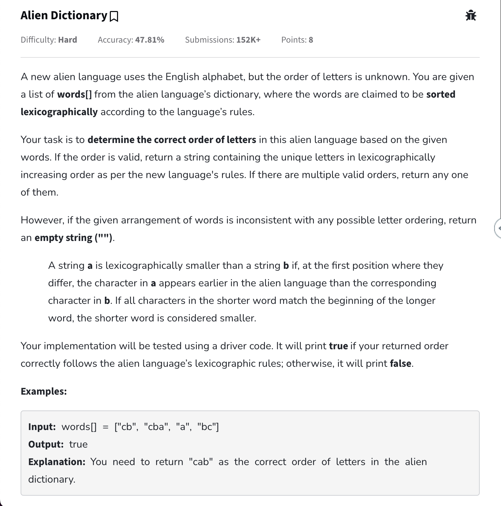

## Approach

- Pattern: Kahns Algo
- **Also see how to work with numbers and char in case of graph**

## Code

```cpp
class Solution {
    // Approach
    // This has dependencies on words in dictionary
    // ex. baa comes before abcd according to the dict in that case b comes
    // before a ( b -> a ) abcd comes before abca ( means d comes before a in
    // this dictionary d -> a ) what we need to find is this dictionaries order
    // basically want to find the sorted order for this can use topo sort to
    // find sorted order if we consider a as 0 b as 1 etc.
   private:
    vector<int> topoSort(vector<vector<int>>& adjList) {
        int n = adjList.size();

        vector<int> indegree(n, 0);
        vector<int> result;

        queue<int> q;
        for (int i = 0; i < n; i++) {
            for (int edge : adjList[i]) {
                indegree[edge]++;
            }
        }

        for(int i = 0; i < n; i++){
			if(indegree[i] == 0) q.push(i);
		}

        while (!q.empty()) {
            int node = q.front();
            q.pop();
            result.push_back(node);

            for (int neighbour : adjList[node]) {
                indegree[neighbour]--;
                if (indegree[neighbour] == 0) q.push(neighbour);
            }
        }

        return result;
    }

   public:
    string findOrder(string dict[], int N, int K) {
        string result = "";
        vector<vector<int>> adjList(K);

        for (int i = 0; i < N - 1; i++) {
            string s1 = dict[i];
            string s2 = dict[i + 1];

            int minLength = min(s1.size(), s2.size());

            for (int ptr = 0; ptr < minLength; ptr++) {
                if (s1[ptr] != s2[ptr]) {
                    // baa & abcd b not equal to a then a is dependent on b or b
                    // -> a also - 'a' to store as number only
                    adjList[s1[ptr] - 'a'].push_back(s2[ptr] - 'a');
                    break;  // in a dictionary only first letter matters
                }
            }
        }

        vector<int> topo = topoSort(adjList);

        // if(topo.size() != K) return "";

        for (int i = 0; i < topo.size(); i++) {
            result +=
                char(topo[i] +
                     'a');  // 0 + 'a' = 97 then converting ascii back to get a
        }

        return result;
    }
};
```

# Shortest path in DAG

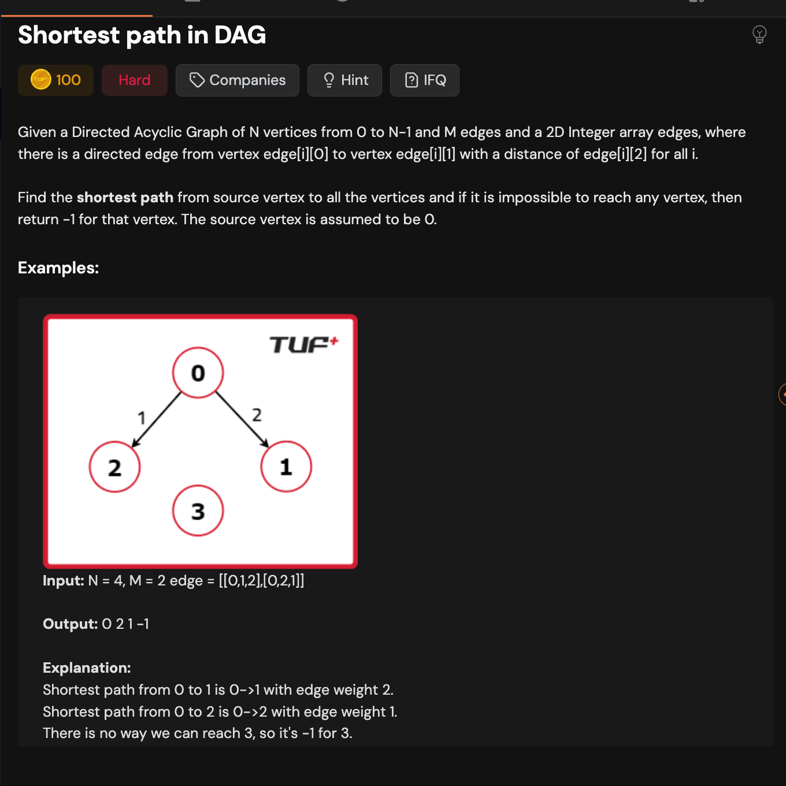

- Important how to define graphs with weight

## Code

```cpp
class Solution {
   private:
    void topoSort(int node, vector<vector<pair<int, int>>>& adj,
                  vector<bool>& vis, stack<int>& st) {
        // Mark the node as visited
        vis[node] = true;

        // Traverse all the neighbors
        for (auto it : adj[node]) {
            // Get the node
            int v = it.first;

            // If not visited, recursively perform DFS.
            if (!vis[v]) {
                topoSort(v, adj, vis, st);
            }
        }

        /* Add the current node to stack
        once all the nodes connected to it
        have been processed */
        st.push(node);
    }

    /*
    Approach
        ham isme shortest path nikal rahe using topo sort
        topo sort isliye kyuki agar kisi node ko process karte h toh all nodes jisse
        uss node tak pahuch sakte the voh already process ho chuke h unke distances
        what we basically do is for each node in topo sort check karte h ki agar
        is node se edge ka weight use karke neighbour pe jaae toh is it smaller than the path
        we already took before to reach that node ( or INT_MAX )
    */
   public:
    vector<int> shortestPath(int N, int M, vector<vector<int>>& edges) {
        vector<int> dist(N, 1e9);

        vector<vector<pair<int, int>>> adjList(N);
        // create adjList from given edges
        for (int i = 0; i < M; i++) {
            int u = edges[i][0];
            int v = edges[i][1];
            int wt = edges[i][2];

            adjList[u].push_back({v, wt});
        }

        // find topo sort using dfs
        // can also get through kahns as well
        stack<int> st;
        vector<bool> visited(N);

        for (int i = 0; i < N; i++) {
            if (!visited[i]) {
                topoSort(i, adjList, visited, st);
            }
        }

        dist[0] = 0;  // if starting from 0 then shortest distance for this will
                      // be 0 only
        while (!st.empty()) {
            int u = st.top();
            st.pop();

            for (auto& neighbour : adjList[u]) {
                int v = neighbour.first;
                int wt = neighbour.second;

                // known as relaxation process
                dist[v] = min(dist[v], dist[u] + wt);
            }
        }

        // answer demands we replace with -1 if not possible
        for (int i = 0; i < N; i++) {
            if (dist[i] == 1e9) dist[i] = -1;
        }

        return dist;
    }
};
```

# [Shortest Path in Undirected Graph with unit weight](https://www.geeksforgeeks.org/problems/shortest-path-in-undirected-graph-having-unit-distance/1?utm_source=youtube&utm_medium=collab_striver_ytdescription&utm_campaign=shortest-path-in-undirected-graph-having-unit-distance)

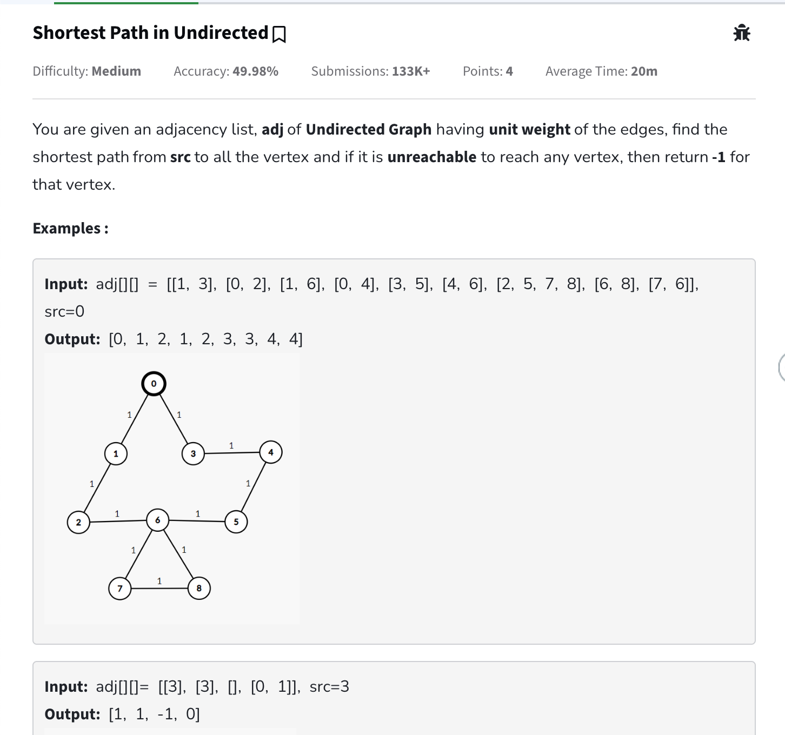

## Approach

- BFS algo does shortest path by default if graph is not directed.

## Code

```cpp
class Solution {
  public:
    // Function to find the shortest path from source to all other nodes
    vector<int> shortestPath(vector<vector<int>>& adj, int src) {
        // code here
        int n = adj.size();
        vector<int> dist(n, INT_MAX);
        queue<pair<int,int>> q; // stores node vs path length it took to reach here
        dist[src] = 0;

        q.push({src, 0});

        while(!q.empty()){
            pair<int, int> p = q.front();
            q.pop();

            int node = p.first;
            int pathLengthTillHere = p.second;

            // unit weight for a single path length
            for(int neighbour: adj[node]){
                if(pathLengthTillHere + 1 < dist[neighbour]) {
                    dist[neighbour] = 1 + pathLengthTillHere;
                    q.push({neighbour, 1 + pathLengthTillHere});
                }
            }
        }

        for(int i = 0; i < dist.size(); i++){
            if(dist[i] == INT_MAX) dist[i] = -1;
        }

        return dist;
    }
};
```

# [127. Word Ladder](https://leetcode.com/problems/word-ladder/description/)

A **transformation sequence** from word <code>beginWord</code> to word <code>endWord</code> using a dictionary <code>wordList</code> is a sequence of words <code>beginWord -> s<sub>1</sub> -> s<sub>2</sub> -> ... -> s<sub>k</sub></code> such that:

- Every adjacent pair of words differs by a single letter.
- Every <code>s<sub>i</sub></code> for <code>1 <= i <= k</code> is in <code>wordList</code>. Note that <code>beginWord</code> does not need to be in <code>wordList</code>.
- <code>s<sub>k</sub> == endWord</code>

Given two words, <code>beginWord</code> and <code>endWord</code>, and a dictionary <code>wordList</code>, return the **number of words** in the **shortest transformation sequence** from <code>beginWord</code> to <code>endWord</code>, or <code>0</code> if no such sequence exists.

**Example 1:**

```
Input: beginWord = "hit", endWord = "cog", wordList = ["hot","dot","dog","lot","log","cog"]
Output: 5
Explanation: One shortest transformation sequence is "hit" -> "hot" -> "dot" -> "dog" -> cog", which is 5 words long.
```

**Example 2:**

```
Input: beginWord = "hit", endWord = "cog", wordList = ["hot","dot","dog","lot","log"]
Output: 0
Explanation: The endWord "cog" is not in wordList, therefore there is no valid transformation sequence.
```

**Constraints:**

- <code>1 <= beginWord.length <= 10</code>
- <code>endWord.length == beginWord.length</code>
- <code>1 <= wordList.length <= 5000</code>
- <code>wordList[i].length == beginWord.length</code>
- <code>beginWord</code>, <code>endWord</code>, and <code>wordList[i]</code> consist of lowercase English letters.
- <code>beginWord != endWord</code>
- All the words in <code>wordList</code> are **unique** .

## Approach

- Pattern: BFS shortest path

## Code

```cpp
class Solution {
public:
    int ladderLength(string beginWord, string endWord, vector<string>& wordList) {
        int result = 0;

        queue<pair<string, int>> q; // stores word vs the level this word was formed on
        // ex. beginWord is at level 1 -> then after a single transformation it is at level 2
        unordered_set<string> wordMap;

        q.push({beginWord, 1});
        // create a map of all available words for O(1) access later
        for(string word: wordList){
            wordMap.insert(word);
        }

        while(!q.empty()){
            string currentWord = q.front().first;
            int level = q.front().second;

            q.pop();

            // if at any moment we reach the end word then return the level
            if(currentWord == endWord){
                return level;
            }

            // now for each charcter in this word we are doing a change and testing if it
            // exists in our allowed words or not
            // if it exists then again for that word check for all characters
            // also remove this word from set since can land again at this word through other transformations.
            for(int i = 0; i < currentWord.size(); i++){
                string testWord = currentWord;
                for(char c = 'a'; c <= 'z'; c++){
                    testWord[i] = c;
                    if(wordMap.find(testWord) != wordMap.end()){
                        q.push({testWord, level + 1});
                        wordMap.erase(testWord);
                    }
                }
            }
        }

        return result;
    }
};
```

# [126. Word Ladder II](https://www.geeksforgeeks.org/problems/word-ladder-ii/1)

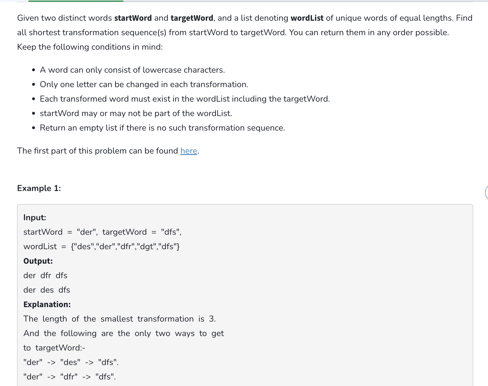

## Approach

- Pattern: BFS based shortest path
- T.C => O(M _ N _ 26) (N word list size, M average word length)

## Code

- This is not the most optimised solution for this ( not working on leetcode )

```cpp
/*
    in word ladder 1 we only needed to find the length of transformation but in this we
    need to find all so cant remove the word from wordlist just after single usage
    need to make sure that all similar length transformations have access to that word
    - basically means ki agar hit se hot fir usse lot and dot bana dia then koi aur chota path isse exist nahi karta jo ki hot banade firse jo can remove that word then
    and not at the first occurence
*/

class Solution {
public:
    vector<vector<string>> findLadders(string beginWord, string endWord, vector<string>& wordList) {
        vector<vector<string>> ans;

        unordered_set<string> wordMap;
        unordered_set<string> wordsUsedOnCurrentLevel; // stores all the words that have been used in transformations on the current level. These can be removed from the wordMap when the level has been processed

        queue<vector<string>> q; // stores transformation till that level

        for(string word: wordList){
            wordMap.insert(word); // create hashset for O(1) lookups later
        }

        q.push({beginWord});
        wordsUsedOnCurrentLevel.insert(beginWord);

        while(!q.empty()){
            int levelSize = q.size();
            // process all words of this level
            for(int i = 0; i < levelSize; i++){
                vector<string> sequence = q.front();
                q.pop();
                string lastWordOfSequence = sequence.back();

                // check for if equals last word
                if(lastWordOfSequence == endWord && ans.size() == 0){
                    ans.push_back(sequence);
                } else if(lastWordOfSequence == endWord && sequence.size() == ans.back().size()){
                    // checking since there can be a case where shortest path was found before and new paths that are bigger in size are formed. these can be ignored
                    ans.push_back(sequence);
                }
                // find all possible combinations
                for(int i = 0; i < lastWordOfSequence.size(); i++){
                    string original = lastWordOfSequence;
                    for(char ch = 'a'; ch <= 'z'; ch++){
                        lastWordOfSequence[i] = ch;
                        if(wordMap.find(lastWordOfSequence) != wordMap.end()){
                            sequence.push_back(lastWordOfSequence);
                            wordsUsedOnCurrentLevel.insert(lastWordOfSequence);
                            q.push(sequence);
                            sequence.pop_back(); // remove to let other sequences also take place ex. hit -> hot can go either to dot and also to lot
                        }
                    }
                    lastWordOfSequence = original;
                }
            }

            // when the level has been processed all shortest possible till that word have been found
            // can remove all used on this level from wordMap

            for(string word: wordsUsedOnCurrentLevel) wordMap.erase(word);

            wordsUsedOnCurrentLevel.clear();
        }

        return ans;
    }
};
```

# [Dijkstra Algorithm](https://www.geeksforgeeks.org/problems/implementing-dijkstra-set-1-adjacency-matrix/1)

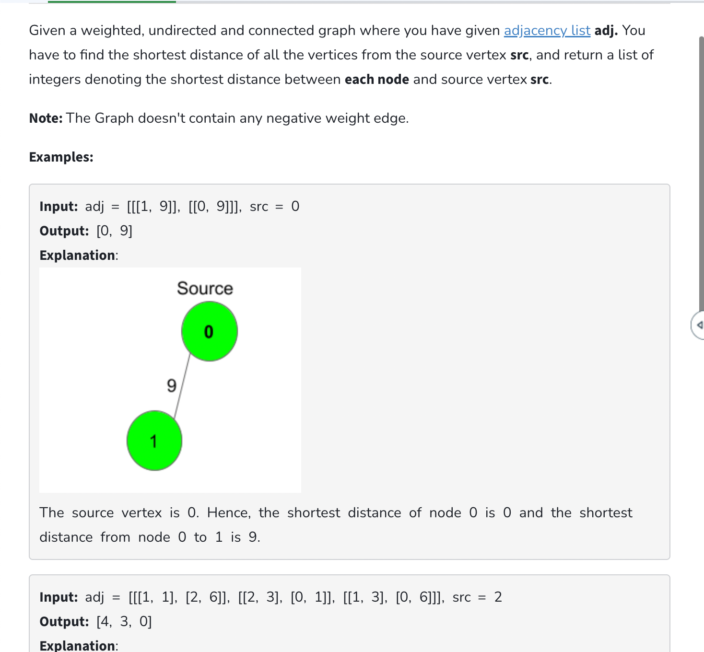

## Approach

- Very similar to finding shortest path in undirected weighted graph but using min heap instead(isliye jisse ki hamesha sabse shortest path vaala distance hi pehle pick ho saving from unnecessary calculations) ( ek chote raste se hi aur chota rasta milege but agar bada pehle process karlia toh baad mein jakar chota mile increasing tc)
- Will never work for graphs with negative weight ( or shortest path ( if we are going somewhere we need to give something positive )) ( if we try with negative weights will keep on running as new calculated distance will always be less than previous )
- T.C for pq => O(V + E) \* O(logV) ( standard bfs + v vertices will be inserted to pq )
- Can also use set for storing ( the t.c will be same and may reduce some future iterations )
- **Useful only when graph edges have weights if unit weight edges then normal bfs will work in case of shortest path**

## Code

### Using min heap

```cpp
class Solution {
  public:
    // Function to find the shortest distance of all the vertices
    // from the source vertex src.
    vector<int> dijkstra(vector<vector<pair<int, int>>> &adj, int src) {
        int n = adj.size();

        vector<int> distance(n, INT_MAX);
        priority_queue<pair<int,int>, vector<pair<int,int>>, greater<pair<int,int>>> pq; // create min heap
        // will store distance vs node
        pq.push({0, src}); // src node will have 0 distance
        distance[src] = 0;

        while(!pq.empty()){
            int distanceTillHere = pq.top().first;
            int node = pq.top().second;

            pq.pop();

            for(auto it: adj[node]){
                int adjacentNode = it.first;
                int edgeWeight = it.second;

                // update if new distance is less
                if(distanceTillHere + edgeWeight < distance[adjacentNode]){
                    distance[adjacentNode] = distanceTillHere + edgeWeight;
                    // push so that this shortest path can be further explored
                    pq.push({distanceTillHere + edgeWeight, adjacentNode});
                }
            }
        }

        return distance;
    }
};
```

# [Print Shortest Path in Weighted Undirected Graph](https://www.geeksforgeeks.org/problems/shortest-path-in-weighted-undirected-graph/1)

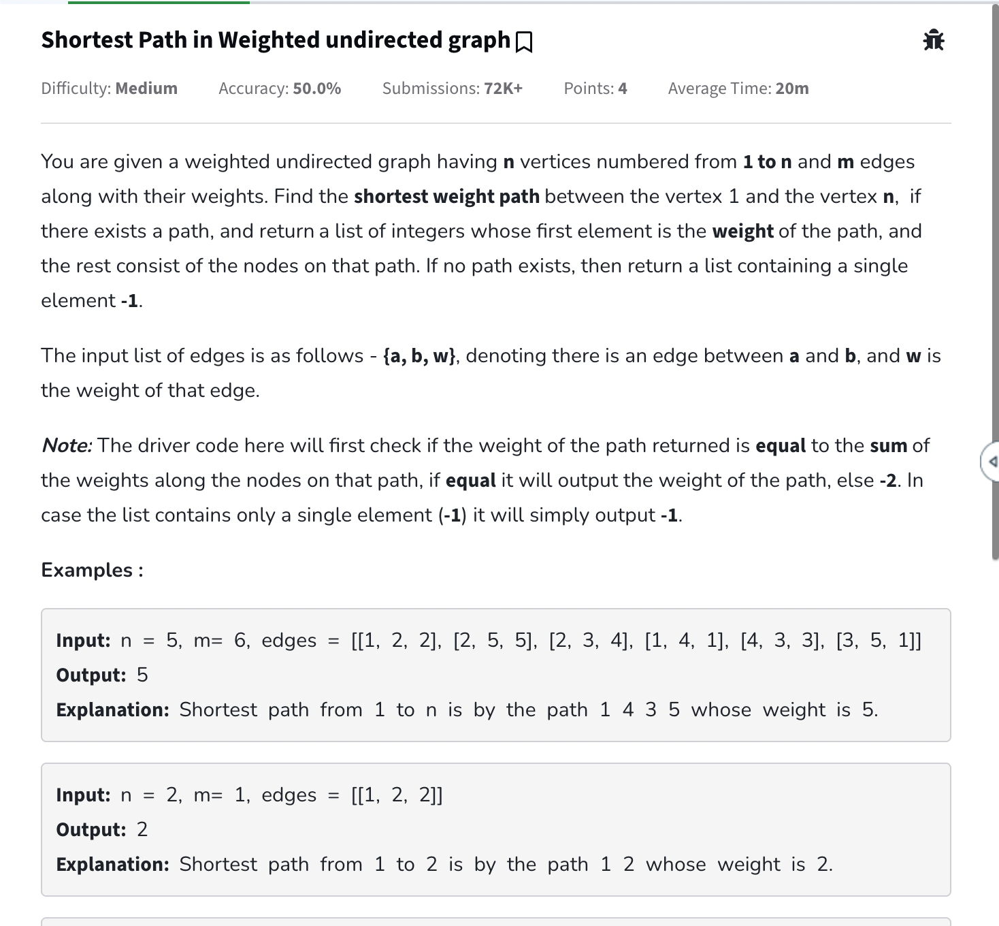

## Approach

- Can use dijkstra to find shortest path weight but also need to return the path.
- We can create a parent array for each node which will store from where this node got its distance. Then for the n node create path by backtracking to parent nodes till we dont reach initial node.
- T.C => O(V + E)(log V) ( dijkstra ki hi h yeh )

### Code

```cpp
#define pii pair<int,int>

class Solution {
  public:
    vector<int> shortestPath(int n, int m, vector<vector<int>>& edges) {
        vector<vector<pii>> adjList(n + 1);
        for(int i = 0; i < m; i++){
            vector<int> edge = edges[i];
            int u = edge[0];
            int v = edge[1];
            int wt = edge[2];

            adjList[u].push_back({v, wt});
            adjList[v].push_back({u, wt});
        }

        vector<int> result;

        priority_queue<pii,vector<pii>, greater<pii>> pq;
        vector<int> distance(n + 1, 1e9);
        vector<int> parent(n + 1);

        // update values to store self as parent
        for(int i = 1; i <= n; i++){
            parent[i] = i;
        }

        distance[1] = 0;
        pq.push({0, 1}); // stores distance vs node

        while(!pq.empty()){
            int distanceTillHere = pq.top().first;
            int node = pq.top().second;

            pq.pop();
            for(auto it: adjList[node]){
                int adjacentNode = it.first;
                int edgeWeight = it.second;

                if(edgeWeight + distanceTillHere < distance[adjacentNode]){
                    distance[adjacentNode] = edgeWeight + distanceTillHere;
                    pq.push({distance[adjacentNode], adjacentNode});
                    parent[adjacentNode] = node;
                }
            }
        }

        if(distance[n] == 1e9) return {-1}; // not able to reach this node

        result.push_back(distance[n]); // push weight at start of the result

        stack<int> st;
        int node = n;

        while(parent[node] != node){
            st.push(node);
            node = parent[node];
        }

        st.push(1);

        while(!st.empty()){
            result.push_back(st.top());
            st.pop();
        }

        return result;
    }
};
```

# [1091. Shortest Path in Binary Matrix](https://leetcode.com/problems/shortest-path-in-binary-matrix/description/)

Given an <code>n x n</code> binary matrix <code>grid</code>, return the length of the shortest **clear path** in the matrix. If there is no clear path, return <code>-1</code>.

A **clear path** in a binary matrix is a path from the **top-left** cell (i.e., <code>(0, 0)</code>) to the **bottom-right** cell (i.e., <code>(n - 1, n - 1)</code>) such that:

- All the visited cells of the path are <code>0</code>.
- All the adjacent cells of the path are **8-directionally** connected (i.e., they are different and they share an edge or a corner).

The **length of a clear path** is the number of visited cells of this path.

**Example 1:**


```
Input: grid = [[0,1],[1,0]]
Output: 2
```

**Example 2:**


```
Input: grid = [[0,0,0],[1,1,0],[1,1,0]]
Output: 4
```

**Example 3:**

```
Input: grid = [[1,0,0],[1,1,0],[1,1,0]]
Output: -1
```

**Constraints:**

- <code>n == grid.length</code>
- <code>n == grid[i].length</code>
- <code>1 <= n <= 100</code>
- <code>grid[i][j] is 0 or 1</code>

## Approach

- Pattern: Shortest Path
- No need for pq since weights are of unit weight normal queue bfs will work

## Code

```cpp
/*
    Can use normal queue in this since the weights are unit
*/
class Solution {
public:
    int shortestPathBinaryMatrix(vector<vector<int>>& grid) {
        if(grid[0][0] != 0) return -1; // if initial is not 0 then cant reach end

        int n = grid.size();

        queue<pair<int, pair<int, int>>> q; // stores distance taken till this vs (row, col)

        vector<vector<int>> distance(n, vector<int>(n, INT_MAX));

        q.push({1, {0, 0}}); // distance to reach {0,0} is 1
        distance[0][0] = 1;

        vector<pair<int, int>> directions = {{0, 1}, {0, -1}, {1, 0}, {-1, 0}, {1, 1}, {-1, -1}, {1, -1}, {-1, 1}}; // can go in eight directions

        while(!q.empty()){
            auto config = q.front();
            q.pop();

            int distanceTillHere = config.first;
            int row = config.second.first;
            int col = config.second.second;

            if(row == n - 1 && col == n - 1){
                return distanceTillHere; // the first occurence of this in bfs will be the shortest only
            }

            for(auto& [dy, dx]: directions){
                int newRow = row + dy;
                int newCol = col + dx;

                // agar valid config h and this is a shorter path
                if(newRow < n && newRow >= 0 && newCol < n && newCol >= 0 && grid[newRow][newCol] == 0 && distanceTillHere + 1 < distance[newRow][newCol]){
                    distance[newRow][newCol] = distanceTillHere + 1;
                    q.push({distanceTillHere + 1, {newRow, newCol}});
                }
            }
        }

        return -1;
    }
};
```

# [1631. Path With Minimum Effort](https://leetcode.com/problems/path-with-minimum-effort/description/)

You are a hiker preparing for an upcoming hike. You are given <code>heights</code>, a 2D array of size <code>rows x columns</code>, where <code>heights[row][col]</code> represents the height of cell <code>(row, col)</code>. You are situated in the top-left cell, <code>(0, 0)</code>, and you hope to travel to the bottom-right cell, <code>(rows-1, columns-1)</code> (i.e.,**0-indexed** ). You can move **up** , **down** , **left** , or **right** , and you wish to find a route that requires the minimum **effort** .

A route's **effort** is the **maximum absolute difference** \*\* \*\* in heights between two consecutive cells of the route.

Return the minimum **effort** required to travel from the top-left cell to the bottom-right cell.

**Example 1:**


```
Input: heights = [[1,2,2],[3,8,2],[5,3,5]]
Output: 2
Explanation: The route of [1,3,5,3,5] has a maximum absolute difference of 2 in consecutive cells.
This is better than the route of [1,2,2,2,5], where the maximum absolute difference is 3.
```

**Example 2:**


```
Input: heights = [[1,2,3],[3,8,4],[5,3,5]]
Output: 1
Explanation: The route of [1,2,3,4,5] has a maximum absolute difference of 1 in consecutive cells, which is better than route [1,3,5,3,5].
```

**Example 3:**


```
Input: heights = [[1,2,1,1,1],[1,2,1,2,1],[1,2,1,2,1],[1,2,1,2,1],[1,1,1,2,1]]
Output: 0
Explanation: This route does not require any effort.
```

**Constraints:**

- <code>rows == heights.length</code>
- <code>columns == heights[i].length</code>
- <code>1 <= rows, columns <= 100</code>
- <code>1 <= heights[i][j] <= 10^6</code>

## Approach

- Pattern: Application of Dijkstra for shortest path
- T.C => O(N _ M _ log(N\*M))
- S.C => O(N \* M)

## Code

```cpp
#define P pair<int, pair<int, int>>

class Solution {
public:
    int minimumEffortPath(vector<vector<int>>& heights) {
        int rows = heights.size();
        int cols = heights[0].size();

        priority_queue<P, vector<P>, greater<P>> pq; // min heap stores distance vs {row, col}

        vector<vector<int>> distance(rows, vector<int>(cols, INT_MAX));
        distance[0][0] = 0;
        pq.push({0, {0, 0}});

        vector<pair<int, int>> directions = {{0, 1}, {0, -1}, {1, 0}, {-1, 0}};

        while(!pq.empty()){
            auto config = pq.top();
            pq.pop();

            int minEffortTillHere = config.first;
            int row = config.second.first;
            int col = config.second.second;

            if(row == rows - 1 && col == cols - 1){
                return minEffortTillHere;
            }

            for(auto& [dy, dx]: directions){
                int newRow = row + dy;
                int newCol = col + dx;

                // store maximum of effort till here or if new can be more than that
                int newEffort = max(abs(heights[row][col] - heights[newRow][newCol]), minEffortTillHere);

                if(newRow < rows && newRow >= 0 && newCol < cols && newCol >= 0 && newEffort < distance[newRow][newCol]){
                    distance[newRow][newCol] = newEffort;
                    pq.push({distance[newRow][newCol], {newRow, newCol}});
                }
            }
        }

        return -1;
    }
};
```

# [787. Cheapest Flights Within K Stops](https://leetcode.com/problems/cheapest-flights-within-k-stops/description/?source=submission-noac)

There are <code>n</code> cities connected by some number of flights. You are given an array <code>flights</code> where <code>flights[i] = [from<sub>i</sub>, to<sub>i</sub>, price<sub>i</sub>]</code> indicates that there is a flight from city <code>from<sub>i</sub></code> to city <code>to<sub>i</sub></code> with cost <code>price<sub>i</sub></code>.

You are also given three integers <code>src</code>, <code>dst</code>, and <code>k</code>, return **the cheapest price** from <code>src</code> to <code>dst</code> with at most <code>k</code> stops. If there is no such route, return <code>-1</code>.

**Example 1:**


```
Input: n = 4, flights = [[0,1,100],[1,2,100],[2,0,100],[1,3,600],[2,3,200]], src = 0, dst = 3, k = 1
Output: 700
Explanation:
The graph is shown above.
The optimal path with at most 1 stop from city 0 to 3 is marked in red and has cost 100 + 600 = 700.
Note that the path through cities [0,1,2,3] is cheaper but is invalid because it uses 2 stops.
```

**Example 2:**


```
Input: n = 3, flights = [[0,1,100],[1,2,100],[0,2,500]], src = 0, dst = 2, k = 1
Output: 200
Explanation:
The graph is shown above.
The optimal path with at most 1 stop from city 0 to 2 is marked in red and has cost 100 + 100 = 200.
```

**Example 3:**


```
Input: n = 3, flights = [[0,1,100],[1,2,100],[0,2,500]], src = 0, dst = 2, k = 0
Output: 500
Explanation:
The graph is shown above.
The optimal path with no stops from city 0 to 2 is marked in red and has cost 500.
```

**Constraints:**

- <code>1 <= n <= 100</code>
- <code>0 <= flights.length <= (n \* (n - 1) / 2)</code>
- <code>flights[i].length == 3</code>
- <code>0 <= from<sub>i</sub>, to<sub>i</sub> < n</code>
- <code>from<sub>i</sub> != to<sub>i</sub></code>
- <code>1 <= price<sub>i</sub> <= 10^4</code>
- There will not be any multiple flights between two cities.
- <code>0 <= src, dst, k < n</code>
- <code>src != dst</code>

## Approach

- Pattern: Dijkstra
- T.C => O(V + E) \* logV

## Code

```cpp
// if we just work on the basis of cost then there can be paths such that which may be cheaper in cost but the total steps may be larger to reach there
// so basically always work on the path with the lowest steps and if a new path is possible from this which has lowerCost and is within our limits then use it
#define pii pair<int, pair<int, int>>
class Solution {
public:
    int findCheapestPrice(int n, vector<vector<int>>& flights, int src, int dst, int k) {
        vector<vector<pair<int, int>>> adjList(n);
        for(auto& edge: flights){
            int u = edge[0];
            int v = edge[1];
            int wt = edge[2];
            adjList[u].push_back({v, wt});
        }

        vector<int> minCost(n, INT_MAX);
        priority_queue<pii, vector<pii>, greater<pii>> pq; // stops vs (node, cost)

        minCost[src] = 0;
        pq.push({0, {src, 0}});

        while(!pq.empty()){
            auto config = pq.top();
            pq.pop();

            int stops = config.first;
            int node = config.second.first;
            int cost = config.second.second;

            if(stops > k) continue; // skip this path say k was 2 then when it is processed finally we added it as 3 stops so can discard this now. Also min cost will be updated before so it works

            for(auto it: adjList[node]){
                int adjacentNode = it.first;
                int edgeWeight = it.second;

                if(cost + edgeWeight < minCost[adjacentNode] && stops <= k){
                    minCost[adjacentNode] = cost + edgeWeight;
                    pq.push({stops + 1, {adjacentNode, minCost[adjacentNode]}});
                }
            }
        }

        return minCost[dst] != INT_MAX ? minCost[dst] : -1;
    }
};
```

# [Minimum Multiplications to reach end](https://www.geeksforgeeks.org/problems/minimum-multiplications-to-reach-end/0)

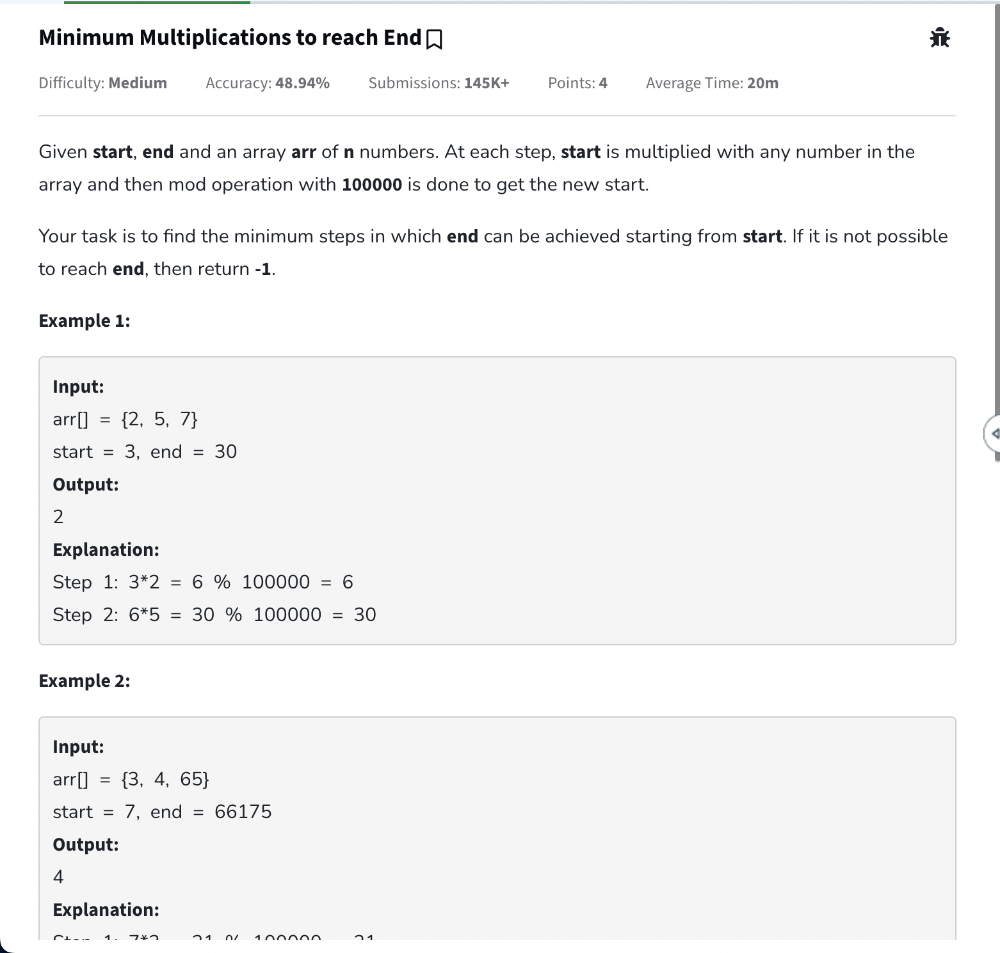

## Approach

- Pattern: Shortest path application
- T.C => O(100000 \* N ( length of array )) ( this is the max queue operations that can be done )
- S.C => O(100000 \* N)

## Code

```cpp
class Solution {
  public:
    int minimumMultiplications(vector<int>& arr, int start, int end) {
        if(start == end) return 0;
        int mod = 1e5;
        queue<pair<int, int>> q;
        vector<int> minSteps(mod, INT_MAX);

        minSteps[start] = 0;
        q.push({start, 0}); // node vs steps taken

        while(!q.empty()){
            int node = q.front().first;
            int stepsTillThisNode = q.front().second;
            q.pop();

            if(node == end) return stepsTillThisNode;

            for(int i = 0; i < arr.size(); i++){
                int newNode = (arr[i] * node) % mod;

                // think of it like a graph with unit weight
                // similar to finding shortest path in undirected graph with unit weigtht edges
                if(stepsTillThisNode + 1 < minSteps[newNode]) {
                    minSteps[newNode] = stepsTillThisNode + 1;
                    q.push({newNode, stepsTillThisNode + 1});
                }
            }
        }

        return -1;
    }
};
```

# [1976. Number of Ways to Arrive at Destination](https://leetcode.com/problems/number-of-ways-to-arrive-at-destination/description/)

You are in a city that consists of <code>n</code> intersections numbered from <code>0</code> to <code>n - 1</code> with **bi-directional** roads between some intersections. The inputs are generated such that you can reach any intersection from any other intersection and that there is at most one road between any two intersections.

You are given an integer <code>n</code> and a 2D integer array <code>roads</code> where <code>roads[i] = [u<sub>i</sub>, v<sub>i</sub>, time<sub>i</sub>]</code> means that there is a road between intersections <code>u<sub>i</sub></code> and <code>v<sub>i</sub></code> that takes <code>time<sub>i</sub></code> minutes to travel. You want to know in how many ways you can travel from intersection <code>0</code> to intersection <code>n - 1</code> in the **shortest amount of time** .

Return the **number of ways** you can arrive at your destination in the **shortest amount of time** . Since the answer may be large, return it **modulo** <code>10^9 + 7</code>.

**Example 1:**


```
Input: n = 7, roads = [[0,6,7],[0,1,2],[1,2,3],[1,3,3],[6,3,3],[3,5,1],[6,5,1],[2,5,1],[0,4,5],[4,6,2]]
Output: 4
Explanation: The shortest amount of time it takes to go from intersection 0 to intersection 6 is 7 minutes.
The four ways to get there in 7 minutes are:
- 0 ➝ 6
- 0 ➝ 4 ➝ 6
- 0 ➝ 1 ➝ 2 ➝ 5 ➝ 6
- 0 ➝ 1 ➝ 3 ➝ 5 ➝ 6
```

**Example 2:**

```
Input: n = 2, roads = [[1,0,10]]
Output: 1
Explanation: There is only one way to go from intersection 0 to intersection 1, and it takes 10 minutes.
```

**Constraints:**

- <code>1 <= n <= 200</code>
- <code>n - 1 <= roads.length <= n \* (n - 1) / 2</code>
- <code>roads[i].length == 3</code>
- <code>0 <= u<sub>i</sub>, v<sub>i</sub> <= n - 1</code>
- <code>1 <= time<sub>i</sub> <= 10^9</code>
- <code>u<sub>i </sub>!= v<sub>i</sub></code>
- There is at most one road connecting any two intersections.
- You can reach any intersection from any other intersection.

## Approach

- Pattern: Dijkstra
- Leetcode has way to difficult constraints

## Code

```cpp
#define PII pair<int, int>
#define PLI pair<long long, int>
class Solution {
public:
    int countPaths(int n, vector<vector<int>>& roads) {
        vector<vector<PII>> adjList(n);
        vector<long long> distance(n, LLONG_MAX); // constraints for question are out of bounds
        vector<int> ways(n, 0); // stores number of times we reach this node in
        // case of shortest path passes through this node
        priority_queue<PLI, vector<PLI>, greater<PLI>> pq;
        int mod = 1e9 + 7;

        for(auto& road: roads){
            int u = road[0];
            int v = road[1];
            int wt = road[2];

            adjList[u].push_back({v, wt});
            adjList[v].push_back({u, wt});
        }

        distance[0] = 0;
        ways[0] = 1; // only 1 way possible for source node
        pq.push({0, 0}); // distance vs node

        while(!pq.empty()){
            long long distanceTillHere = pq.top().first;
            int node = pq.top().second;
            pq.pop();

            for(auto it: adjList[node]){
                int adjNode = it.first;
                int edgeWeight = it.second;

                if(distanceTillHere + edgeWeight < distance[adjNode]){
                    distance[adjNode] = distanceTillHere + edgeWeight;
                    pq.push({distance[adjNode], adjNode});
                    // initially this will be the number of ways or whenever we find the shortest path
                    ways[adjNode] = ways[node];
                }
                // already discovered shortest distance before just add to existing wasy
                else if(distanceTillHere + edgeWeight == distance[adjNode]){
                    ways[adjNode] = (ways[adjNode] % mod) + (ways[node] % mod); // prevent overflow ( a + b ) % mod = a % mod + b % mod
                }
            }
        }

        return ways[n - 1] % mod;
    }
};
```

# [Bellman Ford](https://www.geeksforgeeks.org/problems/distance-from-the-source-bellman-ford-algorithm/1)

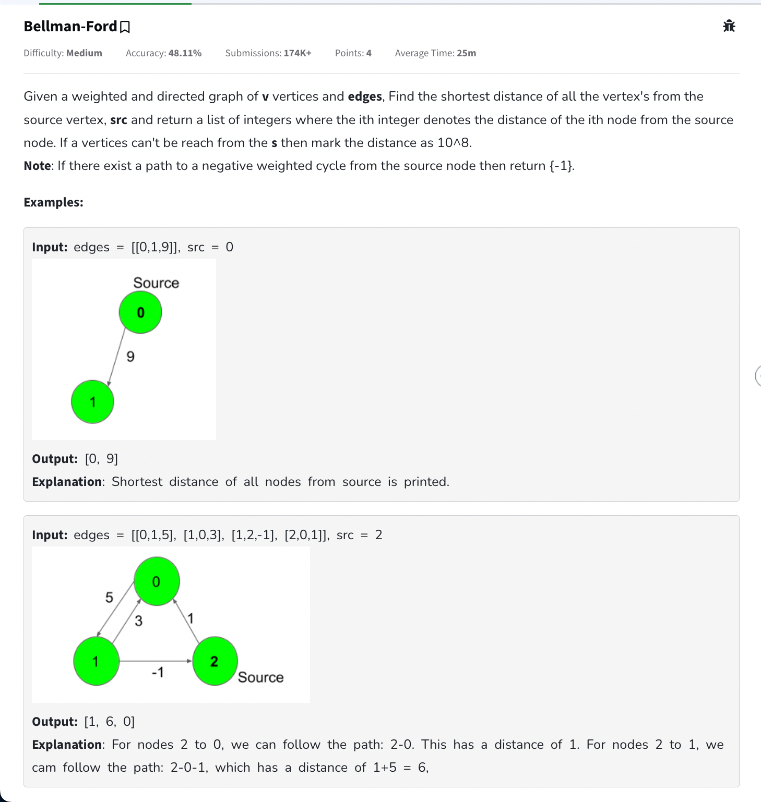

- Bellman ford is used to find shortest path similar to dijkstra but works for a graph with negative weights as well. Complexity is higher as compared to Dijkstra (V \* E)
- Can also be used to find if a negative cycle exists in a graph( any cycle that sums negative )
- Mostly asked as follow up to a dijkstra question ( as what if there are negative cycles )

## Code

```cpp
class Solution {
  public:
    vector<int> bellmanFord(int V, vector<vector<int>>& edges, int src) {
        vector<int> distance(V, 1e8);
        distance[src] = 0;

        // V - 1 times for all edges do relaxation
        for(int i = 0; i < V - 1; i++){
            for(auto& edge: edges){
                int u = edge[0];
                int v = edge[1];
                int wt = edge[2];

                // relaxation process for all edges
                if(distance[u] != 1e8 && distance[u] + wt < distance[v]){
                    distance[v] = distance[u] + wt;
                }
            }
        }

        // if all edges are relaxed then the below will not work
        // but if after v - 1 iterations we can still relax then that means
        // there is a negative cycle
        // 1 final iteration
        for(auto& edge: edges){
            int u = edge[0];
            int v = edge[1];
            int wt = edge[2];

            if(distance[u] != 1e8 && distance[u] + wt < distance[v]){
                return {-1}; // there exists a node that can be visited but after
                // v - 1 relaxations it still has negative dist ( negative cycle exists )
            }
        }

        return distance;
    }
};
```

# [Floyd Warshall](https://www.geeksforgeeks.org/problems/implementing-floyd-warshall2042/1)

- The problem is to find the shortest distances between for every vertex to every vertex in a grid.
- Very brute force approach basically calculate for each node then min cost it is going to take if for every i, j pair we try going through this node.
  - Checking what is min going from i -> j directly or going from i -> via -> j.
- O(N^3) only valid in case N < 100.

## Code

```cpp
void shortestDistance(vector<vector<int>>& mat) {
        int n = mat.size();
        for(int i = 0; i < n; i++){
            for(int j = 0; j < n; j++){
                if(mat[i][j] == -1) mat[i][j] = INT_MAX;
            }
        }
        // mat[i][j] => cost from going from i to j ( adj matrix representation )
        for(int via = 0; via < n; via++){
            for(int i = 0; i < n; i++){
                for(int j = 0; j < n; j++){
                    if(dist[i][via] == INT_MAX || dist[via][j] == INT_MAX) continue; // no need to check for this
                    // try checking whether it is beneficial to go
                    // from i to j directly or go from i -> via -> j
                    mat[i][j] = min(mat[i][j], mat[i][via] + mat[via][j]);
                }
            }
        }

        for(int i = 0; i < n; i++){
            for(int j = 0; j < n; j++){
                if(mat[i][j] == INT_MAX) mat[i][j] = -1;
            }
        }
    }
```

# [1334. Find the City With the Smallest Number of Neighbors at a Threshold Distance](https://leetcode.com/problems/find-the-city-with-the-smallest-number-of-neighbors-at-a-threshold-distance/description/)

There are <code>n</code> cities numbered from <code>0</code> to <code>n-1</code>. Given the array <code>edges</code> where <code>edges[i] = [from<sub>i</sub>, to<sub>i</sub>, weight<sub>i</sub>]</code> represents a bidirectional and weighted edge between cities <code>from<sub>i</sub></code> and <code>to<sub>i</sub></code>, and given the integer <code>distanceThreshold</code>.

Return the city with the smallest number of cities that are reachable through some path and whose distance is **at most** <code>distanceThreshold</code>, If there are multiple such cities, return the city with the greatest number.

Notice that the distance of a path connecting cities **i** and **j** is equal to the sum of the edges' weights along that path.

**Example 1:**


```
Input: n = 4, edges = [[0,1,3],[1,2,1],[1,3,4],[2,3,1]], distanceThreshold = 4
Output: 3
Explanation: The figure above describes the graph.
The neighboring cities at a distanceThreshold = 4 for each city are:
City 0 -> [City 1, City 2]
City 1 -> [City 0, City 2, City 3]
City 2 -> [City 0, City 1, City 3]
City 3 -> [City 1, City 2]
Cities 0 and 3 have 2 neighboring cities at a distanceThreshold = 4, but we have to return city 3 since it has the greatest number.
```

**Example 2:**


```
Input: n = 5, edges = [[0,1,2],[0,4,8],[1,2,3],[1,4,2],[2,3,1],[3,4,1]], distanceThreshold = 2
Output: 0
Explanation: The figure above describes the graph.
The neighboring cities at a distanceThreshold = 2 for each city are:
City 0 -> [City 1]
City 1 -> [City 0, City 4]
City 2 -> [City 3, City 4]
City 3 -> [City 2, City 4]
City 4 -> [City 1, City 2, City 3]
The city 0 has 1 neighboring city at a distanceThreshold = 2.
```

**Constraints:**

- <code>2 <= n <= 100</code>
- <code>1 <= edges.length <= n \* (n - 1) / 2</code>
- <code>edges[i].length == 3</code>
- <code>0 <= from<sub>i</sub> < to<sub>i</sub> < n</code>
- <code>1 <= weight<sub>i</sub>,distanceThreshold <= 10^4</code>
- All pairs <code>(from<sub>i</sub>, to<sub>i</sub>)</code> are distinct.

## Approach

- Pattern: Floyd warshall application
- T.C: O(N^3) from floyd warshall

## Code

```cpp
class Solution {
public:
    int findTheCity(int n, vector<vector<int>>& edges, int distanceThreshold) {
        vector<vector<int>> distance(n, vector<int>(n, INT_MAX));
        int maxCityCount = n;
        int cityNumber = -1;

        for(auto& edge: edges){
            distance[edge[0]][edge[1]] = edge[2];
            distance[edge[1]][edge[0]] = edge[2]; // undirected graph
        }

        for(int i = 0; i < n; i++) distance[i][i] = 0; // distance from i -> i

        // floyd warshall algorithm
        for(int k = 0; k < n; k++){
            for(int i = 0; i < n; i++){
                for(int j = 0; j < n; j++){
                    if(distance[i][k] == INT_MAX || distance[k][j] == INT_MAX) continue;
                    distance[i][j] = min(distance[i][j], distance[i][k] + distance[k][j]);
                }
            }
        }

        // har city ke adjacent cities ka count if they are less then distance threshold
        // also need to return the larger city number so will check till last
        for(int city = 0; city < n; city++){
            int cityCount = 0;
            for(int adjCity = 0; adjCity < n; adjCity++){
                if(distance[city][adjCity] <= distanceThreshold) cityCount++;
            }
            // if found any city which is less than max amount of cities found till now then that is answer
            if(cityCount <= maxCityCount){
                maxCityCount = cityCount;
                cityNumber = city;
            }
        }

        return cityNumber;
    }
};
```

# Disjoint Set Union(DSU)

- A disjoint set is basically a data structure that helps us in finding if two things belong to the same set/ component or not.
- Mostly used in dynamic graphs ( the edges keep on changing/ or in between graph formation we need to know if two belong to the same component or not )

## Code

### Using Rank, Size & Path Compression

- We maintain 2 arrays in this one is a parent array and other is a rank array( means height initially 0 but if 2 gets connected to 0 then 2's rank will be 1) ( 2 is parent of 0 ). Can also be thought of as the height of the subtree but when path compression ( see below ) is done rank is not changed so think of it as rank only.
- Algo for Rank
  - Find ultimate parent of u & v
  - If ranks are same then u -> v and v -> u.
  - Otherwise always connect lower rank one to higher rank and increase higher elements rank by 1 and also change parent of lower rank.
  - Find pu and pv. Then find rpu and rpv
- Path compression: Nothing just finding ultimate parent once and then assigning it in parent array. Our logic works on rank. So next call to find will not be more than 1.
- Algo for size
  - Same as rank but now store the size of tree. And attach shorter tree size to larger tree and give smaller tree size to larger tree.

```cpp
class DisjointSet {
vector<int> rank;
vector<int> parent;
vector<int> size;

private:
    int findUltimateParent(int node){
        if(node == parent[node]) return node;

        parent[node] = findUltimateParent(parent[node]); // apna ultimate parent
        // dhund ke laa aur in return assign it as well to do path compresssion
        return parent[node];
    }

public:
    DisjointSet(int n) {
        rank.resize(n + 1, 0); // ranks are 0 by default
        parent.resize(n + 1);
        size.resize(n + 1, 1); // size are 1 by default

        for(int i = 0; i <= n; i++){
            parent[i] = i; // each one is there own parent initially
        }
    }

    bool find(int u, int v) {
        return findUltimateParent(u) == findUltimateParent(v);
    }

    void unionByRank(int u, int v) {
        int upu = findUltimateParent(u);
        int upv = findUltimateParent(v);

        // always attach smaller rank parent to bigger rank parent
        if(rank[upu] < rank[upv]){
            parent[upu] = upv; // choti rank ka parent update kardia
            // no need to update rank in this case since rank already badi hogi bade vaale ki
            // ex. 1 - 2 and 3 - 4 - 5 - 6 if we do union (1, 3) then rank of 1 is 1 and of 3 is 3
            // if we end up attaching rank will remain same of new parent 3
        } else if(rank[upu] > rank[upv]){
            parent[upv] = upu;
        } else {
            // can do any way
            parent[upv] = upu; // v ka parent u
            // icrease rank of u
            rank[upu]++;
        }
    }

    void unionBySize(int u, int v) {
        int upu = findUltimateParent(u);
        int upv = findUltimateParent(v);

        if(size[upu] < size[upv]){
            parent[upu] = upv;
            size[upv] += size[upu];
        } else if(size[upv] <= size[upu]){ // increasing size in both
        // so no need to have separete equal case
            parent[upv] = upu;
            size[upu] += size[upv];
        }
    }
}
```

# [Find Minimum Spanning Tree Weight](https://www.geeksforgeeks.org/problems/minimum-spanning-tree/1)

## Spanning Tree

- Only for a weighted undirected graph. In a directed graph we cant be sure that all the nodes can be reached.
- Any sub graph of a graph that has n nodes and n - 1 edges and from each node we can reach the other nodes then it is a spanning tree of the graph.
- for the given graph
  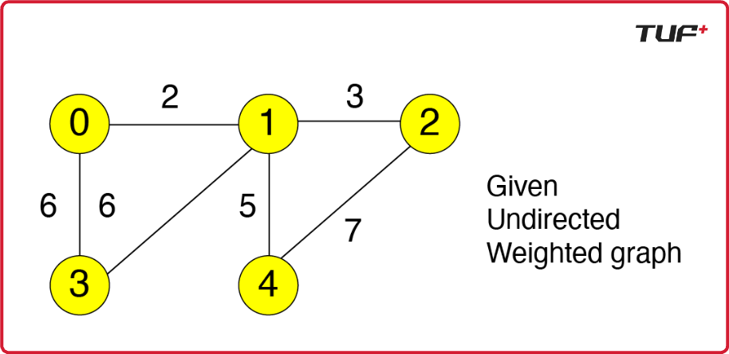

- The below can be spanning trees
  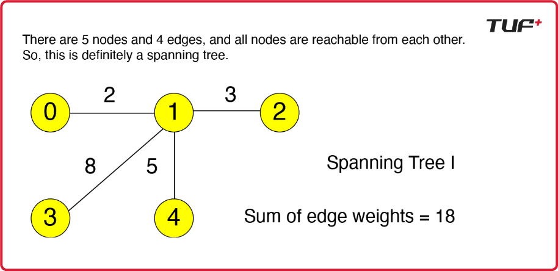
  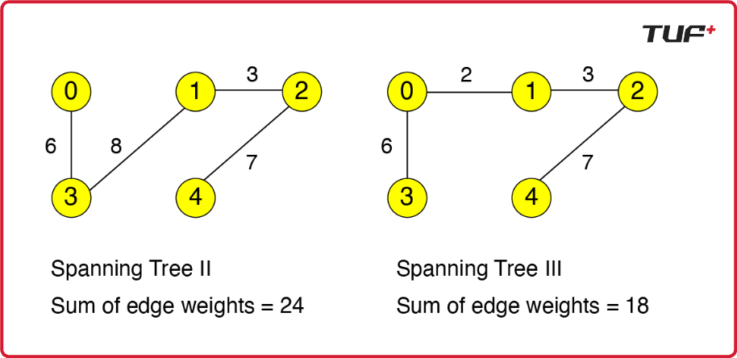

## MST

- Out of all the spanning trees the tree with the minimum path weight sum will be the mst.
- 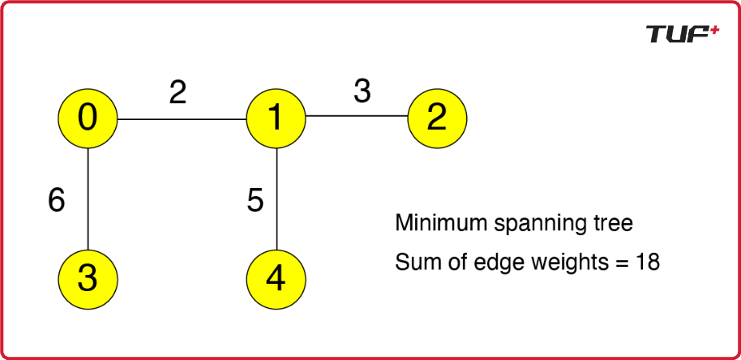
- there can be multiple spanning trees as well.

- Q. Find sum of the edge weights of the mst in graph.

## Using Prims Algorithm

- Greedily keep on expanding mst by adding the edge with most minimum weight.
- T.C => O(E log E) ( will run for edges time )

```cpp
#define P pair<int, pair<int,int>>
class Solution {
  public:
    // Function to find sum of weights of edges of the Minimum Spanning Tree.
    int spanningTree(int V, vector<vector<int>> adj[]) {
        priority_queue<P, vector<P>, greater<P>> pq; // define min heap
        // stores {wt, node, parent}

        vector<pair<int, int>> mst; // stores edges used by the mst
        vector<bool> visited(V, false);
        pq.push({0, {0, -1}}); // if parent is -1 then not part of mst

        int sum = 0;

        while(!pq.empty()){
            auto it = pq.top();
            pq.pop();

            int wt = it.first;
            int node = it.second.first;
            int parent = it.second.second;

            if(visited[node]) continue; // if node is already visited then already part of our mst

            // add this minimum weight to our mst and mark this node as visited now
            sum += wt;
            visited[node] = true;
            // if not initial node then can add this edge to our mst
            if(parent != -1)
                mst.push_back({parent, node}); // not required for this question but can be used

            // add other adjacent nodes to pq if not visited
            for(auto& edge: adj[node]){
                int neighbour = edge[0];
                int edgeWeight = edge[1];
                if(!visited[neighbour]){
                    pq.push({edgeWeight, {neighbour, node}});
                }
            }
        }

        return sum;
    }
};
```

## Using kruskals

- We basically have to get a sorted list of edges sorted by weight. (wt, u, v)
- Now if when traversing over the edges we add this wt to our mst if they dont belong to the same component already using disjoint sets and if they belong we ignore.
- If already sorted is good since can be done in O(E) time but if not sorted then can be done in O(E log E)

```cpp
int mst = 0;
// edges is vector of {wt, {u, v}} sorted by wt
// using sort(edges.begin(), edges.end())
for(auto edge: edges){
    int wt = edge.first;
    int u = edge.second.first;
    int v = edge.second.second;

    // if not part of the same can add to our mst
    if(!ds.isConnected(u,v)){
        mst += wt;
        ds.union(u,v);
    }
}
return mst;
```

# [1319. Number of Operations to Make Network Connected](https://leetcode.com/problems/number-of-operations-to-make-network-connected/description/)

There are <code>n</code> computers numbered from <code>0</code> to <code>n - 1</code> connected by ethernet cables <code>connections</code> forming a network where <code>connections[i] = [a<sub>i</sub>, b<sub>i</sub>]</code> represents a connection between computers <code>a<sub>i</sub></code> and <code>b<sub>i</sub></code>. Any computer can reach any other computer directly or indirectly through the network.

You are given an initial computer network <code>connections</code>. You can extract certain cables between two directly connected computers, and place them between any pair of disconnected computers to make them directly connected.

Return the minimum number of times you need to do this in order to make all the computers connected. If it is not possible, return <code>-1</code>.

**Example 1:**


```
Input: n = 4, connections = [[0,1],[0,2],[1,2]]
Output: 1
Explanation: Remove cable between computer 1 and 2 and place between computers 1 and 3.
```

**Example 2:**


```
Input: n = 6, connections = [[0,1],[0,2],[0,3],[1,2],[1,3]]
Output: 2
```

**Example 3:**

```
Input: n = 6, connections = [[0,1],[0,2],[0,3],[1,2]]
Output: -1
Explanation: There are not enough cables.
```

**Constraints:**

- <code>1 <= n <= 10^5</code>
- <code>1 <= connections.length <= min(n \* (n - 1) / 2, 10^5)</code>
- <code>connections[i].length == 2</code>
- <code>0 <= a<sub>i</sub>, b<sub>i</sub> < n</code>
- <code>a<sub>i</sub> != b<sub>i</sub></code>
- There are no repeated connections.
- No two computers are connected by more than one cable.

## Approach

- Pattern: Disjont set/ dfs with number of components
- MST

## Code

```cpp
/*
    * The minimum way a graph/ can be fully connected is through a spanning tree ( n nodes h aur n - 1 edges )
    * Matlab n computers ko atleast n - 1 wires chaiye ( if this is not the case then -1 not possible )
    *
*/
class DisjointSet{
public:
    vector<int> parent;
    // vector<unsigned long long> size; // doing by size is way outside contraints
    vector<int> rank;

    DisjointSet(int n){
        parent.resize(n + 1);
        rank.resize(n + 1, 0);
        // size.resize(n + 1, 1);
        for(int i = 0; i <= n; i++){
            parent[i] = i;
        }
    }

    int findUltimateParent(int node){
        if(parent[node] == node) return node;
        parent[node] = findUltimateParent(parent[node]);
        return parent[node];
    }

    void unionByRank(int u, int v){
        int upu = findUltimateParent(u);
        int upv = findUltimateParent(v);

        // always connect smaller rank to bigger one
        if(rank[upu] < rank[upv]){
            parent[upu] = upv;
        } else if(rank[upv] < rank[upu]){
            parent[upv] = upu;
        } else{
            parent[upu] = upv;
            rank[upv]++;
        }
    }
};

class Solution {
public:
    int makeConnected(int n, vector<vector<int>>& connections) {
        int wires = connections.size();
        if(wires < n - 1) return -1; // if we dont have atleast n - 1 wires then not possible

        // using disjoint set to find number of componets
        // according to spanning tree we need atleast n - 1 edges to make n nodes completely connected

        DisjointSet ds(n);
        int numberOfComponents = 0;

        for(auto connection: connections){
            int u = connection[0];
            int v = connection[1];
            ds.unionByRank(u, v);
        }

        for(int i = 0; i < n; i++) {
            // if any node is there own parent then they form a component
            if(ds.parent[i] == i) numberOfComponents++;
        }

        return numberOfComponents - 1;
    }
};
```

# [721. Accounts Merge](https://leetcode.com/problems/accounts-merge/description/)

Given a list of <code>accounts</code> where each element <code>accounts[i]</code> is a list of strings, where the first element <code>accounts[i][0]</code> is a name, and the rest of the elements are **emails** representing emails of the account.

Now, we would like to merge these accounts. Two accounts definitely belong to the same person if there is some common email to both accounts. Note that even if two accounts have the same name, they may belong to different people as people could have the same name. A person can have any number of accounts initially, but all of their accounts definitely have the same name.

After merging the accounts, return the accounts in the following format: the first element of each account is the name, and the rest of the elements are emails **in sorted order** . The accounts themselves can be returned in **any order** .

**Example 1:**

```
Input: accounts = [["John","johnsmith@mail.com","john_newyork@mail.com"],["John","johnsmith@mail.com","john00@mail.com"],["Mary","mary@mail.com"],["John","johnnybravo@mail.com"]]
Output: [["John","john00@mail.com","john_newyork@mail.com","johnsmith@mail.com"],["Mary","mary@mail.com"],["John","johnnybravo@mail.com"]]
Explanation:
The first and second John's are the same person as they have the common email "johnsmith@mail.com".
The third John and Mary are different people as none of their email addresses are used by other accounts.
We could return these lists in any order, for example the answer [['Mary', 'mary@mail.com'], ['John', 'johnnybravo@mail.com'],
['John', 'john00@mail.com', 'john_newyork@mail.com', 'johnsmith@mail.com']] would still be accepted.
```

**Example 2:**

```
Input: accounts = [["Gabe","Gabe0@m.co","Gabe3@m.co","Gabe1@m.co"],["Kevin","Kevin3@m.co","Kevin5@m.co","Kevin0@m.co"],["Ethan","Ethan5@m.co","Ethan4@m.co","Ethan0@m.co"],["Hanzo","Hanzo3@m.co","Hanzo1@m.co","Hanzo0@m.co"],["Fern","Fern5@m.co","Fern1@m.co","Fern0@m.co"]]
Output: [["Ethan","Ethan0@m.co","Ethan4@m.co","Ethan5@m.co"],["Gabe","Gabe0@m.co","Gabe1@m.co","Gabe3@m.co"],["Hanzo","Hanzo0@m.co","Hanzo1@m.co","Hanzo3@m.co"],["Kevin","Kevin0@m.co","Kevin3@m.co","Kevin5@m.co"],["Fern","Fern0@m.co","Fern1@m.co","Fern5@m.co"]]
```

**Constraints:**

- <code>1 <= accounts.length <= 1000</code>
- <code>2 <= accounts[i].length <= 10</code>
- <code>1 <= accounts[i][j].length <= 30</code>
- <code>accounts[i][0]</code> consists of English letters.
- <code>accounts[i][j] (for j > 0)</code> is a valid email.

## Approach

- These type of questions which talk about connecting components or linkage can mostly be solved through dsu. ( merging ). Normal component questions were about finding number which is good through dfs but can be done through dsu as well.
- Any question of graph that keeps on changing edges should be thought through dsu.

## Code

```cpp
class DisjointSet{
    public:
        vector<int> rank;
        vector<int> parent;

    DisjointSet(int n){
        rank.resize(n + 1, 0);
        parent.resize(n + 1);
        for(int i = 0; i <= n; i++){
            parent[i] = i;
        }
    }

    int find(int node){
        if(parent[node] != node) parent[node] = find(parent[node]);
        return parent[node];
    }

    void unionByRank(int u, int v){
        int upu = find(u);
        int upv = find(v);
        if(upu == upv) return;
        if(rank[upu] < rank[upv]){
            parent[upu] = upv;
        } else if(rank[upv] < rank[upu]){
            parent[upv] = upu;
        } else{
            parent[upv] = upu;
            rank[upu]++;
        }
    }
};

class Solution {
public:
    vector<vector<string>> accountsMerge(vector<vector<string>>& accounts) {
        int n = accounts.size();
        DisjointSet ds(n);

        unordered_map<string, int> userIndexMailMap;
        vector<vector<string>> mergedMails(n);
        vector<vector<string>> result;

        for(int i = 0; i < n; i++){
            for(int j = 1; j < accounts[i].size(); j++){
                int user = i;// the user position is referd to using its index in account
                string mail = accounts[i][j];

                if(userIndexMailMap.find(mail) == userIndexMailMap.end()){
                    // if not able to find in map then insert it
                    userIndexMailMap[mail] = i; // ex. johnsmith@mail.com is of user that is at index 0 in accounts array
                    // or mary@mail.com is of user which has index 2 in accounts array
                } else {
                    // if we are able to find then that means user with same mail already exists
                    // merge these 2 users together using dsu
                    ds.unionByRank(userIndexMailMap[mail], i);
                }
            }
        }

        for(auto it: userIndexMailMap){
            string mail = it.first;
            int userIndex = it.second;
            // store mails to the top user
            // ex. if john was found first then parent is 0 for both 0 and 1. they should be in the same list
            int userParent = ds.find(userIndex);
            mergedMails[userParent].push_back(mail);
        }

        for(int i = 0; i < mergedMails.size(); i++){
            if(mergedMails[i].size() == 0) continue; // this user was already covered through its paretn
            string user = accounts[i][0]; // this users name is stored here
            sort(mergedMails[i].begin(), mergedMails[i].end()); // sort this users mails
            vector<string> temp;
            temp.push_back(user);
            for(auto mail: mergedMails[i]){
                temp.push_back(mail);
            }
            result.push_back(temp);
        }

        return result;
    }
};
```

# [Number of islands 2](https://www.geeksforgeeks.org/problems/number-of-islands/1)

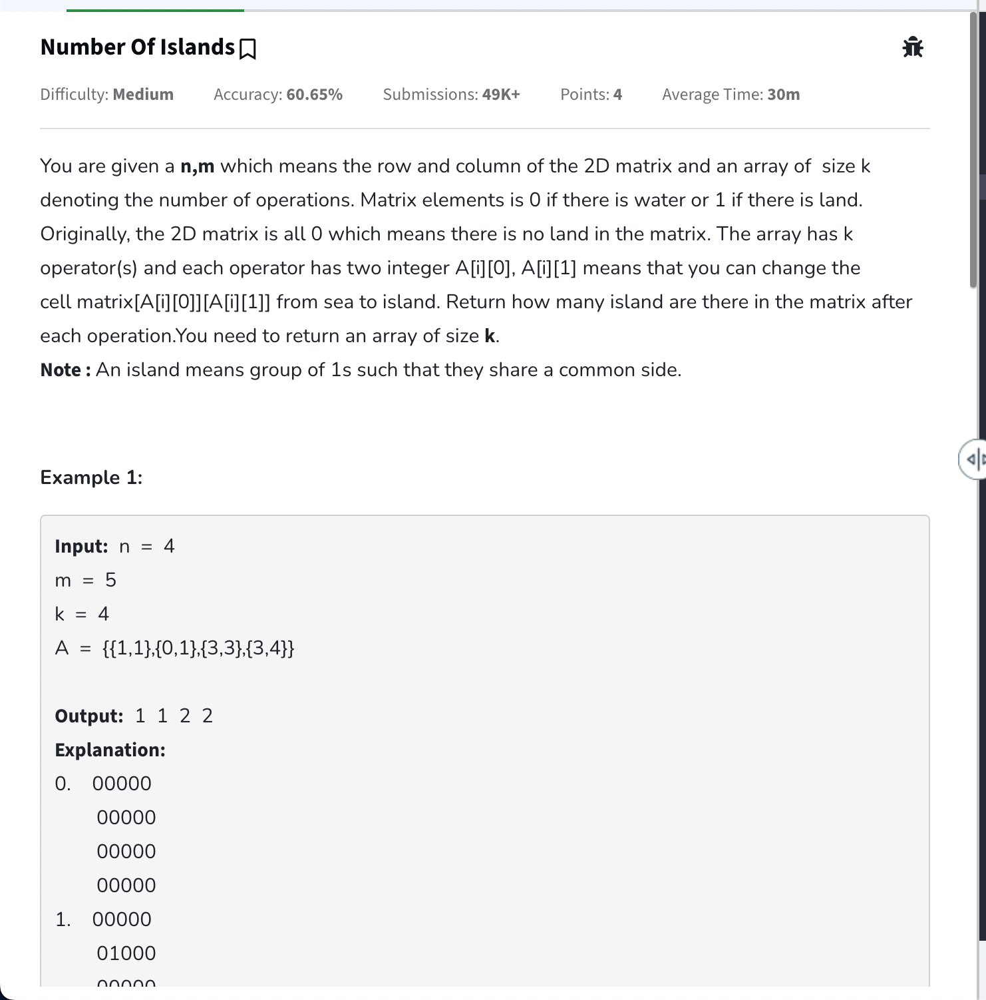

## Code

```cpp
class DisjointSet {
   private:
    vector<int> parent;
    vector<int> rank;

   public:
    DisjointSet(int n) {
        parent.resize(n + 1);
        rank.resize(n + 1, 0);

        for (int i = 0; i <= n; i++) {
            parent[i] = i;
        }
    }

    int findParent(int node) {
        if (parent[node] != node) parent[node] = findParent(parent[node]);
        return parent[node];
    }

    void unionByRank(int u, int v) {
        int pu = findParent(u);
        int pv = findParent(v);

        if (pu == pv) return;

        if (rank[pu] < rank[pv]) {
            parent[pu] = pv;
        } else if (rank[pv] < rank[pu]) {
            parent[pv] = pu;
        } else {
            parent[pv] = pu;
            rank[pu]++;
        }
    }
};

class Solution {
   public:
    vector<int> numOfIslands(int n, int m, vector<vector<int>>& A) {
        vector<vector<int>> mat(n, vector<int>(m, 0));  // matrix of n * m
        DisjointSet ds(m * n);
        vector<int> result;
        int count = 0;

        vector<pair<int, int>> directions = {{0, 1}, {0, -1}, {1, 0}, {-1, 0}};

        for (auto& operation : A) {
            int row = operation[0];
            int col = operation[1];

            // if already a land then no need to do anything
            if (mat[row][col] == 1) {
                result.push_back(count);
                continue;
            }

            // if thats not the case consider this move as a new island
            mat[row][col] = 1;
            count++;

            for (auto& [dy, dx] : directions) {
                int newRow = row + dy;
                int newCol = col + dx;

                // representing a array cell [i, j] as i * m + j ex. 1, 0 will
                // be 5 (1 * 5) + 0
                int originalNode = row * m + col;
                int adjacentNode = newRow * m + newCol;

				// agar ek valid matrix config h
				// adjacent cell ek land h
				// and agar dono same island(component) ko belong nahi karte
				// then we are merging these two islands together which we originally considered to be and island
				// and reducing count
                if (newRow >= 0 && newRow < n && newCol >= 0 && newCol < m &&
                    mat[newRow][newCol] == 1 &&
                    ds.findParent(originalNode) !=
                        ds.findParent(adjacentNode)) {
                    count--;
                    ds.unionByRank(originalNode, adjacentNode);
                }
            }

            result.push_back(count);
        }

    	return result;
    }
};
```

# [827. Making A Large Island](https://leetcode.com/problems/making-a-large-island/description/)

You are given an <code>n x n</code> binary matrix <code>grid</code>. You are allowed to change **at most one** <code>0</code> to be <code>1</code>.

Return the size of the largest **island** in <code>grid</code> after applying this operation.

An **island** is a 4-directionally connected group of <code>1</code>s.

**Example 1:**

```
Input: grid = [[1,0],[0,1]]
Output: 3
Explanation: Change one 0 to 1 and connect two 1s, then we get an island with area = 3.
```

**Example 2:**

```
Input: grid = [[1,1],[1,0]]
Output: 4
Explanation: Change the 0 to 1 and make the island bigger, only one island with area = 4.
```

**Example 3:**

```

Input: grid = [[1,1],[1,1]]
Output: 4
Explanation: Can't change any 0 to 1, only one island with area = 4.

```

**Constraints:**

- <code>n == grid.length</code>
- <code>n == grid[i].length</code>
- <code>1 <= n <= 500</code>
- <code>grid[i][j]</code> is either <code>0</code> or <code>1</code>.

## Approach

- Pattern: Dynamic Graph

## Code

```cpp
class DisjointSet{
private:
    vector<int> parent;
    vector<int> size;

public:
    DisjointSet(int n){
        parent.resize(n + 1);
        size.resize(n + 1, 1);
        for(int i = 0; i <= n; i++){
            parent[i] = i;
        }
    }

    int findParent(int node){
        if(parent[node] != node) parent[node] = findParent(parent[node]);
        return parent[node];
    }

    bool isConnected(int u, int v){
        return findParent(u) == findParent(v);
    }

    void unionBySize(int u, int v){
        int pu = findParent(u);
        int pv = findParent(v);

        if(pu == pv) return;

        if(size[pu] < size[pv]){
            parent[pu] = pv;
            size[pv] += size[pu];
        } else {
            parent[pv] = pu;
            size[pu] += size[pv];
        }
    }

    int getSize(int node){
        return size[node];
    }
};

/*
    Create a disjoint set since it is a graph with dynamic edges
    Now merge all islands together that are 1 so that they are connected if possible in the 4 directions
    Again traverse the grid and for every 0 check adjacent cells if 1 then add there parents size for island size calculation if this parent was not already counted ex. below case 0 the size may get calculated multiple times if we dont consider parent
    1 1 1
    1 0 1
    1 1 1
*/
class Solution {
public:
    int largestIsland(vector<vector<int>>& grid) {
        int n = grid.size();
        DisjointSet ds(n * n);
        int maxIslandSize = 0;

        vector<pair<int, int>> directions = {{0, 1}, {0, -1}, {1, 0}, {-1, 0}};

        // make connected components
        for(int i = 0; i < n; i++){
            for(int j = 0; j < n; j++){
                if(grid[i][j] == 1){
                    for(auto& [dy, dx]: directions){
                        int newRow = i + dy;
                        int newCol = j + dx;
                        int originalCellNumberMapping = i * n + j;
                        int adjacentCellNumberMapping = newRow * n + newCol;

                        // if valid config and is a land cell and not already connected then connect
                        if(newRow < n && newRow >= 0 && newCol < n && newCol >= 0 && grid[newRow][newCol] == 1 && !ds.isConnected(originalCellNumberMapping, adjacentCellNumberMapping)){
                            ds.unionBySize(originalCellNumberMapping, adjacentCellNumberMapping);
                        }
                    }
                }
            }
        }

        for(int i = 0; i < n; i++){
            for(int j = 0; j < n; j++){
                if(grid[i][j] == 0){
                    unordered_set<int> parents;
                    int islandSize = 0;
                    for(auto& [dy, dx]: directions){
                        int newRow = i + dy;
                        int newCol = j + dx;
                        int originalCellNumberMapping = i * n + j;
                        int adjacentCellNumberMapping = newRow * n + newCol;
                        // insert parents of all such 1 adjacent 1's we can find to a set to avoid duplicate parents
                        // we can use this to calculate sizes afterwards
                        if(newRow < n && newRow >= 0 && newCol < n && newCol >= 0 && grid[newRow][newCol] == 1){
                            parents.insert(ds.findParent(adjacentCellNumberMapping));
                        }
                    }

                    for(auto it: parents){
                        islandSize += ds.getSize(it); // add sizes of all others
                    }

                    islandSize++; // will also count self
                    maxIslandSize = max(islandSize, maxIslandSize);
                }
            }
        }

        // can be the case where there are no 0's present or somehow any original island was the largest one only ??
        for(int i = 0; i < n; i++){
            maxIslandSize = max(maxIslandSize, ds.getSize(i));
        }

        return maxIslandSize;
    }
};
```

# [947. Most Stones Removed with Same Row or Column](https://leetcode.com/problems/most-stones-removed-with-same-row-or-column/description/)

On a 2D plane, we place <code>n</code> stones at some integer coordinate points. Each coordinate point may have at most one stone.

A stone can be removed if it shares either **the same row or the same column** as another stone that has not been removed.

Given an array <code>stones</code> of length <code>n</code> where <code>stones[i] = [x<sub>i</sub>, y<sub>i</sub>]</code> represents the location of the <code>i^th</code> stone, return the largest possible number of stones that can be removed.

**Example 1:**

```
Input: stones = [[0,0],[0,1],[1,0],[1,2],[2,1],[2,2]]
Output: 5
Explanation: One way to remove 5 stones is as follows:
1. Remove stone [2,2] because it shares the same row as [2,1].
2. Remove stone [2,1] because it shares the same column as [0,1].
3. Remove stone [1,2] because it shares the same row as [1,0].
4. Remove stone [1,0] because it shares the same column as [0,0].
5. Remove stone [0,1] because it shares the same row as [0,0].
Stone [0,0] cannot be removed since it does not share a row/column with another stone still on the plane.
```

**Example 2:**

```
Input: stones = [[0,0],[0,2],[1,1],[2,0],[2,2]]
Output: 3
Explanation: One way to make 3 moves is as follows:
1. Remove stone [2,2] because it shares the same row as [2,0].
2. Remove stone [2,0] because it shares the same column as [0,0].
3. Remove stone [0,2] because it shares the same row as [0,0].
Stones [0,0] and [1,1] cannot be removed since they do not share a row/column with another stone still on the plane.
```

**Example 3:**

```
Input: stones = [[0,0]]
Output: 0
Explanation: [0,0] is the only stone on the plane, so you cannot remove it.
```

**Constraints:**

- <code>1 <= stones.length <= 1000</code>
- <code>0 <= x<sub>i</sub>, y<sub>i</sub> <= 10^4</code>
- No two stones are at the same coordinate point.

## Approach

- Pattern: Counting components

## Code

```cpp
/*
    * If we look closely from a single component we can remove all stones except the last 1.
    * So we can basically derive ans = each component - 1 => all stones - count of components
*/
class DisjointSet{
private:
    vector<int> parent;
    vector<int> size;

public:
    DisjointSet(int n){
        parent.resize(n + 1);
        size.resize(n + 1, 1);
        for(int i = 0; i <= n;i++){
            parent[i] = i;
        }
    }

    int findParent(int node){
        if(parent[node] != node) parent[node] = findParent(parent[node]);
        return parent[node];
    }

    void unionBySize(int u, int v){
        int pu = findParent(u);
        int pv = findParent(v);

        if(size[pu] < size[pv]){
            parent[pu] = pv;
            size[pv] += pu;
        } else {
            parent[pv] = pu;
            size[pu] += pv;
        }
    }
};

class Solution {
public:
    int removeStones(vector<vector<int>>& stones) {
        // to find count of components we can either use dfs and count no of dfs calls(by creating adj list) or we can use union find and then find number of unique parents
        int n = stones.size();
        DisjointSet ds(n); // using stones[i] as tracker in this case
        for(int i = 0; i < n; i++){
            for(int j = i + 1; j < n; j++){
                // if shares same row or same column with any stone coordinate then union stone position
                if(stones[i][0] == stones[j][0] || stones[i][1] == stones[j][1]){
                ds.unionBySize(i, j);
                }
            }
        }
        unordered_set<int> seen;

        for(int i = 0; i < n; i++){
            if(seen.find(ds.findParent(i)) == seen.end()){
                seen.insert(ds.findParent(i));
            }
        }

        int numberOfConnectedComponents = seen.size();

        return n - numberOfConnectedComponents;
    }
};
```
