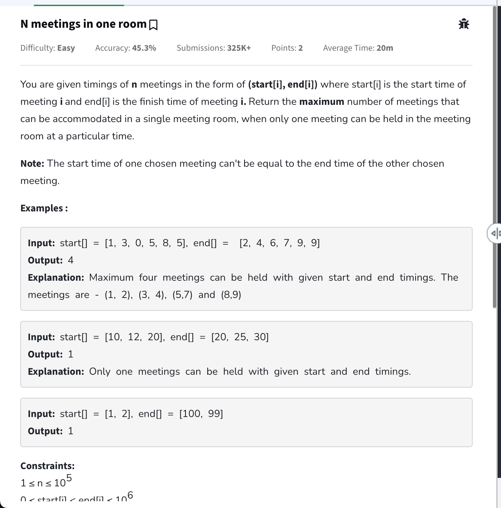
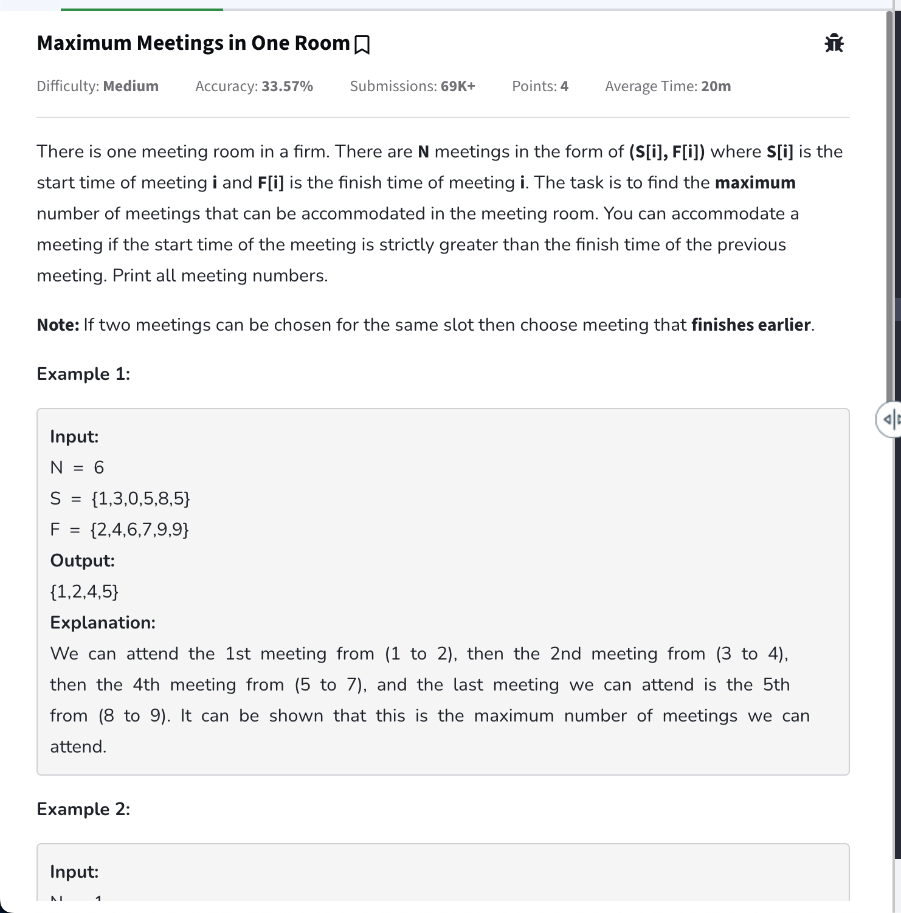

- [Greedy Algorithm](#greedy-algorithm)
  - [when greedy works](#when-greedy-works)
    - [template](#template)
- [Questions List](#questions-list)
  - [N Meetings in one Room](#n-meetings-in-one-room)
    - [Code](#code)
      - [Custom comparator if needed](#custom-comparator-if-needed)
- [252. Meeting Rooms](#252-meeting-rooms)
  - [Approach](#approach)
  - [Code](#code-1)
- [Maximum Meetings in One Room](#maximum-meetings-in-one-room)
    - [COde](#code-2)
- [455. Assign Cookies](#455-assign-cookies)
  - [Approach](#approach-1)
  - [Code](#code-3)
- [860. Lemonade Change](#860-lemonade-change)
  - [Approach](#approach-2)
  - [Code](#code-4)
- [1710. Maximum Units on a Truck](#1710-maximum-units-on-a-truck)
  - [Approach](#approach-3)
  - [Code](#code-5)
- [435. Non-overlapping Intervals](#435-non-overlapping-intervals)
  - [Approach](#approach-4)
  - [Code](#code-6)
- [56. Merge Intervals](#56-merge-intervals)
  - [Approach](#approach-5)
  - [Code](#code-7)
- [452. Minimum Number of Arrows to Burst Balloons](#452-minimum-number-of-arrows-to-burst-balloons)
  - [Approach](#approach-6)
  - [Code](#code-8)
- [134. Gas Station](#134-gas-station)
  - [Approach](#approach-7)
  - [Code](#code-9)
- [when to use which sorting in case of interval problems](#when-to-use-which-sorting-in-case-of-interval-problems)
- [253. Meeting Rooms II](#253-meeting-rooms-ii)
  - [Approach](#approach-8)
  - [Code](#code-10)
- [621. Task Scheduler](#621-task-scheduler)
  - [Approach](#approach-9)
  - [Code](#code-11)

# Greedy Algorithm

- Approach in which we choose the best option at that time without thinking about future consequeunces. Jo us time best lag rahi ho.
- Basically be lalchi. Example if agar 10 chocolates of different prices are there and we need to buy maximum chocolates then sabse pehli approach yehi hogi ki sabse sasti vaali le jo 50 mein sakti.
- There is no general pattern to solve and is more of practice/ can try this approach.

## when greedy works

- When there is maximise/ minimise in problem but future decisions are not affected by current choice. ( agar affect karte h toh then saare explore karne padege and use dp ). Known as greedy choice property.
- There is optimal substructure ( can be broken down into smaller problems )

### template

1. Sort karo ya kisi rule ke according elements ko priority do.

2. Har step pe best dikhnay wali option uthao.

3. Repeat till task khatam ho jaye.

# Questions List

## [N Meetings in one Room](https://www.geeksforgeeks.org/problems/n-meetings-in-one-room-1587115620/1)



- Pattern: Activity Selection
- T.C => O(n log n)

### Code

```cpp
class Solution {
  public:
    // Function to find the maximum number of meetings that can
    // be performed in a meeting room.
    int maxMeetings(vector<int>& start, vector<int>& end) {
        // sort pair of start and end time of meetings based on end time
        // so the earlies end time is at the start
        // if we pick greedily in order to complete most meetings
        // we should complete all those that ends early
        int count = 1;

        int n = start.size();

        vector<pair<int, int>> intervals(n);

        for(int i = 0; i < n; i++){
            intervals[i] = {end[i], start[i]};
        }

        sort(intervals.begin(), intervals.end()); // will sort on the basis of end
        // if cant push end as first then need to use custom comparator

        int lastMeetingEndTime = intervals[0].first; // will need to complete the first meeting

        for(int i = 1; i < n; i++){
            // if start time of next meeting is greater than previous end
            // this meeting can be completed
            if(intervals[i].second > lastMeetingEndTime) {
                count++;
                lastMeetingEndTime = intervals[i].first;
            }
        }

        return count;
    }
};
```

#### Custom comparator if needed

- will sort in ascending order based on second value of the pairs provided

```cpp
static bool cmp(pair<int, int> a, pair<int, int> b){
  return a.second < b.second;
}
```

# [252. Meeting Rooms](https://leetcode.com/problems/meeting-rooms/description/)

Given an array of meeting time <code>intervals</code>where <code>intervals[i] = [start<sub>i</sub>, end<sub>i</sub>]</code>, determine if a person could attend all meetings.

**Example 1:**

```
Input: intervals = [[0,30],[5,10],[15,20]]
Output: false
```

**Example 2:**

```
Input: intervals = [[7,10],[2,4]]
Output: true
```

**Constraints:**

- <code>0 <= intervals.length <= 10^4</code>
- <code>intervals[i].length == 2</code>
- <code>0 <= start<sub>i</sub> <end<sub>i</sub> <= 10^6</code>

## Approach

- Pattern: activity selection

## Code

```cpp
class Solution {
public:
    static bool cmp(vector<int>& a, vector<int>& b){
        return a[1] < b[1];
    }

    bool canAttendMeetings(vector<vector<int>>& intervals) {
        int n = intervals.size();
        if(n == 0) return true;

        sort(intervals.begin(), intervals.end(), cmp);
        int lastCompletedMeetingTime = intervals[0][1];

        for(int i = 1; i < n; i++){
            if(!(intervals[i][0] >= lastCompletedMeetingTime)) {
                return false;
            }
            lastCompletedMeetingTime = intervals[i][1];
        }

        return true;
    }
};
```

# [Maximum Meetings in One Room](https://www.geeksforgeeks.org/problems/maximum-meetings-in-one-room/1)



- Pattern: activity selection
- Check how to handle duplicate start times

### COde

```cpp
class Solution{
public:
    vector<int> maxMeetings(int N,vector<int> &start,vector<int> &end){
        // sort pair of start and end time of meetings based on end time
        // so the earlies end time is at the start
        // if we pick greedily in order to complete most meetings
        // we should complete all those that ends early
        vector<int> result;

        int n = start.size();
        unordered_map<int, int> mp;

        vector<pair<int, pair<int, int>>> intervals(n);

        for(int i = 0; i < n; i++){
            intervals[i] = {end[i], {start[i], i + 1}};
        }

        sort(intervals.begin(), intervals.end()); // will sort on the basis of end
        // if cant push end as first then need to use custom comparator

        int lastMeetingEndTime = intervals[0].first; // will need to complete the first meeting
        result.push_back(intervals[0].second.second); // first meeting will always be completed

        for(int i = 1; i < n; i++){
            // if start time of next meeting is greater than previous end
            // this meeting can be completed
            if(intervals[i].second.first > lastMeetingEndTime) {
                result.push_back(intervals[i].second.second);
                lastMeetingEndTime = intervals[i].first;
            }
        }

        sort(result.begin(), result.end());
        return result;
    }
};
```

# [455. Assign Cookies](https://leetcode.com/problems/assign-cookies/description/)

Assume you are an awesome parent and want to give your children some cookies. But, you should give each child at most one cookie.

Each child <code>i</code> has a greed factor <code>g[i]</code>, which is the minimum size of a cookie that the child will be content with; and each cookie <code>j</code> has a size <code>s[j]</code>. If <code>s[j] >= g[i]</code>, we can assign the cookie <code>j</code> to the child <code>i</code>, and the child <code>i</code> will be content. Your goal is to maximize the number of your content children and output the maximum number.

**Example 1:**

```
Input: g = [1,2,3], s = [1,1]
Output: 1
Explanation: You have 3 children and 2 cookies. The greed factors of 3 children are 1, 2, 3.
And even though you have 2 cookies, since their size is both 1, you could only make the child whose greed factor is 1 content.
You need to output 1.
```

**Example 2:**

```
Input: g = [1,2], s = [1,2,3]
Output: 2
Explanation: You have 2 children and 3 cookies. The greed factors of 2 children are 1, 2.
You have 3 cookies and their sizes are big enough to gratify all of the children,
You need to output 2.
```

**Constraints:**

- <code>1 <= g.length <= 3 \* 10^4</code>
- <code>0 <= s.length <= 3 \* 10^4</code>
- <code>1 <= g[i], s[j] <= 2^31 - 1</code>

**Note:** This question is the same as <a href="https://leetcode.com/problems/maximum-matching-of-players-with-trainers/description/" target="_blank"> 2410: Maximum Matching of Players With Trainers.</a>

## Approach

- T.C => O(n log n + m Log m)
- The least greedy children should be satisfied with the smallest size cookies if it is within there greed.

## Code

```cpp
class Solution {
public:
    int findContentChildren(vector<int>& g, vector<int>& s) {
        // sort both greed and size so that children with the least greed have the small size cookies
        sort(g.begin(), g.end());
        sort(s.begin(), s.end());

        int count = 0;
        int i = 0;
        int j = 0;

        while(i < g.size() && j < s.size()){
            if(g[i] <= s[j]){
                count++;
                i++;
                j++;
            } else{
                j++; // this cookie size can not be assigned since more i will be larger values of greed
            }
        }

        return count;
    }
};
```

# [860. Lemonade Change](https://leetcode.com/problems/lemonade-change/description/)

At a lemonade stand, each lemonade costs <code>$5</code>. Customers are standing in a queue to buy from you and order one at a time (in the order specified by bills). Each customer will only buy one lemonade and pay with either a <code>$5</code>, <code>$10</code>, or <code>$20</code> bill. You must provide the correct change to each customer so that the net transaction is that the customer pays <code>$5</code>.

Note that you do not have any change in hand at first.

Given an integer array <code>bills</code> where <code>bills[i]</code> is the bill the <code>i^th</code> customer pays, return <code>true</code> if you can provide every customer with the correct change, or <code>false</code> otherwise.

**Example 1:**

```
Input: bills = [5,5,5,10,20]
Output: true
Explanation:
From the first 3 customers, we collect three $5 bills in order.
From the fourth customer, we collect a $10 bill and give back a $5.
From the fifth customer, we give a $10 bill and a $5 bill.
Since all customers got correct change, we output true.
```

**Example 2:**

```
Input: bills = [5,5,10,10,20]
Output: false
Explanation:
From the first two customers in order, we collect two $5 bills.
For the next two customers in order, we collect a $10 bill and give back a $5 bill.
For the last customer, we can not give the change of $15 back because we only have two $10 bills.
Since not every customer received the correct change, the answer is false.
```

**Constraints:**

- <code>1 <= bills.length <= 10^5</code>
- <code>bills[i]</code> is either <code>5</code>, <code>10</code>, or <code>20</code>.

## Approach

- T.C: O(N)

## Code

```cpp
class Solution {
public:
    bool lemonadeChange(vector<int>& bills) {
        int fiveCount = 0;
        int tenCount = 0;

        for(int i = 0; i < bills.size(); i++){
            if(bills[i] == 5) {
                // no change is needed to be given back
                // just incrememnt
                fiveCount++;
            } else if(bills[i] == 10){
                // can only be possible if we have atleast one five dollar bill
                if(fiveCount > 0){
                    fiveCount--;
                    tenCount++;
                } else {
                    return false;
                }
            } else {
                // if bill is 20 then there are 2 cases
                // either 10 + 5 or 5 + 5 + 5 needs to be returned
                // but we need max 5 so best to first check 10 dollar bills
                if(tenCount > 0 && fiveCount > 0){
                    tenCount--;
                    fiveCount--;
                } else if(fiveCount >= 3){
                    fiveCount -= 3;
                } else {
                    return false;
                }
            }
        }

        return true;
    }
};
```

# [1710. Maximum Units on a Truck](https://leetcode.com/problems/maximum-units-on-a-truck/description/)

You are assigned to put some amount of boxes onto **one truck** . You are given a 2D array <code>boxTypes</code>, where <code>boxTypes[i] = [numberOfBoxes<sub>i</sub>, numberOfUnitsPerBox<sub>i</sub>]</code>:

- <code>numberOfBoxes<sub>i</sub></code> is the number of boxes of type <code>i</code>.
- <code>numberOfUnitsPerBox<sub>i</sub></code><sub> </sub>is the number of units in each box of the type <code>i</code>.

You are also given an integer <code>truckSize</code>, which is the **maximum** number of **boxes** that can be put on the truck. You can choose any boxes to put on the truck as long as the numberof boxes does not exceed <code>truckSize</code>.

Return the **maximum** total number of **units** that can be put on the truck.

**Example 1:**

```
Input: boxTypes = [[1,3],[2,2],[3,1]], truckSize = 4
Output: 8
Explanation: There are:
- 1 box of the first type that contains 3 units.
- 2 boxes of the second type that contain 2 units each.
- 3 boxes of the third type that contain 1 unit each.
You can take all the boxes of the first and second types, and one box of the third type.
The total number of units will be = (1 * 3) + (2 * 2) + (1 * 1) = 8.
```

**Example 2:**

```
Input: boxTypes = [[5,10],[2,5],[4,7],[3,9]], truckSize = 10
Output: 91
```

**Constraints:**

- <code>1 <= boxTypes.length <= 1000</code>
- <code>1 <= numberOfBoxes<sub>i</sub>, numberOfUnitsPerBox<sub>i</sub> <= 1000</code>
- <code>1 <= truckSize <= 10^6</code>

## Approach

- T.C => O(n log n)

## Code

```cpp
class Solution {
private:
    // sorts in descending order on the basis of second element
    static bool cmp(vector<int>& a, vector<int>& b){
        return a[1] > b[1];
    }
public:
    int maximumUnits(vector<vector<int>>& boxTypes, int truckSize) {
        // sort box types on the basis of units so that the first boxes we put on the truck have the maximum units in order to maximise units
        sort(boxTypes.begin(), boxTypes.end(), cmp);

        int maxUnits = 0;

        for(int i = 0; i < boxTypes.size(); i++){
            int boxes = boxTypes[i][0];
            int unitsInABox = boxTypes[i][1];

            // will auto stop if at any time truckSize becomes negative since boxes count is >= 1
            if(boxes <= truckSize){
                truckSize -= boxes;
                maxUnits += (boxes * unitsInABox);
            } else if(truckSize > 0){
                // ex. if size remaining was 2 and we had 4 boxes
                // then can still use 2 boxes to fill up the truck
                int boxesUsed = truckSize;
                truckSize -= boxesUsed;
                maxUnits += (boxesUsed * unitsInABox);
            }
        }

        return maxUnits;
    }
};
```

# [435. Non-overlapping Intervals](https://leetcode.com/problems/non-overlapping-intervals/description/)

Given an array of intervals <code>intervals</code> where <code>intervals[i] = [start<sub>i</sub>, end<sub>i</sub>]</code>, return the minimum number of intervals you need to remove to make the rest of the intervals non-overlapping.

**Note** that intervals which only touch at a point are **non-overlapping** . For example, <code>[1, 2]</code> and <code>[2, 3]</code> are non-overlapping.

**Example 1:**

```
Input: intervals = [[1,2],[2,3],[3,4],[1,3]]
Output: 1
Explanation: [1,3] can be removed and the rest of the intervals are non-overlapping.
```

**Example 2:**

```
Input: intervals = [[1,2],[1,2],[1,2]]
Output: 2
Explanation: You need to remove two [1,2] to make the rest of the intervals non-overlapping.
```

**Example 3:**

```
Input: intervals = [[1,2],[2,3]]
Output: 0
Explanation: You don't need to remove any of the intervals since they're already non-overlapping.
```

**Constraints:**

- <code>1 <= intervals.length <= 10^5</code>
- <code>intervals[i].length == 2</code>
- <code>-5 _ 10^4 <= start<sub>i</sub> < end<sub>i</sub> <= 5 _ 10^4</code>

## Approach

- Pattern: activity selection
- we sort by end time, because:

The earlier an interval ends, the more room we leave for future intervals.

This maximizes the number of non-overlapping intervals.

## Code

```cpp
class Solution {
private:
    static bool comp(vector<int>& a, vector<int>& b){
        return a[1] < b[1];
    }
public:
    int eraseOverlapIntervals(vector<vector<int>>& intervals) {
        // similar to activity selection/ n meetings problem
        // in order to find number of intervals to remove so that the rest are non overlapping we can just find max number of non overlapping intervals instead
        int n = intervals.size();
        sort(intervals.begin(), intervals.end(), comp);

        // these are sorted on the basis of there end time now
        // think of this like meeting times only

        int count = 1; // count non overlapping intervals
        int lastIntervalEndTime = intervals[0][1];
        for(int i = 1; i < n; i++){
            int start = intervals[i][0];
            int end = intervals[i][1];

            if(start >= lastIntervalEndTime) {
                count++;
                lastIntervalEndTime = end;
            }
        }

        return n - count;
    }
};
```

# [56. Merge Intervals](https://leetcode.com/problems/merge-intervals/description/)

Given an arrayof <code>intervals</code>where <code>intervals[i] = [start<sub>i</sub>, end<sub>i</sub>]</code>, merge all overlapping intervals, and return an array of the non-overlapping intervals that cover all the intervals in the input.

**Example 1:**

```
Input: intervals = [[1,3],[2,6],[8,10],[15,18]]
Output: [[1,6],[8,10],[15,18]]
Explanation: Since intervals [1,3] and [2,6] overlap, merge them into [1,6].
```

**Example 2:**

```
Input: intervals = [[1,4],[4,5]]
Output: [[1,5]]
Explanation: Intervals [1,4] and [4,5] are considered overlapping.
```

**Constraints:**

- <code>1 <= intervals.length <= 10^4</code>
- <code>intervals[i].length == 2</code>
- <code>0 <= start<sub>i</sub> <= end<sub>i</sub> <= 10^4</code>

## Approach

- Pattern:

## Code

```cpp
class Solution {
// private:
//     static bool comp(vector<int>& a, vector<int>& b){
//         return a[1] != b[1] ? a[1] < b[1] : a[0] < b[0];
//     }
public:
    vector<vector<int>> merge(vector<vector<int>>& intervals) {
        // we need to merge the interval which can be done simply by comparing interval end to next interval start and pushing to vector
        // but there exists cases like [[1,3], [2, 6], [6, 10]]
        // now first 2 will merge in one 1, 6 but then 6, 10 can also be merged to return 1,10 which is one final interval

        // there is a difference between this merge problem and finding overlap problem/ meetings problem. in that we wanted to maximise the count of intervals. so earlier a interval ends we greedily took it the more room we have for more intervals
        // in this we want to find early start points
        // rule merge -> start
        // max/ min interval -> end
        sort(intervals.begin(), intervals.end());
        int n = intervals.size();

        vector<vector<int>> merged;
        merged.push_back(intervals[0]);

        for(int i = 1; i < n; i++){
            int lastMergedStartTime = merged.back()[0];
            int lastMergedEndTime = merged.back()[1];

            int start = intervals[i][0];
            int end = intervals[i][1];

            if(start > lastMergedEndTime){
                merged.push_back({start,end});
            } else if(end > lastMergedEndTime){
                // if that is not the case need to update the last merged interval end time in order to merge this
                // ex. if [1,3] was there and we are now at [2,6] then can just change 1,3 to 1, 6 to reflect changes

                merged.back()[1] = end;
            }
        }

        return merged;
    }
};
```

# [452. Minimum Number of Arrows to Burst Balloons](https://leetcode.com/problems/minimum-number-of-arrows-to-burst-balloons/description/)

There are some spherical balloons taped onto a flat wall that represents the XY-plane. The balloons are represented as a 2D integer array <code>points</code> where <code>points[i] = [x<sub>start</sub>, x<sub>end</sub>]</code> denotes a balloon whose **horizontal diameter** stretches between <code>x<sub>start</sub></code> and <code>x<sub>end</sub></code>. You do not know the exact y-coordinates of the balloons.

Arrows can be shot up **directly vertically** (in the positive y-direction) from different points along the x-axis. A balloon with <code>x<sub>start</sub></code> and <code>x<sub>end</sub></code> is **burst** by an arrow shot at <code>x</code> if <code>x<sub>start</sub> <= x <= x<sub>end</sub></code>. There is **no limit** to the number of arrows that can be shot. A shot arrow keeps traveling up infinitely, bursting any balloons in its path.

Given the array <code>points</code>, return the **minimum** number of arrows that must be shot to burst all balloons.

**Example 1:**

```
Input: points = [[10,16],[2,8],[1,6],[7,12]]
Output: 2
Explanation: The balloons can be burst by 2 arrows:
- Shoot an arrow at x = 6, bursting the balloons [2,8] and [1,6].
- Shoot an arrow at x = 11, bursting the balloons [10,16] and [7,12].
```

**Example 2:**

```
Input: points = [[1,2],[3,4],[5,6],[7,8]]
Output: 4
Explanation: One arrow needs to be shot for each balloon for a total of 4 arrows.
```

**Example 3:**

```
Input: points = [[1,2],[2,3],[3,4],[4,5]]
Output: 2
Explanation: The balloons can be burst by 2 arrows:
- Shoot an arrow at x = 2, bursting the balloons [1,2] and [2,3].
- Shoot an arrow at x = 4, bursting the balloons [3,4] and [4,5].
```

**Constraints:**

- <code>1 <= points.length <= 10^5</code>
- <code>points[i].length == 2</code>
- <code>-2^31 <= x<sub>start</sub> < x<sub>end</sub> <= 2^31 - 1</code>

## Approach

- Pattern: can be seen that the problem asks for min/ max of intervals. sort end ascending
-

## Code

```cpp
class Solution {
private:
    static bool comp(vector<int>& a, vector<int>& b){
        return a[1] < b[1];
    }
public:
    int findMinArrowShots(vector<vector<int>>& points) {
        sort(points.begin(), points.end(), comp);
        int n = points.size();

        int count = 1;
        int lastShot = points[0][1];

        for(int i = 1; i < n; i++){
            int xStart = points[i][0];
            int xEnd = points[i][1];

            if(xStart <= lastShot && xEnd >= lastShot){
                // this shot will be covered with the previous arrow
                // if say shot at 5 then covers both 2, 5 and 1,6
            } else {
                // new arrow is needed
                count++;
                lastShot = xEnd; // shooting as far right possible in order to cover more axises
            }
        }

        return count;
    }
};
```

# [134. Gas Station](https://leetcode.com/problems/gas-station/description/)

There are <code>n</code> gas stations along a circular route, where the amount of gas at the <code>i^th</code> station is <code>gas[i]</code>.

You have a car with an unlimited gas tank and it costs <code>cost[i]</code> of gas to travel from the <code>i^th</code> station to its next <code>(i + 1)^th</code> station. You begin the journey with an empty tank at one of the gas stations.

Given two integer arrays <code>gas</code> and <code>cost</code>, return the starting gas station's index if you can travel around the circuit once in the clockwise direction, otherwise return <code>-1</code>. If there exists a solution, it is **guaranteed** to be **unique** .

**Example 1:**

```
Input: gas = [1,2,3,4,5], cost = [3,4,5,1,2]
Output: 3
Explanation:
Start at station 3 (index 3) and fill up with 4 unit of gas. Your tank = 0 + 4 = 4
Travel to station 4. Your tank = 4 - 1 + 5 = 8
Travel to station 0. Your tank = 8 - 2 + 1 = 7
Travel to station 1. Your tank = 7 - 3 + 2 = 6
Travel to station 2. Your tank = 6 - 4 + 3 = 5
Travel to station 3. The cost is 5. Your gas is just enough to travel back to station 3.
Therefore, return 3 as the starting index.
```

**Example 2:**

```
Input: gas = [2,3,4], cost = [3,4,3]
Output: -1
Explanation:
You can't start at station 0 or 1, as there is not enough gas to travel to the next station.
Let's start at station 2 and fill up with 4 unit of gas. Your tank = 0 + 4 = 4
Travel to station 0. Your tank = 4 - 3 + 2 = 3
Travel to station 1. Your tank = 3 - 3 + 3 = 3
You cannot travel back to station 2, as it requires 4 unit of gas but you only have 3.
Therefore, you can't travel around the circuit once no matter where you start.
```

**Constraints:**

- <code>n == gas.length == cost.length</code>
- <code>1 <= n <= 10^5</code>
- <code>0 <= gas[i], cost[i] <= 10^4</code>

## Approach

- Can also do brute force as well checking from each i travel to all other elements if non negative tank is there. For rotation use modulo operator. ex. if array [0,1,2,3] and start from i = 3 then to go back to i = 1 using iterator we can do in normal loop i will become 5 but we can do i % n => 5 % 4 = 1 to go there.

## Code

```cpp
class Solution {
    // think of gas like earning and cost like spending
    // we can not traverse if our earning is less then our cost
    // but if it is more or equal then it is possible
public:
    int canCompleteCircuit(vector<int>& gas, vector<int>& cost) {
        int n = gas.size();
        int totalGas = 0;
        int totalCost = 0;

        for(int i = 0; i < n; i++){
            totalGas += gas[i];
            totalCost += cost[i];
        }

        if(totalGas < totalCost) return -1;

        int station = 0;
        int current = 0;

        for(int i = 0; i < n; i++){
            // gas[i] - cost[i] + current is cost for moving forward
            // if that becomes negative then this cant be our station
            if(current + gas[i] - cost[i] < 0) {
                current = 0;
                station = i + 1; // check with this station
            } else {
                current += gas[i] - cost[i];
            }
        }

        return station;
    }
};
```

# when to use which sorting in case of interval problems

1. Start Time: Process intervals in the order they begin, merge intervals, detect overlaps early
2. End Time: Choose intervals that finish the earliest, avoid conflicts, schedule efficiently

# [253. Meeting Rooms II](https://leetcode.com/problems/meeting-rooms-ii/description/)

Given an array of meeting time intervals <code>intervals</code> where <code>intervals[i] = [start<sub>i</sub>, end<sub>i</sub>]</code>, return the minimum number of conference rooms required.

**Example 1:**

```
Input: intervals = [[0,30],[5,10],[15,20]]
Output: 2
```

**Example 2:**

```
Input: intervals = [[7,10],[2,4]]
Output: 1
```

**Constraints:**

- <code>1 <=intervals.length <= 10^4</code>
- <code>0 <= start<sub>i</sub> < end<sub>i</sub> <= 10^6</code>

## Approach

- Pattern:

## Code

```cpp
class Solution {
public:
    // normal interval approach/ acitivty seleciton will not work since need to find overlap with not jsut previous but all previous

    int minMeetingRooms(vector<vector<int>>& intervals) {
        int n = intervals.size();

        // sort on the basis of start time so that logically we assing rooms to those meetings first that want to start first
        sort(intervals.begin(), intervals.end());
        priority_queue<int, vector<int>, greater<int>> pq; // stores the earliest finishing meetings. so when we need to assign room to a new meeting check with this if meeting can finish before then can just assign this room

        int roomCount = 1;
        pq.push(intervals[0][1]); // this meeting will start the earliest so it will occupy the first room. other meetings will have to wait for this one to get this room or take a new room

        for(int i = 1; i < n; i++){
            int startTime = intervals[i][0];
            int endTime = intervals[i][1];

            if(startTime >= pq.top()){
                pq.pop(); // use the same room
            } else {
                roomCount++;
            }
            // in both cases we need to consider the end time for this new meeting
            pq.push(endTime);
        }

        return roomCount;
    }
};
```

# [621. Task Scheduler](https://leetcode.com/problems/task-scheduler/description/)

You are given an array of CPU <code>tasks</code>, each labeled with a letter from A to Z, and a number <code>n</code>. Each CPU interval can be idle or allow the completion of one task. Tasks can be completed in any order, but there's a constraint: there has to be a gap of **at least** <code>n</code> intervals between two tasks with the same label.

Return the **minimum** number of CPU intervals required to complete all tasks.

**Example 1:**

<div class="example-block" style="border-color: var(--border-tertiary); border-left-width: 2px; color: var(--text-secondary); font-size: 0.875rem; margin-bottom: 1rem; margin-top: 1rem; overflow: visible; padding-left: 1rem;">
Input: tasks = ["A","A","A","B","B","B"], n = 2

Output: 8

Explanation: A possible sequence is: A -> B -> idle -> A -> B -> idle -> A -> B.

After completing task A, you must wait two intervals before doing A again. The same applies to task B. In the 3^rd interval, neither A nor B can be done, so you idle. By the 4^th interval, you can do A again as 2 intervals have passed.

**Example 2:**

<div class="example-block" style="border-color: var(--border-tertiary); border-left-width: 2px; color: var(--text-secondary); font-size: 0.875rem; margin-bottom: 1rem; margin-top: 1rem; overflow: visible; padding-left: 1rem;">
Input: tasks = ["A","C","A","B","D","B"], n = 1

Output: 6

Explanation: A possible sequence is: A -> B -> C -> D -> A -> B.

With a cooling interval of 1, you can repeat a task after just one other task.

**Example 3:**

<div class="example-block" style="border-color: var(--border-tertiary); border-left-width: 2px; color: var(--text-secondary); font-size: 0.875rem; margin-bottom: 1rem; margin-top: 1rem; overflow: visible; padding-left: 1rem;">
Input: tasks = ["A","A","A", "B","B","B"], n = 3

Output: 10

Explanation: A possible sequence is: A -> B -> idle -> idle -> A -> B -> idle -> idle -> A -> B.

There are only two types of tasks, A and B, which need to be separated by 3 intervals. This leads to idling twice between repetitions of these tasks.

**Constraints:**

- <code>1 <= tasks.length <= 10^4</code>
- <code>tasks[i]</code> is an uppercase English letter.
- <code>0 <= n <= 100</code>

## Approach

- Pattern:

## Code

```cpp
class Solution {
public:
    int leastInterval(vector<char>& tasks, int n) {
        int totalTime = 0;

        // create frequency map
        unordered_map<char, int> freq;
        priority_queue<int> pq; // will store the task with the most frequency at top
        // it is best to pick the task with the most frequency first to efficiently distribute other tasks after this in the tasks cooldown perido

        for(char task: tasks){
            freq[task]++;
        }
        for(auto f: freq){
            pq.push(f.second); // dont really care about the order
        }

        while(!pq.empty()){
            vector<int> temp; // stores that levels uncompleted elements
            int cycle = n + 1; // in this segement say after picking A then need to complete n more tasks before we can pick A again
            // complete this cycle
            while(cycle > 0 && !pq.empty()){
                int currentMaxFrequency = pq.top();
                pq.pop();

                currentMaxFrequency--;
                cycle--;
                totalTime++;

                if(currentMaxFrequency > 0){
                    // if this elements frequency still remains
                    temp.push_back(currentMaxFrequency);
                }
            }

            // if we had elements with remaining freq insert back into pq for use in next cycle
            for(int num: temp) pq.push(num);

            // if cycle length is remaining then that means no element present that can be used this should be used as idle time
            // also only add this if elements are present
            // since if pq is empty then that means everything was completed no need to add extra idle time
            if(!pq.empty()){
                totalTime += cycle;
            }
        }

        return totalTime;
    }
};
```
